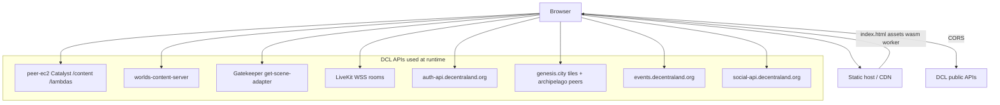

# Browser deployment — pre-push checklist & outline

> **Status:** Pre-live blockers cleared (2026-06-13). This doc is the go-live runbook for the static SPA build.

---

## Quick summary

| Item | Value |
|------|-------|
| **Build** | `npm run build` → `dist/` static SPA |
| **Runtime** | Any static host + SPA fallback (nginx, Cloudflare Pages, S3+CloudFront, etc.) |
| **Auth** | Wallet connect — guest via `?guest` / `?skipLogin` only (no splash button) |
| **Realm** | Default catalyst `https://peer-ec2.decentraland.org` (override via env) |
| **Workers** | Scene script runs in Web Worker — host must serve `.js` with correct MIME |

---

## Pre-push checklist

Run through this on a **production build** (`npm run build && npm run preview` or staging URL), not just dev.

### Build & assets

- [ ] `npm run build` exits 0 (tsc + vite)
- [ ] `npm run preview` loads at `http://localhost:4173`
- [ ] Optional: `npm run bundle:wearables` if bundled base wearables changed
- [ ] Confirm `dist/` includes PhysX WASM (`assets/*.wasm` or vendor chunk)
- [ ] Deep links work: `/rickroll.dcl.eth`, `/genesis-city` or parcel routes your host supports

### Login & session

- [ ] Splash shows **Connect Wallet** only (no DCL auth-server button; no guest button)
- [ ] Wallet login → profile loads → avatar composes with wearables
- [ ] Returning user: **Jump into Decentraland** + **Use a different account**
- [ ] Guest dev URLs: `?guest` or `?skipLogin` still bypass splash
- [ ] Loading overlay stays **5s after scene load** on first entry; teleports dismiss fast

### Core scene

- [ ] RickRoll (`/rickroll.dcl.eth`) — layout matches Explorer, NPCs on ground
- [ ] Genesis Plaza or light-heavy scene — **FPS acceptable** (LightManager culling)
- [ ] Local player feet on ground; remote avatars aligned
- [ ] Sky: sun disc + soft clouds (no blue speckle / jagged cloud edges)
- [ ] Night skybox slider ~23:59 — moon visible; avatars/ground readable (not black silhouettes)
- [ ] ECS `LightSource` scenes — no blinding yellow overexposure

### Multiplayer / comms

- [ ] Two signed-in clients, same scene — see each other move
- [ ] Remote avatars load profile (not grey forever)
- [ ] Scene chat sends and receives (LiveKit reliable path)
- [ ] Chat 140 char cap; URLs render blue; `@` autocomplete; purple bubble when @-mentioned
- [ ] Chat sidebar badge increments when panel closed; clears on open

### Emotes (user-confirmed critical path)

- [ ] Stand still → **B** → **Money** / **Clap** / **Kiss** — **prop GLBs visible**
- [ ] Remote peer emote shows props
- [ ] AvatarShape NPC expression emote loops until cleared
- [ ] Scene `triggerSceneEmote` URNs play when same scene loaded (silent skip cross-scene OK)
- [ ] No console spam for missing scene-emote / collider logs (unless debug toggles on)

### UI chrome

- [ ] Minimap → opens Map tab; pan/zoom; parcel click → popup + **Jump In**
- [ ] **World mode:** minimap hidden; world card shows name + coords + **Jump back to Genesis City** → `0,0`
- [ ] Map peer markers (face256 circles) when archipelago API reachable
- [ ] Events tab — Weekly/Calendar views, live events from `events.decentraland.org`
- [ ] Settings, Backpack, skybox day/night slider
- [ ] Orbit: left-drag orbits; right-click / Esc toggles pointer lock

### PointerEvents manual test

Code path: `PointerEventsSystem.ts` → mirror `PointerEventsResult` + `PrimaryPointerInfo` → scene worker `pointerEventsSystem`.

**Best scenes:** Genesis Plaza (`/` or `0,0`) — many buttons/doors/NPCs with `PointerEvents`. Custom dev scenes (e.g. camera-operator) good for isolated button tests.

1. **Load** scene, click canvas to **pointer-lock** (crosshair center = ray origin) or use orbit mode (`?orbit=1`).
2. **Hover** — aim at interactive props. Tooltip shows scene `hoverText` + **button icon** (E, F, mouse, 1–4, Spc, Ctrl).
3. **Highlight** — entities with `showHighlight` turn **green** in range, **red** out of range (per-entry `maxDistance`).
4. **Click / keys** — fire the matching action while aimed:
   - `IA_POINTER` — left click
   - `IA_PRIMARY` — **E** (not left click)
   - `IA_SECONDARY` — **F**
   - `IA_ACTION_3`–`IA_ACTION_6` — **1**–**4**
   - `IA_JUMP` — **Space** (jump still works when not on a target)
   - `IA_WALK` — **Ctrl**
5. **Blocked UI** — open chat/settings overlay; pointer ray should **not** hit scene (no stray hovers behind panel).
6. **Debug** — Help → client debug log (`[pointer]` + `[scene]` lines). Scene `console.log` from callbacks appears here.

**Pass criteria**

- [x] Hover enter/leave fires (tooltip + icon appears/disappears)
- [x] Left click (`IA_POINTER`) and E/F fire scene callbacks when in range
- [x] Keys 1–4 / Space / Ctrl fire when entity registers those actions
- [x] Green/red highlight matches in-range state
- [x] No console throw from `PointerEventsSystem` each frame
- [x] Clicks while UI open do not trigger scene behind panel

**Known gaps:** proximity events (`PET_PROXIMITY_*` — player walks near entity, not cursor), UI entity pointers, **Tags** component (`getEntitiesByTag`).

### Known gaps (OK for v1 push — document in release notes)

- [ ] Explorer chat timestamps wrong on our outbound messages (wire format)
- [ ] Voice / LiveKit audio not wired
- [x] `PointerEvents` — hover icons, highlight, full input actions (see [manual test](#pointerevents-manual-test))
- [ ] Parcel route `/80,-1` catalyst fetch stub
- [ ] Guest only via dev URL `?guest` / `?skipLogin` (not in splash)

### Browser matrix (spot-check)

- [ ] Chrome / Edge (primary)
- [ ] Firefox
- [ ] Safari (WebGL + wallet popup quirks)

---

## Build commands

```bash
# Install
npm ci

# Optional — refresh bundled base wearables in public/
npm run bundle:wearables

# Production bundle
npm run build

# Local smoke of production output
npm run preview
# → http://localhost:4173
```

Output: **`dist/`** — upload entire folder. Vite `appType: 'spa'` expects all routes to fall back to `index.html`.

---

## Deployment architecture



The client is a **static SPA**. All game logic runs in the browser. No Node server required unless you add **API proxies** (recommended for map parity with neurolink).

---

## Hosting options

### Option A — Static SPA only (simplest)

Upload `dist/` to Cloudflare Pages, Netlify, S3+CloudFront, GitHub Pages, etc.

**Requirements:**

1. **SPA fallback** — every path → `index.html` (except real files)
2. **Correct MIME** — `.wasm` → `application/wasm`, `.js` → `application/javascript`
3. **HTTPS** — required for wallet + LiveKit

**CORS:** Most DCL APIs allow browser origins. Map tiles load from `https://genesis.city` (images). If any API blocks your domain, use Option B proxies.

### Option B — Static SPA + nginx proxies (recommended)

Matches dcl-neurolink production pattern for map sidebar APIs.

```nginx
server {
  listen 443 ssl http2;
  server_name client.example.com;

  root /var/www/threejs-dcl-client/dist;
  index index.html;

  # SPA fallback
  location / {
    try_files $uri $uri/ /index.html;
  }

  # WASM
  location ~* \.wasm$ {
    types { application/wasm wasm; }
    add_header Cache-Control "public, max-age=31536000, immutable";
  }

  # Map API proxies (optional — prod hits these if VITE_* not set to direct URLs)
  location /api/peers {
    proxy_pass https://archipelago-ea-stats.decentraland.org/peers;
    proxy_ssl_server_name on;
  }

  location /api/parcels/ {
    proxy_pass https://api.decentraland.org/v2/parcels/;
    proxy_ssl_server_name on;
  }

  location /api/worlds/live-data {
    proxy_pass https://worlds-content-server.decentraland.org/live-data;
    proxy_ssl_server_name on;
  }
}
```

Point env vars at proxies (build-time):

```bash
VITE_ARCHIPELAGO_PEERS_URL=/api/peers
VITE_PARCELS_API_BASE=/api/parcels
VITE_WORLDS_LIVE_DATA_URL=/api/worlds/live-data
```

Rebuild after setting env — Vite inlines `import.meta.env.VITE_*` at build time.

### Option C — Docker + nginx

```dockerfile
FROM node:20-alpine AS build
WORKDIR /app
COPY package*.json ./
RUN npm ci
COPY . .
ARG VITE_ARCHIPELAGO_PEERS_URL=/api/peers
ARG VITE_PARCELS_API_BASE=/api/parcels
ARG VITE_WORLDS_LIVE_DATA_URL=/api/worlds/live-data
RUN npm run build

FROM nginx:alpine
COPY --from=build /app/dist /usr/share/nginx/html
COPY deploy/nginx.conf /etc/nginx/conf.d/default.conf
EXPOSE 80
```

(Copy the nginx block above into `deploy/nginx.conf` when you add Docker — not in repo yet.)

---

## Environment variables (build-time)

Set before `npm run build`. All are optional; defaults hit public DCL endpoints directly in production.

| Variable | Default (prod) | Purpose |
|----------|----------------|---------|
| `VITE_CATALYST_BASE_URL` | `https://peer-ec2.decentraland.org` | Catalyst + lambdas base |
| `VITE_ARCHIPELAGO_PEERS_URL` | direct archipelago URL | Map live peers; use `/api/peers` with nginx |
| `VITE_PARCELS_API_BASE` | `https://api.decentraland.org/v2/parcels` | Parcel metadata for map popup |
| `VITE_WORLDS_LIVE_DATA_URL` | worlds-content-server direct | Worlds sidebar on map |
| `VITE_SOCIAL_API_URL` | `https://social-api.decentraland.org` | Signed communities fetch |

Wallet login uses MetaMask `personal_sign` directly in the browser (no auth-server proxy).

---

## Post-deploy smoke test (5 min)

1. Open `https://your-domain/rickroll.dcl.eth`
2. Sign in with wallet → wait for loading hold → walk with WASD
3. Open Map (**M**) → click a parcel → Jump In to another scene
4. Trigger **Money** emote (stand still) → see dollar props
5. Open second browser / incognito → same scene → confirm peer visible + chat

---

## Rollback

Keep previous `dist/` artifact or CDN deployment ID. Static SPA rollback = redeploy prior folder. No database migrations.

---

## Release notes template

```markdown
## Three.js DCL Client — browser beta

**Works:** Worlds/scenes via URL, wallet login, multiplayer presence + chat, profile avatars,
emote props, LightSource culling, Genesis map, events calendar.

**Known limitations:** No voice, proximity pointer events, in-world UI (`UiTransform`), Explorer chat date quirk,
guest login removed from splash (wallet required for comms).
```

---

## Related docs

- [`PROGRESS.md`](./PROGRESS.md) — milestone log & phase status
- [`lightsource-parity.md`](./lightsource-parity.md) — lighting/shadow outstanding items
- [`IMPLEMENTATION_PLAN.md`](./IMPLEMENTATION_PLAN.md) — architecture & risks
