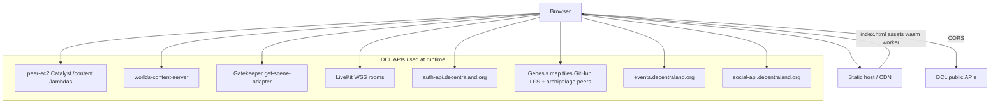

# Browser deployment — pre-push checklist & outline

> **Status:** **v1.0.0** = core play loop production beta (not full Explorer parity) — see [REPO_MANAGEMENT.md](./REPO_MANAGEMENT.md).  
> This doc is the go-live runbook for the static SPA build.

---

## Quick summary

| Item | Value |
|------|-------|
| **Build** | `npm run build` → staging/local SPA (analytics off) · `npm run build:prod` → production SPA (analytics on) |
| **Runtime** | Any static host + SPA fallback (nginx, Cloudflare Pages, S3+CloudFront, etc.) |
| **Auth** | Non-blocking session resume; explorer auth sheet for wallet/guest (dev: `?guest` / `?skipLogin`) |
| **Realm** | Default catalyst `https://peer-ec2.decentraland.org` (override via env) |
| **Workers** | Scene script runs in Web Worker — host must serve `.js` with correct MIME |

---

## Pre-push checklist

Run through this on a **production build** (`npm run build && npm run preview` or staging URL), not just dev.

### Build & assets

- [ ] `npm run build` exits 0 (tsc + vite)
- [ ] `npm run preview` loads at `http://localhost:4173`
- [ ] Optional: `npm run bundle:wearables` if bundled base wearables changed
- [ ] Confirm `dist/` includes PhysX WASM (`assets/*.wasm` or vendor chunk)
- [ ] Deep links work: `/rickroll.dcl.eth`, `/genesis-city` or parcel routes your host supports

### Login & session

- [ ] Cold load resumes stored wallet or continues as guest (no full-screen splash)
- [ ] Explorer header **Sign in** → wallet + guest sheet works
- [ ] Wallet login → profile loads → avatar composes with wearables
- [ ] Guest dev URLs: `?guest` or `?skipLogin` still force guest without wallet sheet
- [ ] Landing **Jump in** uses landing progress bar; in-play teleports use loading overlay

### Core scene

- [ ] RickRoll (`/rickroll.dcl.eth`) — layout matches Explorer, NPCs on ground
- [ ] Genesis Plaza or light-heavy scene — **FPS acceptable** (LightManager culling)
- [ ] Local player feet on ground; remote avatars aligned
- [ ] Sky: sun disc + soft clouds (no blue speckle / jagged cloud edges)
- [ ] Night skybox slider ~23:59 — moon visible; avatars/ground readable (not black silhouettes)
- [ ] ECS `LightSource` scenes — no blinding yellow overexposure

### Multiplayer / comms

- [ ] Two signed-in clients, same scene — see each other move
- [ ] Remote avatars load profile (not grey forever)
- [ ] Scene chat sends and receives (LiveKit reliable path)
- [ ] 2D social shell: chat FAB expand/collapse restores last view; scene tab × on Explore
- [ ] Chat 140 char cap; URLs render blue; `@` autocomplete; purple bubble when @-mentioned
- [ ] Chat sidebar badge increments when panel closed; clears on open

### Emotes (user-confirmed critical path)

- [ ] Stand still → **B** → **Money** / **Clap** / **Kiss** — **prop GLBs visible**
- [ ] Remote peer emote shows props
- [ ] AvatarShape NPC expression emote loops until cleared
- [ ] Scene `triggerSceneEmote` URNs play when same scene loaded (silent skip cross-scene OK)
- [ ] No console spam for missing scene-emote / collider logs (unless debug toggles on)

### UI chrome

- [ ] **Circular minimap** (parcels) — under location pill, same width; satellite basemap; player dot at center
- [ ] Minimap **click** → in-world Map panel (settings) centered on player; pan/zoom; parcel click → popup + **Jump In**
- [ ] **World mode:** minimap hidden; world card shows name + coords + **Jump back to Genesis City** → `0,0`
- [ ] Full `/map` route — social shell + GENESIS PLAZA / MY LOCATION HUD; peer markers when archipelago API reachable
- [ ] Scene landing — card fits viewport; map thumbnail not taller than card; gap above Upcoming events
- [ ] Events tab — Weekly/Calendar views, live events from `events.decentraland.org`
- [ ] Settings, Backpack, skybox day/night slider
- [ ] Orbit: left-drag orbits; right-click / Esc toggles pointer lock

### PointerEvents manual test

Code path: `PointerEventsSystem.ts` → mirror `PointerEventsResult` + `PrimaryPointerInfo` → scene worker `pointerEventsSystem`.

**Best scenes:** Genesis Plaza (`/` or `0,0`) — many buttons/doors/NPCs with `PointerEvents`. Custom dev scenes (e.g. camera-operator) good for isolated button tests.

1. **Load** scene, click canvas to **pointer-lock** (crosshair center = ray origin) or use orbit mode (`?orbit=1`).
2. **Hover** — aim at interactive props. Tooltip shows scene `hoverText` + **button icon** (E, F, mouse, 1–4, Spc, Ctrl).
3. **Highlight** — entities with `showHighlight` turn **green** in range, **red** out of range (per-entry `maxDistance`).
4. **Click / keys** — fire the matching action while aimed:
   - `IA_POINTER` — left click
   - `IA_PRIMARY` — **E** (not left click)
   - `IA_SECONDARY` — **F**
   - `IA_ACTION_3`–`IA_ACTION_6` — **1**–**4**
   - `IA_JUMP` — **Space** (jump still works when not on a target)
   - `IA_WALK` — **Ctrl**
5. **Blocked UI** — open chat/settings overlay; pointer ray should **not** hit scene (no stray hovers behind panel).
6. **Debug** — Help → client debug log (`[pointer]` + `[scene]` lines). Scene `console.log` from callbacks appears here.

**Pass criteria**

- [x] Hover enter/leave fires (tooltip + icon appears/disappears)
- [x] Left click (`IA_POINTER`) and E/F fire scene callbacks when in range
- [x] Keys 1–4 / Space / Ctrl fire when entity registers those actions
- [x] Green/red highlight matches in-range state
- [x] No console throw from `PointerEventsSystem` each frame
- [x] Clicks while UI open do not trigger scene behind panel

**Known gaps:** proximity events (`PET_PROXIMITY_*` — player walks near entity, not cursor), UI entity pointers (scene ECS UI hit polish).  
**Not gaps:** **Tags** + `engine.getEntitiesByTag()` — 🟢 mirror CRDT (scene worker has full ECS index).

### Known gaps (OK for v1 push — document in release notes)

- [ ] Explorer chat timestamps wrong on our outbound messages (wire format)
- [x] Voice / LiveKit nearby audio (PTT Speak · worlds + Genesis parcels · Explorer interop)
- [x] `PointerEvents` — hover icons, highlight, full input actions (see [manual test](#pointerevents-manual-test))
- [ ] Parcel route `/80,-1` catalyst fetch stub
- [ ] Guest also available from explorer auth sheet; dev URL `?guest` / `?skipLogin` still force guest

### Browser matrix (spot-check)

- [ ] Chrome / Edge (primary)
- [ ] Firefox
- [ ] Safari (WebGL + wallet popup quirks)

---

## Build commands

```bash
# Install
npm ci

# Optional — refresh bundled base wearables in public/
npm run bundle:wearables

# Production bundle
npm run build

# Local smoke of production output
npm run preview
# → http://localhost:4173
```

Output: **`dist/`** — upload entire folder. Vite `appType: 'spa'` expects all routes to fall back to `index.html`.

---

## Deployment architecture


```mermaid
flowchart TB
  User[Browser]
  CDN[Static host / CDN]
  DCL[DCL public APIs]

  User --> CDN
  CDN -->|index.html assets wasm worker| User
  User -->|CORS| DCL

  subgraph dcl_apis [DCL APIs used at runtime]
    Catalyst[peer-ec2 Catalyst /content /lambdas]
    Worlds[worlds-content-server]
    Gatekeeper[Gatekeeper get-scene-adapter]
    LiveKit[LiveKit WSS rooms]
    Auth[auth-api.decentraland.org]
    Map[Genesis map tiles GitHub LFS + archipelago peers]
    Events[events.decentraland.org]
    Social[social-api.decentraland.org]
  end

  User --> Catalyst
  User --> Worlds
  User --> Gatekeeper
  User --> LiveKit
  User --> Auth
  User --> Map
  User --> Events
  User --> Social
```

The client is a **static SPA**. All game logic runs in the browser. No Node server required unless you add **API proxies** (recommended for map parity with neurolink).

---

## Hosting options

### Option A — Static SPA only (simplest)

Upload `dist/` to Cloudflare Pages, Netlify, S3+CloudFront, GitHub Pages, etc.

**Requirements:**

1. **SPA fallback** — every path → `index.html` (except real files)
2. **Correct MIME** — `.wasm` → `application/wasm`, `.js` → `application/javascript`
3. **HTTPS** — required for wallet + LiveKit

**CORS:** Most DCL APIs allow browser origins. Map tiles load from GitHub LFS media
(`media.githubusercontent.com/.../genesis.city/.../map/latest`) — same images as
genesis.city, valid TLS. Override with `VITE_GENESIS_TILE_BASE_URL` if needed.
If any API blocks your domain, use Option B proxies.

### Option B — Static SPA + nginx proxies (recommended)

Matches dcl-neurolink production pattern for map sidebar APIs.

```nginx
server {
  listen 443 ssl http2;
  server_name client.example.com;

  root /var/www/threejs-dcl-client/dist;
  index index.html;

  # SPA fallback
  location / {
    try_files $uri $uri/ /index.html;
  }

  # WASM
  location ~* \.wasm$ {
    types { application/wasm wasm; }
    add_header Cache-Control "public, max-age=31536000, immutable";
  }

  # Map API proxies (optional — prod hits these if VITE_* not set to direct URLs)
  location = /api/peers {
    proxy_pass https://archipelago-ea-stats.decentraland.org/peers;
    proxy_ssl_server_name on;
    proxy_set_header Host archipelago-ea-stats.decentraland.org;
  }

  location /api/parcels/ {
    proxy_pass https://api.decentraland.org/v2/parcels/;
    proxy_ssl_server_name on;
    proxy_set_header Host api.decentraland.org;
  }

  location = /api/worlds/live-data {
    proxy_pass https://worlds-content-server.decentraland.org/live-data;
    proxy_ssl_server_name on;
    proxy_set_header Host worlds-content-server.decentraland.org;
  }

  # Required for v0.5.0 Explorer — client always calls /api/places/* (no direct CORS fallback)
  location /api/places/ {
    proxy_pass https://places.decentraland.org/api/;
    proxy_ssl_server_name on;
    proxy_set_header Host places.decentraland.org;
  }

  location /api/marketplace/ {
    proxy_pass https://marketplace-api.decentraland.org/;
    proxy_ssl_server_name on;
    proxy_set_header Host marketplace-api.decentraland.org;
  }
}
```

**Full reference:** [`deploy/nginx.conf`](../deploy/nginx.conf) — copy to the droplet site config. After v0.5.0, missing `/api/places/` causes Explorer 404s (`places/worlds`, `places/places`).

**Droplet apply (one-time or after editing):**

```bash
sudo nginx -t && sudo systemctl reload nginx
curl -sS 'https://decentraland.lastslice.co/api/places/worlds?limit=1' | head -c 120
# expect {"total":...,"ok":true,...} not {"code":"not_found"}
```

Point env vars at proxies (build-time):

```bash
VITE_ARCHIPELAGO_PEERS_URL=/api/peers
VITE_PARCELS_API_BASE=/api/parcels
VITE_WORLDS_LIVE_DATA_URL=/api/worlds/live-data
```

Rebuild after setting env — Vite inlines `import.meta.env.VITE_*` at build time.

### Option C — Docker + nginx

```dockerfile
FROM node:20-alpine AS build
WORKDIR /app
COPY package*.json ./
RUN npm ci
COPY . .
ARG VITE_ARCHIPELAGO_PEERS_URL=/api/peers
ARG VITE_PARCELS_API_BASE=/api/parcels
ARG VITE_WORLDS_LIVE_DATA_URL=/api/worlds/live-data
RUN npm run build

FROM nginx:alpine
COPY --from=build /app/dist /usr/share/nginx/html
COPY deploy/nginx.conf /etc/nginx/conf.d/default.conf
EXPOSE 80
```

Reference config: [`deploy/nginx.conf`](../deploy/nginx.conf).

---

## Environment variables (build-time)

Set before `npm run build`. All are optional; defaults hit public DCL endpoints directly in production.

| Variable | Default (prod) | Purpose |
|----------|----------------|---------|
| `VITE_CATALYST_BASE_URL` | `https://peer-ec2.decentraland.org` | Catalyst + lambdas base |
| `VITE_ARCHIPELAGO_PEERS_URL` | direct archipelago URL | Map live peers; use `/api/peers` with nginx |
| `VITE_PARCELS_API_BASE` | `https://api.decentraland.org/v2/parcels` | Parcel metadata for map popup |
| `VITE_WORLDS_LIVE_DATA_URL` | worlds-content-server direct | Worlds sidebar on map |
| `VITE_SOCIAL_API_URL` | `https://social-api.decentraland.org` | Signed communities fetch |
| `VITE_PLACES_API_BASE` | `/api/places` (always same-origin in prod build) | **Requires nginx** `location /api/places/` — see [`deploy/nginx.conf`](../deploy/nginx.conf) |

Wallet login uses MetaMask `personal_sign` directly in the browser (no auth-server proxy).

### Production console noise (usually not nginx)

| Message | Cause | Fix |
| ------- | ----- | --- |
| `ObjectMultiplex - orphaned data for stream "background-liveness"` | MetaMask browser extension | Ignore — not your app |
| `GET /api/places/... 404` | nginx missing or wrong `/api/places/` proxy | Add `deploy/nginx.conf` block; trailing slashes matter |
| `social.decentraland.org ... 530` | DCL friendships API upstream down | Transient; client returns empty friends list (no console spam) |
| `peer-wc1.decentraland.org ERR_NAME_NOT_RESOLVED` | Retired catalyst in Places thumbnails | Client rewrites to `VITE_CATALYST_BASE_URL` / `peer-ec2` |
| `lambdas/profiles/0x… 404` | Scene owner has no Catalyst profile deployed | Expected — explorer shows initials, not an nginx bug |

---

## Post-deploy smoke test (5 min)

1. Open `https://your-domain/rickroll.dcl.eth`
2. Sign in with wallet → wait for loading hold → walk with WASD
3. Open Map (**M**) → click a parcel → Jump In to another scene
4. Trigger **Money** emote (stand still) → see dollar props
5. Open second browser / incognito → same scene → confirm peer visible + chat

---

## Rollback

Keep previous `dist/` artifact or CDN deployment ID. Static SPA rollback = redeploy prior folder. No database migrations.

---

## Release notes template

```markdown
## Three.js DCL Client — v1.0.0 (core play loop production beta)

**Contract:** 1.0 = we stand behind the **core play loop** in production. The product remains a
**beta** Explorer alternative — not full DCL / Explorer parity. See REPO_MANAGEMENT.md.

**Works:** Worlds/scenes via URL, wallet login, multiplayer presence + chat + **nearby voice**
(browser ↔ Explorer), **circular Genesis minimap** (parcel HUD), profile avatars, emote props,
LightSource culling, Genesis map, events calendar.

**Known limitations:** No 3D spatial voice falloff; no in-world `/goto`; no community DMs;
proximity pointer events; scene UI polish; graphics P3/P4; guest via explorer auth sheet or
`?guest` / `?skipLogin`.
```

---

## Related docs

- [`PROGRESS.md`](./PROGRESS.md) — milestone log
- [`ARCHITECTURE.md`](./ARCHITECTURE.md) — architecture & debt
- [`IMPLEMENTATION_PLAN.md`](./IMPLEMENTATION_PLAN.md) — historical phase plan
