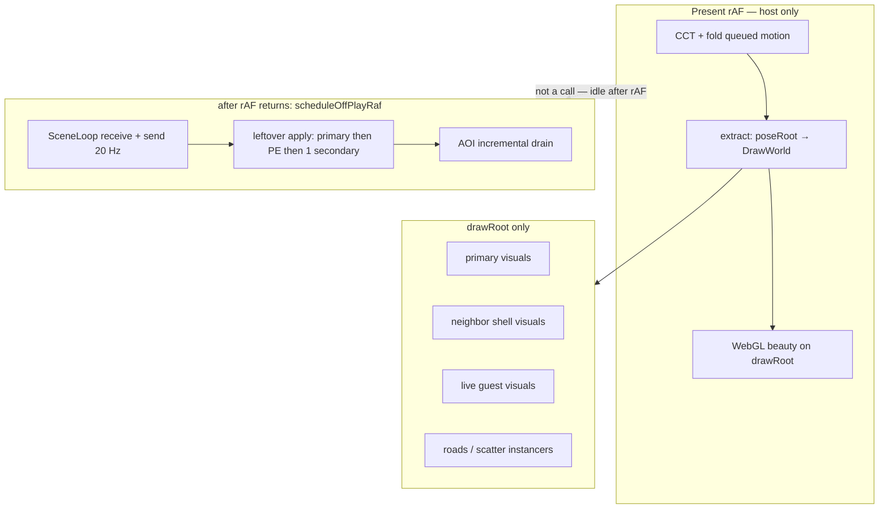
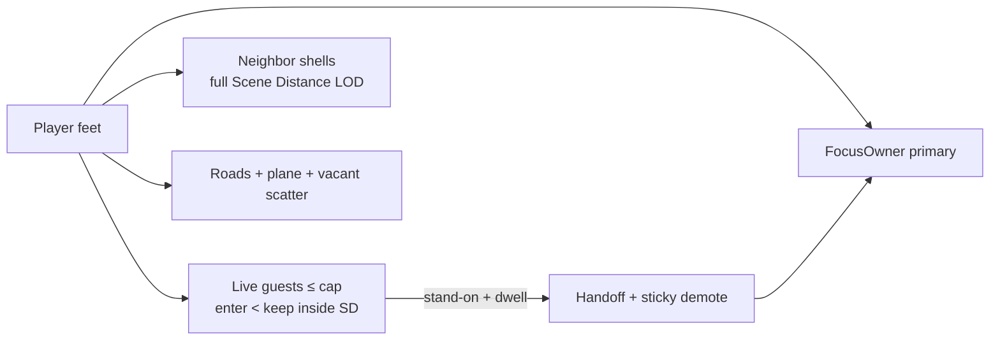

# Open-world residency (Genesis city load)

| Field | Value |
| --- | --- |
| **Author** | LastSlice (perfv2 city chapter) |
| **Date** | 2026-08-13 |
| **Status** | Live guests + Scene Distance disc **on**. Shells **on `v3`**. Promote **off**. |
| **Branch** | `v3` (city chapter after v2.2.0 clock) |
| **Audience** | Senior engineers who already know FocusOwner, SceneLoop, extract, and the multi-scene handoff |

---

## Overview

As of **v2.2.0** the clock is 🟢 and **live SceneLoop guests are compile-default on** (enter ≤20 m, cap 4). Scene Distance disc (roads / empty) is on. **`v3` turns neighbor composite shells on** so claimed estates are extract GLBs, not dirt. Stand-on promote stays **off**. Soft-route already updates the URL without a reload.

This document is the phased plan to make plaza → street → neighbor estate feel like one continuous verse: **no void, no loading screen, no full reload**, neighbor buildings actually there, FocusOwner correct under feet. It does that on `perfv2` by turning the existing (disabled) residency machine back on **in the host-invert shape**: pose vs draw, 20 Hz SceneLoop guests, extract-registered shells, leftover apply. Kill-switches that we invented (80 m GLB cliff, 16/8 clone caps used as “never show”, `LOAD_AOI_SCENE_VISUALS = false`, never-promote) are replaced by **budgets inside official Scene Distance**.

Ship order is mandatory: **shells → Scene Distance LOD → live guests → stand-on promote**. Each step is a feature-flagged PR whose **merge default is off** until a CBD walk log is pasted, then a one-line const flip. FPS bar is non-negotiable: **30–60 always, 60 on high**.

---

## Background & Motivation

### What we actually ship today (verified in tree)

| Lever | Value | File |
| --- | --- | --- |
| Neighbor workers / promote | `AOI_GLB_SHELLS_ONLY = true` → `aoiGlbShellsOnly()` | [`src/dcl/multiScene/caps.ts`](../src/dcl/multiScene/caps.ts) |
| Live-only / no first-frame | `AOI_LIVE_SECONDARIES_ONLY = true` → `aoiLiveSecondariesOnly()` (also true when shells-only) | `caps.ts` L17–18, L137–139 |
| Neighbor **draw** | `LOAD_AOI_SCENE_VISUALS = false` — composites cleared every discover | [`src/dcl/aoi/AoiVisualLayer.ts`](../src/dcl/aoi/AoiVisualLayer.ts) L112, L929–940 |
| Visual disc | `visualWarmRadiusM() = min(pref, AOI_SHELL_KEEP_M)` with `AOI_SHELL_KEEP_M = 80` | `caps.ts` L45–68 |
| Shell builder | `buildPlacementVisualGroup` emits one translucent AABB (`aoi-far-proxy`); `maxGltfs` unused; `cache` unused | [`src/dcl/aoi/compositeVisuals.ts`](../src/dcl/aoi/compositeVisuals.ts) L227–288 |
| Composite parse | Gltf + Transform only; **root-level parent 0**; skips Animator / MeshCollider / PointerEvents | `compositeVisuals.ts` L23–26, L77–79 |
| Heavy AOI drain after play-ready | `WALK_IDLE_MS = 2000` + `isPlayerSettled()`; `update()` **returns at L630** before drain | `AoiVisualLayer.ts` L90–95, L630, L658–666, L820–822, L1002, L1025–1028 |
| AOI parent | `ctx.hostScene.add(this.root)` — `aoi-visual-layer` is a **sibling of `draw-root`** | `AoiVisualLayer.ts` L482; `retargetPrimary` L446–447 |
| Shell hide | `applyShellVisibility` sets `group.visible` on scene children | `AoiVisualLayer.ts` L284–294 |
| Soft-route | Always on; promote evaluate returns early under shells-only | [`src/dcl/aoi/ScenePromoteController.ts`](../src/dcl/aoi/ScenePromoteController.ts) L198–230 |
| FocusOwner | Spawn primary forever (`tryPromoteInWorld` / `promotePrimary` no-op) | [`src/core/World.ts`](../src/core/World.ts) L4776; [`src/client/AppController.ts`](../src/client/AppController.ts) L3788 |
| Present hitch leftovers | `host.scene.add(root)` on live/demote; `pumpSecondaryMotionBridges` on `onSyncFrame` L1926–1928 | `SceneWorkerSlot.ts`, `SecondaryLiveManager.ts`, `World.ts` |
| Dual clock | `onAsyncFrame` calls `multiScene.tickSync` after `sceneLoop.send`; `secondaryTickIntervalMs() === 0` → `tickPlayFrame` | `World.ts` L2082–2091; `caps.ts` L172–174 |
| SceneLoop | `setPrimary` is a **getter**; `applyWorld` primary-only; no live-guest reconcile | `SceneLoop.ts` L37–41, L119–128 |

City fill that *does* run:

- One Genesis empty plane ([`genesisEmptyPlane.ts`](../src/dcl/aoi/genesisEmptyPlane.ts)).
- Explorer road catalog as `InstancedMesh` — **also clipped to `visualWarmRadiusM()`** (so roads die at 80 m even when the slider is 200). Comment at `AoiVisualLayer.ts` L2021 claims full Scene Distance; the loop at L1975 contradicts it. Rebuild is a full instanced-layer reconstruct on parcel-signature change (L1975–2008).
- Vacant scatter inside the same 80 m disc. Real catalyst footprints are correctly excluded from scatter (`realSceneFootprint`) — which, with visuals off, is exactly the **dirt void**: estate parcels are “claimed” so they get no trees, and they get no building either.

`docs/MULTI_SCENE_CONTINUITY.md` still says “neighbors = composite GLBs over Scene Distance” and “no extra 80 m gate,” and its status line says “shipping default = GLB shells only.” That is **aspirational / stale**. The running product is: pointers may fetch to Scene Distance; **meshes stop at 80 m; neighbor GLBs do not attach at all**.

`AOI_SHELL_KEEP_M` is also imported by [`directionalSunShadow.ts`](../src/rendering/directionalSunShadow.ts) (`SUN_SHADOW_DISTANCE_M`) and [`shadowCastPolicy.ts`](../src/rendering/shadowCastPolicy.ts) (`ENV_CASTER_KEEP_M`). It is a **shadow / PhysX-adjacent constant**, not only an AOI visual cliff. Phase 2 must not delete it.

### Official platform law we must match

Contributor Execution + [ADR-117](https://adr.decentraland.org/adr/ADR-117) (scene CRDT) + [ADR-204](https://adr.decentraland.org/adr/ADR-204) (comms: island ≠ scene room):

| Law | Meaning here |
| --- | --- |
| Continuous city | Several scenes resident; sight past the footprint; **no full reload** on parcel step |
| **Far** Scene Distance disc | `main.composite` + models **without eval** (CRDT/static). **No PhysX** on far shells — walk-through until a live guest cooks |
| **Closer / under Scene Distance** | Live guests (scripts tick, FocusOwner muted), **budgeted** (cap + enter/keep), not every entity in the disc |
| **Under feet** | Promote that deployment to FocusOwner; prior primary stays resident if still in range |
| Same multi-parcel entity | No promote; origin stays base |
| Scene UI / media / restricted actions / scene LiveKit | **FocusOwner only** |
| Soft-route | Every cell; **realm unchanged** on Genesis walk |
| Island ≠ scene room | Archipelago island is a **position-driven control plane**. Scene LiveKit is a **FocusOwner media plane**. They are not the same socket |
| Scene Distance | Preferences **0–200 m** ([`SCENE_LOAD_RADIUS_MAX_M`](../src/rendering/RenderQualitySettings.ts)); default **64 m** |

Our 80 m GLB kill, 16/8 clone caps used as a cliff, never-promote, and `LOAD_AOI_SCENE_VISUALS = false` are **our kill-switches**, not platform law.

### Three comms planes (do not collapse)

`CommsService.bindSceneTarget` ([`CommsService.ts`](../src/network/CommsService.ts) L643–671) **does not touch LiveKit sockets**. It rewrites origin / bounds / `sceneTarget` and calls `seedArchipelagoPresenceFromScene` (island seed from **scene origin center**, not feet). `applyPromoteHandoff` then calls `seedArchipelagoSceneLocal(feet)` (World L5111).

| Plane | Owner | On Genesis walk | On promote |
| --- | --- | --- | --- |
| **Realm** | catalyst `/about` | Unchanged | Unchanged |
| **Archipelago island** | position / proximity | May change island by feet | `bindSceneTarget` re-seeds from new origin center, then `seedArchipelagoSceneLocal(feet)` **is correct**. Do **not** promise “island room unchanged.” Do **not** `connect` island LiveKit when scene media is up (`pruneIslandLiveKitIfSceneMedia` already) |
| **Scene LiveKit** | FocusOwner only | Soft-route does not reconnect | See helper below. Secondaries **never** join a scene room |

```ts
// Reconnect scene LiveKit iff FocusOwner deployment changed.
// Do NOT compare commsAdapterHint — that is the realm /about adapter
// (Genesis archipelago). buildCommsTarget copies the same hint for plaza
// and every neighbor estate (World.ts L747). Comparing it never reconnects
// and leaves voice / scene packets on the spawn room.
function sceneRoomIdentityChanged(prev: SceneCommsTarget, next: SceneCommsTarget): boolean {
  return prev.sceneId !== next.sceneId || prev.pointer !== next.pointer
}
```

Gatekeeper `get-scene-adapter` is keyed by **`sceneId` + parcel + realmName**. `buildCommsTarget` sets `sceneId` from `scene.entityId` (World L738). Same-entity walks already no-op in `ScenePromoteController` (L215–218), so intra-estate 320 ms dwells **do not** reconnect — no fuzzy helper needed for that.

**Different `sceneId` ⇒ `connectSceneRoom` is expected** on a successful promote. Hitch-deferral is the **common** path, not a rare branch: measure reconnect; if it costs **>1 present frame**, defer the socket swap off present (`scheduleOffPlayRaf`) and keep publishing movement on the old room for one RTT. Always `bindSceneTarget` first (origin, before feet). Then, if identity changed, `connectSceneRoom` (deferred). Never compare `commsAdapterHint`.

### Host invert laws (non-negotiable on `perfv2`)

Present rAF is host-only ([`SceneHost.start`](../src/rendering/SceneHost.ts), [`docs/ARCHITECTURE.md`](./ARCHITECTURE.md)):

```text
rAF present:
  CCT + fold already-queued motion + extract + WebGL
  (guest send / receive / apply MUST NOT start on this rAF)

after this rAF returns → scheduleOffPlayRaf (not a call chained from present):
  SceneLoop.receive → reconcile → send (20 Hz, one in-flight)
  → peelMotion(primary) → applyWorld(primary)
  → tickAsync(PE then 1 secondary) → AOI drain
```

The mermaid below is a cartoon of that split. **Do not implement `present → async` as a function call from `renderMainPass`.** `scheduleOffPlayRaf` runs after the rAF callback returns ([`SceneHost.ts`](../src/rendering/SceneHost.ts) L543–556).

- `poseRoot` is **not** a child of `SceneHost.scene` and is **not rendered**.
- GPU objects must `DrawWorld.register(visual, pose)` or sit on an instancer under `drawRoot`. Present copies `pose.matrixWorld` (and `pose.visible`) only when they change; **leaf** frozen statics skip the matrix write.
- **Pose roots stay live.** `userData.dclDrawStatic` may be set on **leaf clones only**. Setting it on the shell pose (or calling `freezeStaticGraph` on the pose root) skips the matrix write after retarget — sky-GLB / stuck-at-old-SW. `DrawWorld.sync` always copies `pose.visible`, then skips the matrix when `dclDrawStatic` is set ([`DrawWorld.ts`](../src/rendering/DrawWorld.ts) L49–56).
- Instanced hide = **zero-scale slot** + `pose.visible` extract ([`SceneGltfInstancer.writeMatrix`](../src/rendering/SceneGltfInstancer.ts) L620–629). Billboard facing is an extract write on the instance matrix — it must not dirty the pose graph.
- Neighbor origin: `neighborOriginOffset(neighborBase, primaryBase)` × `dclToThreePos` on the **pose** root ([`compositeVisuals.ts`](../src/dcl/aoi/compositeVisuals.ts) L200–211, [`secondarySceneOrigin.ts`](../src/dcl/multiScene/secondarySceneOrigin.ts)). Rebake this on every primary-base change, then force one extract write.
- PhysX: `secondaryPhysOffset(slot) = 30_000_000 + slot × 2_000_000`. Rekey, do not recook. **Never wipe sticky ids on an empty dirty stream** ([`MULTI_SCENE_CONTINUITY.md`](./MULTI_SCENE_CONTINUITY.md) “Do not wipe when empty this frame”).
- Live neighbor guests **share SceneLoop** (`GuestKind: 'secondary'`, `priority = false`, `!inFlight`). PE already shows the pattern: `playFrameOwnedExternally` + `PeSlotGuest` at 50 ms. **`secondaryTickIntervalMs = 0` plus `SceneWorkerSlot.tickSync` → `tickPlayFrame()` every async frame is the FPS death** — do not re-enable that clock.
- **Never** `host.scene.add(entityStore.root)`. Roots stay on `poseRoot`. ThreeBridge already `DrawWorld.register`s.
- Promote: handoff + sticky demote. `comms.bindSceneTarget` **before** `restoreGenesisFeet`. Never `disposeSecondariesOnly` + `jumpIn` on walk.

### Never resurrect

| Anti-pattern | Why it dies |
| --- | --- |
| Neighbor owns rAF | Dual present clocks; CBD < 20 FPS |
| `disposeSecondariesOnly` + seamless `jumpIn` | Loading-screen void on parcel step |
| Parcel-count refuse / size-based tertiary | Estates never go live; plaza never stays sticky |
| Every-frame `syncCollisionForce` | Multi-shape expand thrash |
| Empty dirty stream = PhysX wipe | Missing-actors → recook death spiral |
| N full `syncRenderer` on one rAF | Apply blowout; next present skipped |
| Freeze **pose-root** TRS / `dclDrawStatic` on the shell pose | Sky-GLB / stuck-at-old-SW after retarget (the tertiary bug, reintroduced) |
| `host.scene.add(root)` as a “visibility fix” | Present walks pose graphs; invert broken |
| `pumpSecondaryMotionBridges` on `onSyncFrame` | Plaza mixers skip the next present |
| Double-send (`sceneLoop.send` + `tickSync` → `tickPlayFrame`) | Dual clock |

### Reuse (do not rewrite)

FocusOwner mute (`SceneScriptSystem.setFocusPolicy('secondary')`), `SceneWorkerSlot` origin + remapped colliders, `adoptDemotedPrimary`, rekey-not-recook (`physics.rekeyStaticColliderFamily`), SceneLoop guest types (`GuestKind` already includes `'secondary'`), PE external clock, `caps.ts` enter/keep/**cap** as **budgets**, `AssetCache.load` + clone (already used by [`SecondaryFirstFrameSampler.buildHierarchicalFirstFrameGroup`](../src/dcl/aoi/SecondaryFirstFrameSampler.ts)), `yieldToIdle` / `lastFrameOverBudget` / `scheduleOffPlayRaf`.

---

## Goals & Non-Goals

### Goals

1. Neighbor **content** on as extract-registered **neighbor shells** (real parent-walked GLBs from `main.composite`, not AABB toys), budgeted, incremental, **no 2 s settle hole**.
2. Visual band = **Preferences Scene Distance** (0–200 m), with LOD — not an 80 m cliff.
3. Live guests only as **SceneLoop secondaries** (muted FocusOwner). Enter/keep is a **budget inside Scene Distance** with **enter ≠ keep at the 64 m default**.
4. Stand-on **promote** with the existing handoff contract **plus invert leftovers fixed** (`World.applyPromoteHandoff`).
5. Dense and continuous **by Phase 2 retain**: roads + ground + neighbor silhouettes then full meshes. Phase 1 only fills the **nearest 12** composite neighbors; remaining claimed footprints stay plane (no trees).
6. Stay on **`perfv2`**. Incremental PRs. Feature flags: shells → Scene Distance disc (`aoiSceneDistanceVisuals`) → guests → promote. **Each PR merges with its flag off.**
7. FPS: **30–60 always, 60 on high**. Measure a CBD walk (plaza → street → neighbor estate) before any default-on flip.

### Non-goals

- Worlds / named realms / changeRealm (Genesis walk does not change realm).
- Running neighbor **scene UI, video, audio, privileged pointers, or scene LiveKit** on a secondary (FocusOwner law).
- Evaluating `bin/index.js` for the far disc (far = composite / models without eval).
- **PhysX on far shells.** Walk-through of unvisited estates is accepted until a live guest (or a later optional 48 m hull PR) cooks colliders.
- First-frame isolated `SceneHost` as the default shell path (too expensive; keep as fallback for script-built scenes with no composite).
- Landscape Distance / Shadows Distance backends.
- Raising PhysX road/scatter furniture to 200 m (visuals yes; CCT furniture stays ~48 m).
- Rewriting comms, shim/worker, or CRDT wire format.
- Runtime hot-toggle of flags after `World` bind (flags are **boot-time**; falling-edge teardown exists for unbind / `?noaoi` / next load).
- Shipping all three layers on in one PR.
- Deleting `AOI_SHELL_KEEP_M` (shadow / caster far).

---

## Proposed Design

### Product model (target)

```text
UNDER FEET …………………… FocusOwner (primary guest)
  scripts 20 Hz · UI / media / restricted / scene LiveKit
  origin = this deployment's base (no promote if same entity)

CLOSER (budgeted live ring inside Scene Distance)
  SceneLoop guests, GuestKind = 'secondary', FocusOwner muted
  hard cap by tier · enter < keep hysteresis · boot concurrency 1
  share leftover apply · one in-flight

FAR (rest of Scene Distance disc)
  neighbor shells: main.composite GLBs, no eval, no PhysX
  extract-registered · LOD by distance · hide not dispose

CITY FILL (full Scene Distance)
  genesis empty plane · Explorer roads · vacant scatter only
  never scatter / red dirt on real or resident footprints

ALWAYS
  soft-route every cell · realm unchanged
  island = position-driven · scene LiveKit = FocusOwner, reconnect when sceneId/pointer change (never commsAdapterHint; hitch-defer is the common path)
```





### Feature flags (boot-time; merge default off)

Three product flags plus a **city-fill disc** flag and the existing `?noaoi`. Flags are read **once** at `World` bind / `caps.ts` init (URL + compile const). They are not a runtime settings slider. Unbind / next load / `?noaoi` is the off path. Each flag still has a **falling-edge teardown** (see Rollback) so unbind does not leak `DrawWorld` links.

| Current getter | Fate |
| --- | --- |
| `LOAD_AOI_SCENE_VISUALS` | Delete. Replaced by `aoiNeighborShells()` |
| `AOI_GLB_SHELLS_ONLY` / `aoiGlbShellsOnly()` | Compat wrapper → `!aoiLiveGuests()` during cutover; delete call sites in the PR that lands live |
| `AOI_LIVE_SECONDARIES_ONLY` / `aoiLiveSecondariesOnly()` | **Delete.** It currently skips script-warm (`ScenePromoteController.ts` L249), double-gates live emit (`AoiVisualLayer.ts` L636–637, L825–828), and takes the first-frame-off branch (L944). First-frame becomes `aoiNeighborShells() && !findCompositeFile`. Live emit becomes `aoiLiveGuests()`. Script-warm becomes `aoiStandOnPromote() \|\| aoiLiveGuests()` (prefetch for boots), still `MAX_SCRIPT_WARM_PER_SCAN = 3` |
| `visualWarmRadiusM()` 80 m cliff | Stays until `aoiSceneDistanceVisuals()` (PR-2). Independent of shells |
| `skipAoiNeighbors()` (`?noaoi`) | **Unchanged and wins.** World skips bind entirely |

Getters (all false when `skipAoiNeighbors()`):

```ts
export function aoiNeighborShells(): boolean {
  if (skipAoiNeighbors()) return false
  return urlBool('aoishells', AOI_NEIGHBOR_SHELLS) // compile const default false
}

export function aoiLiveGuests(): boolean {
  if (skipAoiNeighbors()) return false
  return urlBool('aoilive', AOI_LIVE_GUESTS) // compile const default false
}

export function aoiStandOnPromote(): boolean {
  if (skipAoiNeighbors()) return false
  if (!aoiLiveGuests()) return false          // promote implies live
  return urlBool('aoipromote', AOI_STAND_ON_PROMOTE)
}

export function aoiSceneDistanceVisuals(): boolean {
  if (skipAoiNeighbors()) return false
  return urlBool('aoidisc', AOI_SCENE_DISTANCE_VISUALS) // default false
}
```

| Query | Effect |
| --- | --- |
| `?noaoi` / `?skipaoi` | Primary only. Wins over all flags |
| `?aoishells=0` / `=1` | Force shells off / on (ignored if `?noaoi`) |
| `?aoidisc=0` / `=1` | Force Scene Distance visual disc (roads/scatter/shell LOD radius) off / on |
| `?aoilive=0` / `=1` | Force live guests off / on |
| `?aoipromote=0` / `=1` | Force promote off / on; **no-op if live is off** |

`?aoishells=1&noaoi` → no AOI bind (noaoi wins). `?aoipromote=1&aoilive=0` → promote **off**. `?aoishells=1` does **not** lift roads to 200 m (`?aoidisc` is separate). Live does not imply promote. Shells do not imply live.

**Merge default for every feature PR is `false`.** Soak with the URL. After the CBD walk protocol is pasted in the PR that flips the const, a one-line follow-up sets that const `true`. Do not merge PR-1 with `AOI_NEIGHBOR_SHELLS = true`.

Delete the single-primary bench comment at `AoiVisualLayer.ts` L111 in PR-1.

---

### Phase 1 — Extract-registered neighbor shells

**Intent:** walk past an estate and **see its authored GLB hierarchy**. No workers. No promote. No 2 s hole. No AABB toys. No PhysX on those shells.

**Phase 1 success metric (honest):** nearest **12** composite neighbors show parent-walked authored GLBs; remaining claimed footprints stay **plane** (no trees). Dirt voids are *reduced*, not gone. Phase 2 retain=24 + full Scene Distance is when the disc fills.

#### 1.1 Parenting and extract invalidation

Today `AoiVisualLayer.bind` does `ctx.hostScene.add(this.root)`. That draws because `renderer.render(scene)` walks every child of `SceneHost.scene`, **including siblings of `draw-root`**. It bypasses extract:

- `pose.visible` is not law (`DrawWorld.sync` never sees the mesh).
- Instanced hide / billboard extract do not apply.
- Present walks extra graphs that the invert explicitly removed from the pose side.
- `retargetPrimary` L446–447 re-adds `this.root` to `hostScene`.

**Rule:** any real neighbor mesh is either

1. a **draw visual** registered with `host.drawWorld.register(visual, pose)`, pose parented under `host.poseRoot`, or
2. an **instancer slot** under `drawRoot` (zero-scale to hide).

City-fill (roads, scatter, empty plane) **stays a scene sibling in Phase 1**. Visibility / hide-with-live-guest on a **road** parcel is undefined until a later extract move: a live guest covering a road parcel already owns the footprint via `realSceneFootprint` / `residentParcelSet` (roads are skipped when a secondary scene owns the parcel). Do not hide the city-wide empty plane.

```text
poseRoot                          (not in scene)
  └── aoi-pose-root               Group — STAYS LIVE (no dclDrawStatic)
        └── aoi-shell:<entityId>  pose — STAYS LIVE
              position = dclToThreePos(neighborOriginOffset)
              userData.aoiEntityId, neighborBase
              (no Mesh children)

drawRoot
  └── registered clone group      visual — NOT dclDrawStatic on the group itself
        └── leaf GLB clones       MAY set dclDrawStatic + matrixAutoUpdate=false
                                  (local TRS never moves; world comes from pose)
```

**Extract invalidation contract (implement this, not “freeze the graph”):**

1. `DrawWorld.register(visual, pose)` once on attach. One link **per shell** in PR-1.
2. First extract writes the matrix. **Leaf** clones may then set `userData.dclDrawStatic = true` and `matrixAutoUpdate = false`. The **pose node and `aoi-pose-root` stay live** (`dclDrawStatic` unset, `matrixAutoUpdate` true).
3. Do **not** call today’s `freezeStaticGraph` on the pose root. If a freeze helper remains, it walks **visual leaves only**.
4. `applyShellVisibility` sets **`pose.visible` only**. Never `visual.visible`. Never scene-sibling `group.visible`. `DrawWorld.sync` copies `pose.visible` every frame (L49) and would overwrite a visual-only hide — shells would pop back on top of a live guest.
5. On `retargetPrimary` / `notifyPrimaryChanged` / any primary-base change: for every loaded shell, rebake `pose.position` from `neighborOriginOffset(entity.base, newPrimary.base)` × `dclToThreePos`, then force one extract write. Preferred: clear `dclDrawStatic` on the visual **group** for one frame (leaves can stay frozen — their local matrix is identity-under-pose). Alternative: `unregister`+`register`. Do **not** rebuild already-loaded ids.
6. Retarget assert (debug / test): after promote, shell pose world XZ equals `dclToThreePos(neighborOriginOffset(entity.base, newPrimary.base))` within 0.01 m.
7. LRU / unbind / shells-off: `DrawWorld.unregister(visual)` **before** disposing the pose node. `compositeRoot.clear()` is not enough.

`AoiVisualLayerContext` takes `host: SceneHost` (poseRoot + drawWorld), not just `hostScene`. `retargetPrimary` parents nothing onto `host.scene`.

`loadedCompositeIds: Set<string>` becomes `loadedShells: Map<string, AoiShellRecord>` (see Data Model).

#### 1.2 Real GLBs — three Phase-1 laws

Delete the AABB body of `buildPlacementVisualGroup`. Delete the unused-`cache` proxy path. Do not leave a dead `maxGltfs` on an `aoi-far-proxy` builder.

Replace with a parent-walk clone builder (same algorithm as `buildHierarchicalFirstFrameGroup`, **no worker**). **Do not inflate a whole estate on one drain tick.**

1. Parse composite `core::GltfContainer` + `core::Transform` **including `parent`**. Build a node per Transform entity; parent them the way the first-frame sampler does (`SecondaryFirstFrameSampler.ts` v7). Root-only extract is **not** “shells on.”
2. Sort placements by silhouette key `max(|sx|, |sy|, |sz|) * max(1, |py|)` (height-weighted; a huge underground scale-mesh must not beat a tower). Cap the *list* at `maxGltfs`. Ground-skip remains opt-in via `aoiSkipGroundGlbs`.
3. Create `{ pose, visual, pendingSrcs[] }` immediately (hierarchy empty of clones). `DrawWorld.register(visual, pose)` once. Store a **minimal** `AoiShellRecord` (`entityId`, `neighborBase`, `pose`, `visual`, `pendingSrcs`, `attachedCount = 0`, `targetCount = pendingSrcs.length`). That is enough for PR-1 — bands/hysteresis wait for PR-2.
4. **Attach at most 1 clone per leftover drain turn.** `yieldToIdle` **before each** `cache.load`. If leftover &lt; 2 ms or `lastFrameOverBudget(33)`, return and resume the **same** shell next drain (`attachedCount < targetCount`). Never `Promise.all` N loads. `COMPOSITE_LOAD_PER_DRAIN = 1` means one *clone*, not one estate of 16.
5. Hide nodes named `*collider*` (visual only). **Do not emit PhysX.** Far shells are walk-through. That is law, not an accident. Optional later PR: composite `MeshCollider` hulls only inside `ROAD_PHYS_RADIUS_M` (48 m) — not silent, not Phase 1.
6. **Animator (clip-0 freeze) — `root.clone(true)` does not carry `CachedGltf.animations`.** Bind-pose-only is not accepted. Pose the **clone**, never the cached template:

```ts
const { root, animations } = await cache.load(url, hash)
const clone = root.clone(true)
const clip = animations[0] // implicit default = first embedded clip (implicitAnimator)
if (clip) {
  const mixer = new THREE.AnimationMixer(clone)
  mixer.clipAction(clip).play()
  mixer.setTime(0)
  mixer.stopAllAction()
  mixer.uncacheRoot(clone)
  // drop mixer — do not retain, do not tick on present
}
```

7. Parent the posed clone under the matching visual hierarchy node. Increment `attachedCount`.

`buildCompositeVisualGroup` stays the fetch wrapper (JSON only). Clone attach lives in the drain caller so leftover can stop mid-estate.

#### 1.3 Incremental drain — all four clocks

`WALK_IDLE_MS = 2000` was added because 350 ms settle thrashed discover+drain mid-walk. That is the right instinct for **full rediscover**, the wrong gate for **one already-queued composite**.

**If PR-1 only deletes the settle test inside `drainOutstandingWork`, walking still never drains.** `update()` **returns at L630** on `!isPlayerSettled()`. `mayDrainThisRefresh` at L820–822 is `prewarm || allowDrainOnce || settled`. `drainOutstandingWork` re-checks settle at L1002 and L1025–1028. All four must change.

| Clock | Function | Rule |
| --- | --- | --- |
| 1. Per-frame LOD / near PhysX | `AoiVisualLayer.update` | Always run `updateStickyScatterLod` + `maybeSyncNearEmptyLandPhys`. **Do not `return` on `!isPlayerSettled`.** |
| 2. Full pointer rediscover | `shouldFullDiscover` / `scheduleDiscover` / `refresh` | Keep `DISCOVER_MIN_MOVE_M = 128` + `REFRESH_DEBOUNCE_MS = 600`. Independent of settle. |
| 3. Drain | `update` → leftover async → `drainOutstandingWork` | Every async turn with leftover ≥ 2 ms **and** `!lastFrameOverBudget(33)`, **even mid-walk**. Drop settle tests at L1002 and L1025–1028. `mayDrainThisRefresh` becomes `prewarm \|\| allowDrainOnce \|\| aoiNeighborShells()` (or simply “has leftover + not over budget”). **`COMPOSITE_LOAD_PER_DRAIN = 1` clone** (not one estate). `yieldToIdle` before **each** `cache.load`. Resume the same `AoiShellRecord` until `attachedCount === targetCount`. Keep `lastDrainAt` 400 ms throttle. |
| 4. Live-candidate emit | `emitLiveSecondaryCandidatesOnly` | Play-ready (`liveReconcileEnabled`), **not** settle. Discover L817–818 already wants this; the L630 early return currently undoes it. |

`isPlayerSettled` may remain for optional extra work (debug logs, uncapped scatter). It is **not** a gate for clocks 1, 3, or 4.

Prewarm during primary hydrate stays; `cancelPrewarm('play-ready')` stays so Jump In does not force-uncap.

Expected attach rate: ~1 **clone** / 400–800 ms while walking. A 6-estate street gets a first silhouette (1 GLB each) in ~3–5 s; full `maxGltfs` fills over subsequent drains. Not after the player stops for 2 s.

When `!aoiNeighborShells()`, `refresh` must **not** `compositeRoot.clear()` as a side effect of discover if teardown already ran; call `teardownShells()` once on the falling edge (see Rollback).

---

### Phase 2 — Scene Distance LOD (no 80 m *visual* cliff)

**Intent:** Preferences Scene Distance is the **mesh** disc. 80 m remains a **shadow / caster / near-PhysX** constant.

#### 2.1 Radius functions

`visualWarmRadiusM()` is also the **road + scatter** clip (`AoiVisualLayer.ts` L890, L1975, `SCATTER_LOD_HIDE_M`). Ungated `return pref` on PR-2 merge instantly meshes city fill out to 200 m for every player, shells on or off. That is not “merge default off.”

```ts
// caps.ts — PR-2. AOI_SCENE_DISTANCE_VISUALS compile default = false.
export function aoiSceneDistanceVisuals(): boolean {
  if (skipAoiNeighbors()) return false
  return urlBool('aoidisc', AOI_SCENE_DISTANCE_VISUALS)
}

export function visualWarmRadiusM(): number {
  const pref = renderQuality.getSceneLoadRadiusM()
  if (pref <= 0) return 0
  // Gate the 80 → pref lift. ?aoishells=1 alone must NOT push roads to 200 m.
  if (!aoiSceneDistanceVisuals()) return Math.min(pref, AOI_SHELL_KEEP_M)
  return pref
}

export function compositeMaxGltfsForDistance(distM: number, _parcels: number): number {
  const d = visualWarmRadiusM()
  if (d <= 0 || distM > d) return 0
  if (distM <= Math.min(48, d * 0.35)) return 24   // near
  if (distM <= Math.min(120, d * 0.75)) return 8    // mid
  return 3                                          // far massing
}
```

`?aoidisc=1` soaks the disc lift after incremental road enqueue exists. Flip `AOI_SCENE_DISTANCE_VISUALS` only after the CBD walk at slider 64 **and** 200. This flag is **independent** of `aoiNeighborShells()`: shells can ship at 80 m (PR-1) while fill stays cliffed.

**Keep `AOI_SHELL_KEEP_M = 80`.** Rename in comments to “shadow / env-caster / near-PhysX keep **and** visual cliff while `!aoiSceneDistanceVisuals()`.” When the disc flag is on, scatter visual hide becomes `visualWarmRadiusM()`; scatter **PhysX** stays `EMPTY_LAND_PHYS_RADIUS_M = 48`. Sun shadow far stays `AOI_SHELL_KEEP_M`.

| Band | Typical at default 64 m | Typical at 200 m | What you see |
| --- | --- | --- | --- |
| Near | 0–22 m | 0–48 m | Up to 24 GLBs, clip-0 freeze, no cast shadows |
| Mid | 22–48 m | 48–120 m | 8 largest |
| Far | 48–64 m | 120–200 m | 3 largest (roofs / towers) |
| Past SD | hide | hide | `pose.visible = false`; purge at `SD + 80` or 160 m |

Hide ≠ dispose. Re-enter is a visibility extract, not a reload.

Roads: visual tiles use **full Scene Distance**. Do **not** lift the 80 → 200 clip by reconstructing the entire instanced layer on slider drag / Jump In (`refreshRoadTiles` L1975–2008). Incremental enqueue: pending road parcels + `ROAD_ADD_PER_DRAIN` (new, start at 32), same leftover/over-budget gate as composites. PhysX furniture stays `ROAD_PHYS_RADIUS_M = 48`.

Scatter: vacant-only; visual LOD hide at Scene Distance; purge at SD+80; PhysX 48 m. Keep `SCATTER_ADD_PER_REFRESH = 48`.

Retain: `COMPOSITE_MAX_RETAINED` → **24** (LRU, mega first). CBD unique SDK7 entities at 64 m are typically 15–25; at 200 m ~30–50. Phase 2 is when “no dirt voids at the shipping default” becomes a real claim.

Draw-call fail number: if `renderer.info.render.calls` stays **> 800** on the CBD walk at 64 m high, shrink near `maxGltfs` or route repeated hashes through `SceneGltfInstancer` before flipping the Phase-2 default on. 1k is the hard abort.

#### 2.2 LOD algorithm (not a sketch)

Per-entity state (replaces `Set` of ids):

```ts
type AoiShellBand = 'near' | 'mid' | 'far' | 'hidden'

type AoiShellPlacement = {
  src: string
  poseLocal: { position; rotation; scale } // neighbor-local, already parent-walked
  node: THREE.Object3D                     // child of visual; hide = node.visible
  attached: boolean
}

type AoiShellRecord = {
  entityId: string
  neighborBase: string
  pose: THREE.Group                 // live; DrawWorld pose
  visual: THREE.Group               // registered against pose
  placements: AoiShellPlacement[]   // sorted by silhouette key desc
  attachedCount: number
  targetCount: number
  band: AoiShellBand
  bandLockUntilDist: { lo: number; hi: number } | null
}
```

- First attach (already in PR-1): `targetCount = compositeMaxGltfsForDistance(...)`; attach **1 clone per leftover turn** until `attachedCount === targetCount`. Never attach a full `maxGltfs` estate on the first tick.
- Upgrade: when band raises `targetCount`, each drain tick appends the **next largest not-yet-attached** placement (1 per drain). Same leftover gate.
- Downgrade: `targetCount` drops → set `placements[i].node.visible = false` for i ≥ target (children of an already-registered visual — **allowed**; PR-1 does not need N DrawWorld links). Do not unregister.
- **Band hysteresis:** a band change requires `dist` to cross the band edge by **± 8 m**. Store `bandLockUntilDist`. Walking 47–49 m must not append/hide every drain.
- One `DrawWorld` link per shell (PR-1 contract). Per-placement pose nodes / instancer is optional Phase 2.1 if draw calls fail the 800 budget — not required to lift the cliff.
- `applyShellVisibility` still only flips the **shell pose.visible** (live-guest handshake). LOD child hides are independent.

#### 2.3 Script-built neighbors (no composite)

`SecondaryFirstFrameSampler` is the fallback. **Not** the default.

Enable only when `aoiNeighborShells() && !findCompositeFile(ent)` and footprint is in the **near** band.

Clock / budget (write this in PR-2 or the sampler blows the FPS bar):

- `FF_MAX_CONCURRENT_SAMPLES = 1`, `FF_MAX_VISIBLE = 3`, `FF_MAX_RETAINED` stays 6.
- Isolated host **after** present only (`scheduleOffPlayRaf` / `yieldToIdle`). The sampler must **not** `tickPlayFrame` on the present rAF. It does not join SceneLoop (it is a bake, not a guest).
- After bake: `DrawWorld.register` the group against a live pose (same contract as composites). Then **dispose the sample worker + hidden `SceneHost`** before `onReady` returns (`SecondaryFirstFrameSampler.ts` already disposes — keep that; do not leave the isolated host in the document body).
- Hard-fail the sample if `lastFrameOverBudget(33)` for **3 consecutive** host frames while sampling; leave the footprint as plane and do not retry this session (`doneIds`).
- `MAX_GLTFS = 400` is an Angzaar ceiling. After extract-register, the visible count is still capped by `FF_MAX_VISIBLE` and the near `maxGltfs` (24). Extra clones stay on the hidden retained group, not 400 draw meshes in the disc.
- Count against `COMPOSITE_MAX_RETAINED` (shared retain): a first-frame group occupies a retain slot.

Default Scene Distance **stays 64 m**. Players who want 100 set the slider. Do not raise the default in this chapter.

Near-band shells **do not cast shadows** (`castShadow = false`). Measure before giving them a caster cap.

**Status:** First-frame sampling is **on** under this budget (`queueFirstFrameSecondaries` + `SecondaryFirstFrameSampler`). Live secondary enter is `min(Scene Distance×0.35, 32)` — not the full visual disc; shells and first-frame still fill Scene Distance / near band respectively.

---

### Phase 3 — Live guests as SceneLoop secondaries

**Intent:** closer neighbors **tick** (doors, NFTs, simple motion) without owning rAF and without FocusOwner.

**Deps:** PR-1 **and** PR-2. Live enter scales with Scene Distance; 200 m enter against an 80 m shell disc is a different product.

#### 3.1 Clock — landing diff, not a slogan

Name-disambiguate:

| Method | Owner | Job |
| --- | --- | --- |
| `MultiSceneRuntime.reconcileSecondaries(candidates)` | already exists (World L961) | **Boot / evict workers** from AOI candidate list |
| `SceneLoop.reconcileLiveGuests(manager)` | **new** (do not call it `reconcileSecondaries`) | Add/remove `GuestKind: 'secondary'` guests to match **running secondary-mode** slots |

`SceneLoop.setPrimary(() => this.sceneScript)` is already a getter (World L395). After `this.sceneScript = newSystem` the primary guest follows. **Do not** add a `setPrimary` call in PR-4. What *is* required: reconcile live guests so the demoted system is no longer sent as if it were still the only clock, and is added as `secondary:<entityId>` (or dropped while tertiary).

`SceneScriptGuest.isDue`: secondaries **must not** honor `needsImmediateGuestTick()` (no pointer inject). 50 ms only. Update the file comment (“primary today; PE/secondary later”) — PE is `PeSlotGuest`; secondary is this PR.

Required deletes / moves in **PR-3** (not “unless invert left a stale add” in PR-4):

1. Delete every `host.scene.add(root)` in `SceneWorkerSlot` (`applyModeVisuals` L213–215, `retargetPrimaryBase` L112–114, `start` adopted L244–246), `SecondaryLiveManager.ensureResidentsVisible` L188–197, `adoptDemotedPrimary` orphan L350–352 / L442–444 / L470–472. Roots stay on `poseRoot`.
2. `SecondaryLiveManager.setPlayFrameOwnedExternally(true)` from `World.attachMultiScene`, next to PE.
3. Move `pumpSecondaryMotionBridges` **off** `onSyncFrame` (L1926–1928). Present may fold *already queued* motion only. Pump on leftover async after send (keep the existing 3-frame LOD / held delta — that LOD is now on the async clock, not a reason to stay on present).
4. `tickSync` / `tickStickySync`: if owned externally → **do not** `tickPlayFrame`. `tickStickySync` during the 8 s settle must not become a back door (`forceAllResidentsTertiary` already pauses scripts; keep `tickPlayFrame` off anyway).

**`onAsyncFrame` is a patch of the existing callback, not a replacement.** The real body continues through pointer prepare, `applyPhysicsCollidersTimed`, `tickDeferredMaterials`, `syncAsyncBridges`, animator PART poses, then `tickAsync` (World L2110–2204). Do **not** delete those tails.

Diff against today’s function (L2072–2204):

```diff
  this.sceneLoop.receive()
  if (this.playerMode && this.player && this.guestTickPlayer && this.guestTickCamera) {
    this.sceneLoop.reconcilePe(this.multiScene?.pe ?? null)
+   this.sceneLoop.reconcileLiveGuests(this.multiScene?.secondaryManager ?? null)
    this.sceneLoop.send({ ... })
    this.sceneLoop.peelMotion(2)
    if (remain() > 2) {
      this.multiScene?.tickSync(...)   // PE pointer only; secondaries no-op when owned externally
+     this.pumpSecondaryMotionBridges(_delta, this.guestTickFrame) // leftover, not present
    }
-   if (remain() > 2 && !this.sceneLoop.lastApplyOverran(28)) {
-     const pos = this.player.getPosition()
-     this.aoiVisual.update(pos.x, pos.z)
-     this.scenePromote.tick(pos.x, pos.z)
-   }
  }
  if (remain() > 2) {
    await this.sceneLoop.applyWorld(Math.min(8, remain()))
  }
  // KEEP: pumpMotionBridges visualOnly, pointer prepare, applyPhysicsCollidersTimed,
  // tickDeferredMaterials, syncAsyncBridges, snapshotPhysMotionSets / PART poses.
  if (this.multiScene?.hasAsyncTickWork()) {
    await this.multiScene.tickAsync({ applyBudgetMs })  // unchanged cursor
  }
+ if (remain() > 2 && !lastFrameOverBudget(33) && this.player) {
+   const pos = this.player.getPosition()
+   this.aoiVisual.update(pos.x, pos.z)     // drain AFTER leftover apply
+   this.scenePromote.tick(pos.x, pos.z)
+ }
```

Today `aoiVisual.update` runs **before** `applyWorld` (L2093–2096). PR-3 **moves** that block to after `tickAsync` so one clone inflate cannot steal primary apply / collider / bridge work. If remain is gone, skip drain — next async turn continues the same shell (`attachedCount`). That is how leftover-aware attach-1 survives live guests.

Also **remove** `pumpSecondaryMotionBridges` from `onSyncFrame` L1926–1928 (present). The insert above is its only remaining call.

`secondaryTickIntervalMs`: unused on the hot path; if anything still calls `slot.tickSync`, pass **50**, never `0`.

Tertiary: not a SceneLoop guest. `reconcileLiveGuests` drops them. Re-enter = add guest back, no GLB reload.

**Handoff / settle (used by PR-4, implemented in PR-3):** after `forceAllResidentsTertiary('promote-settle')`, call `sceneLoop.reconcileLiveGuests` **in the same function**. Settle-end (`setSecondaryActivityEnabled(true)`) reconciles again.

#### 3.2 Enter / keep — real hysteresis at the 64 m default

`enter == keep` at the shipping default is a boot storm. Under-feet force-boot (`priorityParcelKey`) is **outside** these radii, so promote does not need `enter === Scene Distance`.

```ts
export function secondaryLiveEnterRadiusM(): number {
  if (!aoiLiveGuests()) return 0
  const d = renderQuality.getSceneLoadRadiusM()
  if (d <= 0) return 0
  return Math.min(d * 0.35, 32)
}

export function secondaryLiveKeepRadiusM(): number {
  if (!aoiLiveGuests()) return 0
  const d = renderQuality.getSceneLoadRadiusM()
  if (d <= 0) return 0
  const enter = secondaryLiveEnterRadiusM()
  return Math.min(d, Math.max(enter + 16, d * 0.6))
}

export function secondaryLiveCap(tier: PerformanceTier): number {
  if (!aoiLiveGuests()) return 0
  if (tier === 'low') return 1
  if (tier === 'medium') return 2
  return 3
}
```

| Scene Distance | enter | keep | slack |
| --- | ---: | ---: | ---: |
| 32 m | 11 | 27 | 16 |
| **64 m (default)** | **22** | **38** | **16** |
| 100 m | 32 | 60 | 28 |
| 200 m | 32 | 120 | 88 |

Cap 1/2/3 + boot concurrency 1 + under-feet priority. Parcel count **never** refuses a boot.

#### 3.3 Origin, extract, PhysX

Live guest `EntityStore` is constructed on `host.poseRoot`. `ThreeBridge` already `DrawWorld.register`s. **Stop reparenting onto `host.scene`.** Keep `applySecondarySceneRootOrigin` on that pose root. PhysX: `secondaryPhysOffset`, dirty-once, `allRegisteredPhysIds()`.

When the live graph is ready, `markLiveSecondaryGraphReady` → `applyShellVisibility` → **`pose.visible = false`**. Evict / tertiary → `pose.visible = true` (no reload).

#### 3.4 FocusOwner mute (audit, do not regress)

| Surface | Secondary |
| --- | --- |
| Scene UI | `uiDetached` / never paint `#scene-ui-root` |
| Video / audio | `setFocusPolicy('secondary')` hard mute |
| InputHub privileged | none |
| InputModifier / AvatarModifier / CameraMode | never apply player-frame |
| VirtualCamera | not freecam owner |
| RestrictedActions / scene LiveKit | FocusOwner only |
| `movePlayer` / `teleport` / `changeRealm` / `openExternal` | `wireSecondaryHandlers` already nulls |
| `openNftDialog` / `copyToClipboard` / `triggerEmote` | **Must also null** on both boot and adopt paths. Today adopt strips some via World; boot `wireSecondaryHandlers` does not mention these three. Incomplete mute = neighbor dialogs after live guests land |

#### 3.5 Promote settle vs live clock

`SETTLE_LIVE_SECONDARIES_MS = 8_000` is a **live-boot** pause. Shells and sticky meshes stay. `forceAllResidentsTertiary` + `reconcileLiveGuests` in the same handoff. Do not lengthen settle. Do not use it as a visual hole.

---

### Phase 4 — Stand-on promote

**Intent:** FocusOwner is the deployment under feet. Prior primary stays resident.

This is **not** “flip `aoiGlbShellsOnly()`.” It is “fix invert leftovers + enable `aoiStandOnPromote()`” after PR-3 soak.

The existing order in `World.applyPromoteHandoff` L4798–5176 stays. Do not reorder `bindSceneTarget` before `restoreGenesisFeet`. Add a debug assert: after restore, `origin + feetLocal` parcel equals the soft-route cell.

**PR-4 checklist (all required):**

1. `takeSecondaryForPromote` (or force-boot under-feet, then take). **No** `jumpIn`.
2. Rekey new primary phys ids offset → native.
3. `multi.notifyPrimaryChanged(newScene)` so sticky offsets are vs the **new** SW.
4. Revoke FocusOwner on old (`setFocusPolicy('secondary')`, drop InputHub, clear hide/camera).
5. `adoptDemotedPrimary` — always **secondary** mode, parcel count irrelevant. **No** `host.scene.add` on the success path **or** the demote-fail / same-entity orphan paths (World L4900, L4918).
6. Rekey old native → offset + pose-slide (`forceRecookOnPoseChange: false`).
7. Wire adopted system as `this.sceneScript`. Primary SceneLoop guest follows the getter. **Do not** call `sceneLoop.setPrimary`.
8. **`comms.bindSceneTarget(newPrimary)` then `restoreGenesisFeet`.** Realm unchanged. Archipelago: `seedArchipelagoSceneLocal(feet)` after restore (position-driven; island **may** change). Scene LiveKit: if `sceneRoomIdentityChanged(prev, next)` (`sceneId` / `pointer` — **not** `commsAdapterHint`) then `connectSceneRoom` is **expected** (successful promote to a new deployment). Same-entity no-op already skips this on intra-estate walk. Defer the socket off present when connect costs >1 frame; keep publishing on the old room for one RTT. Secondaries never join.
9. Freecam durable (`notifySceneFocusHandoff` — snap boom only).
10. `applySignedFetchSceneContext` / Admin Tools (already L5022–5024) — keep; they belong in this list.
11. Register demoted parcels with AOI **before** `retargetPrimary`.
12. **Shell pose rebake** (Phase 1.1 contract) inside `retargetPrimary`. Then `ensureResidentsVisible` must **not** `host.scene.add`.
13. `forceAllResidentsTertiary('promote-settle')` then `sceneLoop.reconcileLiveGuests` **in this function**. Soft-route to feet cell.
14. 8 s live-boot settle; settle-end reconciles live guests again.

Same multi-parcel entity: `ScenePromoteController` already no-ops when `primaryParcels.has(key)`. Empty / road never promote. Dwell 320 ms / cooldown 2 s stay. Soft-route is **not** gated on promote.

`AppController.promotePrimary` already waits for force-boot and **aborts seamless jump** if handoff fails. Leave that abort.

`wireSecondaryHandlers` mute audit from Phase 3.4 must be done before the flag can go on (can land in PR-3).

---

### Phase 5 — Density (can overlap 2–4)

- Default ground on **all** non-road AOI parcels (plane already). Scatter **only** vacant / catalyst-empty. This law already exists; Phase 1 does not invent it.
- Roads across full Scene Distance with **incremental** enqueue (Phase 2).
- Shells before live (so a booting guest never opens a hole).
- No procedural trees on CBD / resident footprints (`residentParcelKeys` + `realSceneFootprint`).
- `retargetPrimary` must not wipe tertiary/sticky meshes **and** must rebake shell poses (Phase 1.1).
- Do not claim “no dirt voids” until retain ≥ measured unique composite entities at the **shipping** Scene Distance (64 m).

---

### Sequence: walk plaza → street → estate

```mermaid
sequenceDiagram
  participant Feet
  participant AOI as AoiVisualLayer
  participant Loop as SceneLoop
  participant Multi as SecondaryLiveManager
  participant World
  participant Comms

  Feet->>AOI: update(scene-local) even while walking
  AOI->>AOI: discover debounce (128 m)
  Note over AOI: leftover async after applyWorld
  AOI->>AOI: drain 1 clone (extract register, parent-walk)
  Note over AOI: estate silhouette, no 2s wait

  Feet->>AOI: footprint dist ≤ live enter
  AOI->>Multi: reconcileSecondaries(candidates)
  Multi->>Loop: reconcileLiveGuests → GuestKind secondary
  Multi->>AOI: graphReady → pose.visible = false

  Feet->>World: dwell 320 ms on foreign SDK7 cell
  World->>Multi: takeForPromote / force-boot
  World->>Comms: bindSceneTarget then feet. connectSceneRoom if sceneId/pointer changed
  World->>World: restoreGenesisFeet
  World->>AOI: retargetPrimary rebakes shell poses
  World->>Multi: adoptDemotedPrimary (sticky, stay on poseRoot)
  World->>Loop: reconcileLiveGuests after forceAllResidentsTertiary
  Note over World: FocusOwner swapped; plaza meshes stay
```

---

## API / Interface Changes

### `caps.ts`

```ts
export function aoiNeighborShells(): boolean
export function aoiLiveGuests(): boolean
export function aoiStandOnPromote(): boolean // implies aoiLiveGuests() && !skipAoiNeighbors()
export function aoiSceneDistanceVisuals(): boolean // PR-2 disc lift; default false

/** @deprecated use !aoiLiveGuests — delete with PR-3 */
export function aoiGlbShellsOnly(): boolean

export function visualWarmRadiusM(): number
  // min(pref, 80) until aoiSceneDistanceVisuals(); then pref. AOI_SHELL_KEEP_M stays for shadows.

export function secondaryLiveEnterRadiusM(): number
export function secondaryLiveKeepRadiusM(): number
  // PR-3: 0.35d/32 and keep = min(d, max(enter+16, 0.6d)); 0 if !aoiLiveGuests()

export function secondaryTickIntervalMs(_tier: PerformanceTier): number
  // unused hot path; if kept, return 50 never 0
```

### `AoiVisualLayerContext`

```ts
export type AoiVisualLayerContext = {
  scene: ResolvedScene
  cache: AssetCache
  host: SceneHost            // was hostScene: THREE.Scene
  // … collider + candidate callbacks unchanged
}
```

`World` bind: `host: this.host`. `retargetPrimary` must not `host.scene.add(this.root)`.

### `SceneLoop`

```ts
reconcileLiveGuests(manager: SecondaryLiveManager | null): void
// NOT named reconcileSecondaries — that name boots workers on MultiSceneRuntime.
// applyWorld: primary first (unchanged).
```

### `SceneScriptGuest`

```ts
isDue(now: number): boolean {
  if (this.kind === 'secondary') {
    return this.sentAt <= 0 || now - this.sentAt >= 50
  }
  if (this.getSystem().needsImmediateGuestTick()) return true
  return this.sentAt <= 0 || now - this.sentAt >= 50
}
```

### `SecondaryLiveManager`

```ts
setPlayFrameOwnedExternally(owned: boolean): void
listRunningSecondarySlots(): ReadonlyArray<{ id: string; slot: SceneWorkerSlot }>
// tickSync / tickStickySync: if owned externally → do not tickPlayFrame
```

### `compositeVisuals.ts`

Delete AABB `aoi-far-proxy`. New:

```ts
export async function buildPlacementVisualPair(opts: …): Promise<{
  pose: THREE.Group
  visual: THREE.Group
  pendingSrcs: Array<{ src: string; /* parent-walked local TRS */ }>
}>
```

Walks `Transform.parent`. Returns **sorted pending srcs**, not N clones. Drain attaches 1/`cache.load` per leftover turn (clip-0 freeze on the clone via `animations[0]`; never mutate the cached template). No PhysX.

### `applyShellVisibility`

```ts
private applyShellVisibility(): void {
  for (const rec of this.loadedShells.values()) {
    rec.pose.visible = !this.liveGraphReadyIds.has(rec.entityId)
  }
  // first-frame records use the same pose.visible field
}
```

---

## Data Model Changes

No catalyst / IDB schema change. Runtime-only:

| Store | Change |
| --- | --- |
| `AoiVisualLayer.loadedCompositeIds` | → `loadedShells: Map<string, AoiShellRecord>` |
| `DrawWorld.links` | One entry per shell (PR-1/2). Unregister on LRU / unbind / shells-off |
| `SceneLoop.guests` | `secondary:<entityId>` while `residentMode === 'secondary'` |
| PhysX ids | Unchanged namespaces (30 M + slot × 2 M). Shells add **zero** ids |
| Soft-route | Unchanged `replaceState` |
| Comms | `bindSceneTarget` on every promote (origin). `connectSceneRoom` when `sceneId` or `pointer` changed — **expected** on successful promote. Never compare `commsAdapterHint`. Island seed follows feet |

Migration: none. Rollback = boot next load with the flag off, or `?noaoi`. Teardown on unbind must `unregister` (see Rollback).

Storage: 24 shells × ~8–24 GLB clones, mostly shared `AssetCache` hashes. First-frame sampler remains the expensive path and stays near-band + cap 3 + isolated-after-present.

---

## Alternatives Considered

### A. Keep AABB proxies / “silhouette boxes”

**Pros:** Cheap, already written.  
**Cons:** Estates look like debug volumes; dirt voids remain; `maxGltfs` is a lie. **Reject.**

### B. First-frame worker for every neighbor (no composite path)

**Pros:** Correct hierarchy for script-built scenes; one code path.  
**Cons:** Isolated `SceneHost` + `tickPlayFrame` until settle (3.5 s+). Cap 1 concurrent. Cannot fill a 200 m disc. Use **only** as near-band fallback when `main.composite` is missing (PR-2), isolated after present, dispose worker before return.

### C. Uncapped live guests across full Scene Distance

**Cons:** CBD 30–50 VMs. Dual-worker thrash, `secondaryTickIntervalMs = 0` death. **Reject.** Budgeted live + full-disc shells.

### D. Dispose + `jumpIn` on stand-on

**Cons:** Loading screen, void, warp, plaza PhysX wipe. **Reject.** Handoff + sticky demote.

### E. Root-only composite extract (defer parent-walk)

**Cons:** Typical Creator Hub estates parent props under pivots. Root-only is a hollow silhouette — the dirt-void look this chapter exists to kill. Composite JSON already has `parent`; walking it needs no worker. **Reject for PR-1.** Parent-walk is a Phase-1 law.

### F. MeshCollider-from-composite inside 48 m vs visual-only shells

**Accept visual-only for Phase 1–2** (far = no eval, no PhysX). Walk-through until live enter is explicit law. Optional later PR: hulls inside `ROAD_PHYS_RADIUS_M` only — not silent, not this chapter.

### G. `connectSceneRoom` on every promote vs `bindSceneTarget` only

**Accept `connectSceneRoom` when `sceneId` or `pointer` changes.** That **is** every successful stand-on promote (new FocusOwner deployment). Same-entity no-op already prevents reconnect on intra-estate 320 ms dwells. **Reject** comparing `commsAdapterHint` (realm `/about` — identical for all Genesis parcels → never reconnect). Hitch-deferral is mandatory, not rare. Bind origin first, then connect if identity changed (PR-4).

### H. One `DrawWorld` link per shell vs per placement vs instancer

**Accept one link per shell (PR-1).** LOD hide = child `node.visible` on the registered visual (PR-2). Instancer / per-placement links only if CBD walk exceeds 800 draw calls.

### I. Keep `aoi-visual-layer` as a scene sibling for city fill

**Accept for Phase 1–2** (roads / plane / scatter already InstancedMesh). Neighbor shells **must** leave it. Hide-with-live-guest on a road parcel is already handled by ownership skip, not by hiding the plane. Moving fill to extract is out of scope until Visibility/billboard needs it.

---

## Security & Privacy Considerations

| Threat | Mitigation |
| --- | --- |
| Neighbor `bin/index.js` runs muted but still `fetch` / signed-fetch | Same worker sandbox; `applySignedFetchSceneContext` on promote only |
| Secondary RestrictedActions | `wireSecondaryHandlers` nulls move/teleport/changeRealm/openExternal **and** openNftDialog / copyToClipboard / triggerEmote |
| Scene LiveKit / media on a neighbor | FocusOwner mute; secondaries never `connectSceneRoom` |
| Composite fetch from catalyst | Same `contentUrl` as primary realm |
| URL flags | Boot-time debug; defaults stay off until soak |

No new PII. Soft-route already exposes parcel under feet (intended).

---

## Observability

Use existing `[aoi]`, `[promote]`, `[multi-scene]`, `[fps]`, MainFrameHud SceneLoop meters. Add:

| Signal | Where | Alert / fail |
| --- | --- | --- |
| `shells=loaded/retained pending=N drainMs` | `[aoi] discover` | pending stuck > 30 s on standstill |
| `drawVisuals` delta after drain | HUD | drain “succeeds” but `visualCount` unchanged → forgot `DrawWorld.register` |
| `sceneLoop g= due= sent= inflight=` | HUD | live guests with `sent=0` for > 2 s, or `inflight` stuck |
| `applyMs` | HUD | > 28 ms → next rAF minimum (already) |
| CBD walk FPS | `[fps]` + manual | p5 < 30 on high, or any window < 20 |
| Draw calls | `renderer.info.render.calls` | > 800 at 64 m high → shrink LOD / instancer; > 1000 abort default-on |
| Shell world XZ after promote | debug assert | ≠ `dclToThreePos(neighborOriginOffset)` → frozen pose |
| Promote | `HANDOFF OK` / `ABORT seamless jump` | any `jumpIn` / `disposeSecondariesOnly` on walk = P0 |
| PhysX | `[phys] integrity` / Missing-actors | empty-stream wipe regression |
| Scene room | comms log | `connectSceneRoom` when `sceneId`/`pointer` **unchanged** = bug. Missing connect after a different-`sceneId` promote = bug |

CBD walk protocol (every PR that **flips a default const**, and the soak URL PR that precedes it):

1. Jump In Genesis Plaza (high preset, Scene Distance 64 then 200).
2. Walk plaza → road → nearest multi-parcel estate → back.
3. Record: FPS p50/p5, drawCalls, `drawWorld.visualCount` after first drain, live guests, promote count, any void frame.
4. `?noaoi` still primary-only.
5. Soft URL / minimap parcel tracks feet (no `-135,107`-style warp).
6. After promote: shell XZ assert; scene LiveKit **must** `connectSceneRoom` when `sceneId`/`pointer` changed; must **not** when they did not.

---

## Rollback / flag falling edge

Flags are **boot-time**. Falling edge runs on `unbind` / `dispose` / next load with the flag off / `?noaoi`.

| Flag off | Teardown |
| --- | --- |
| `aoiNeighborShells` | Stop enqueue. For each `AoiShellRecord`: `drawWorld.unregister(visual)`, dispose pose node, drop map entry. Do not `compositeRoot.clear()` without unregister. Do not `jumpIn`. |
| `aoiLiveGuests` | `reconcileSecondaries([])` (no new boots). Dispose **non-sticky** slots. Sticky demoted stay as tertiary meshes (or shells if the guest never existed). `reconcileLiveGuests(null)` so SceneLoop stops sending. Mid-boot: let `booting` finish then dispose (do not leave an isolated worker). |
| `aoiStandOnPromote` | Soft-route continues; `evaluate` returns. No handoff. |
| `aoiSceneDistanceVisuals` | Next `visualWarmRadiusM()` is `min(pref, 80)` again. Hide/purge fill outside 80 m. Incremental road tiles already attached beyond 80 may stay until unbind (do not rebuild the whole layer on falling edge). |
| `?noaoi` | World never binds AOI / promote / live (already). |

Do not support flipping URL flags without a reload in this chapter. If a future debug HUD toggles them, it must call the same teardown then re-bind.

---

## Rollout Plan

All work stays on **`perfv2`**.

| Stage | Merge default | Soak | Default-on |
| --- | --- | --- | --- |
| PR-1 | `AOI_NEIGHBOR_SHELLS = false` | `?aoishells=1` | Follow-up one-liner after CBD walk |
| PR-2 | `AOI_SCENE_DISTANCE_VISUALS = false` — `visualWarmRadiusM` still `min(pref, 80)` on merge | `?aoidisc=1` (after incremental roads exist) | Follow-up after CBD walk at 64 **and** 200 |
| PR-3 | `AOI_LIVE_GUESTS = false` | `?aoilive=1` (implies shells on) | Follow-up if p5 ≥ 30 |
| PR-4 | `AOI_STAND_ON_PROMOTE = false` | `?aoipromote=1` | Follow-up |
| Rollback | const false or `?noaoi` + reload | — | teardown on unbind |

If a stage misses the FPS bar, **do not** freeze pose-root TRS, wipe PhysX, or re-own rAF. Shrink retain / maxGltfs / live cap.

---

## Risks

| Risk | Severity | Mitigation |
| --- | --- | --- |
| `dclDrawStatic` on pose root → stuck at old SW | **P0** | Contract: live pose, rebake + one extract write; XZ assert |
| `applyShellVisibility` still sets `visual.visible` → double-draw | **P0** | PR-1 rewrite to `pose.visible` |
| `update()` still returns on settle → 2 s hole remains | **P0** | Four-clock table; PR-1 incomplete without L630 |
| Root-only extract → hollow city | **P0** | Parent-walk is a Phase-1 law |
| `host.scene.add` + present mixer pump | **P0** | Deleted in PR-3, not deferred to PR-4 |
| Double-send `tickPlayFrame` | **P0** | `playFrameOwnedExternally`; test: send once per 50 ms |
| `connectSceneRoom` on intra-estate dwell | **P0** | Same-entity no-op already; do not compare `commsAdapterHint` |
| Missing `connectSceneRoom` after different-`sceneId` promote | **P0** | Identity = `sceneId`/`pointer`; hitch-defer the socket |
| enter == keep at 64 m | **P1** | Formulas + table; under-feet outside radii |
| Incremental drain hitchy | P1 | `yieldToIdle`, 1/drain, over-budget skip |
| 200 m OOM / draw calls | P1 | LOD 3/8/24, retain 24, fail at 800 calls |
| Promote without live guest | P1 | Force-boot; abort jumpIn; shells still show estate |
| Empty collider stream wipes plaza | **P0** | Do not touch `allRegisteredPhysIds` |
| FF sampler on present | P1 | Isolated after present; fail if over budget × 3 |
| Flag soup / `?aoishells=1&noaoi` | P2 | `skipAoiNeighbors` wins; promote implies live |

---

## Open Questions

None blocking implementation. Product choices closed below (Key Decisions 13–18). Re-open only if CBD walk measurement contradicts a budget.

---

## References

- [`docs/ARCHITECTURE.md`](./ARCHITECTURE.md) — host invert, SceneLoop, pose vs draw
- [`docs/AGENTS.md`](./AGENTS.md) — multi-scene continuity non-negotiables
- [`docs/MULTI_SCENE_CONTINUITY.md`](./MULTI_SCENE_CONTINUITY.md) — handoff order, PhysX, FocusOwner surfaces (status text is stale vs kill-switches; PR-1 status-line fix)
- [`src/dcl/multiScene/caps.ts`](../src/dcl/multiScene/caps.ts) — budgets
- [`src/dcl/aoi/AoiVisualLayer.ts`](../src/dcl/aoi/AoiVisualLayer.ts) — discover / drain / city fill
- [`src/dcl/aoi/compositeVisuals.ts`](../src/dcl/aoi/compositeVisuals.ts) — offset + (today) AABB
- [`src/core/sceneLoop/`](../src/core/sceneLoop/) — guests
- [`src/rendering/DrawWorld.ts`](../src/rendering/DrawWorld.ts) — extract; `dclDrawStatic` skips matrix
- [`src/core/World.ts`](../src/core/World.ts) — `applyPromoteHandoff`, SceneLoop tick, `pumpSecondaryMotionBridges`
- [`src/network/CommsService.ts`](../src/network/CommsService.ts) — `bindSceneTarget` does not touch sockets
- [ADR-117](https://adr.decentraland.org/adr/ADR-117) — scene CRDT
- [ADR-204](https://adr.decentraland.org/adr/ADR-204) — comms; island ≠ scene room

---

## PR Plan

Order **must stay** shells → Scene Distance LOD → SceneLoop guests → stand-on promote. Every feature PR merges **flag off**. Each default-on follow-up includes the CBD walk protocol + `visualCount` after first drain.

### PR-1 — Extract neighbor shells (real parent-walked GLBs)

- **Title:** `aoi: extract-registered composite shells (parent-walk, no AABB, no 2s hole)`
- **Deps:** none (`perfv2` as of host invert)
- **Merge default:** `AOI_NEIGHBOR_SHELLS = false`. Soak `?aoishells=1`. One-line follow-up after CBD walk.
- **Files:**
  - `src/dcl/aoi/compositeVisuals.ts` — **delete AABB**; parent-walk `Transform.parent`; silhouette sort; `buildPlacementVisualPair` returns **pending srcs**, not N clones; clip-0 helper takes `{ root, animations }` from `cache.load` (pose clone, drop mixer)
  - `src/dcl/aoi/AoiVisualLayer.ts` — `host: SceneHost`; `loadedShells` with `attachedCount`/`pendingSrcs`; **1 clone per leftover drain**; `yieldToIdle` before each `cache.load`; `DrawWorld.register` / `unregister`; `applyShellVisibility` → `pose.visible`; four drain clocks (`update` L630, `mayDrainThisRefresh`, `drainOutstandingWork` L1002 / L1025); `retargetPrimary` rebake + no `hostScene.add`; `teardownShells`; delete L111 bench comment
  - `src/dcl/multiScene/caps.ts` — `aoiNeighborShells` + URL; retain **12**; do not delete `AOI_SHELL_KEEP_M`
  - `src/client/devFlags.ts` — `?aoishells` composed with `skipAoiNeighbors`
  - `src/core/World.ts` — pass `host` into AOI bind
  - `src/rendering/DrawWorld.ts` — no API change; consume `dclDrawStatic` **leaves only** (document in comment if needed)
  - `docs/MULTI_SCENE_CONTINUITY.md` — status: “shells extract **off by default** (`?aoishells=1`); live/promote still off.” Do **not** claim shells are already on.
- **Tests:** retarget XZ assert (unit on `neighborOriginOffset` rebake); `applyShellVisibility` only writes `pose.visible`; drain does not require `isPlayerSettled`; a drain turn attaches ≤1 clone even when `maxGltfs` is 16.
- **Description:** Turn neighbor content on as static extract-registered, **parent-walked** GLB shells. **One clone per leftover drain** — do not inflate a 16-GLB estate on one tick. Clip-0 freeze uses `CachedGltf.animations[0]` on the clone. Walk-through (no PhysX). City fill stays a scene sibling. No SceneLoop secondaries. No promote. Kill all four 2 s drain gates. Phase 1 bar: nearest 12 composites show authored GLBs (filling over multiple drains); other claimed parcels stay plane.

### PR-2 — Scene Distance LOD

- **Title:** `aoi: Scene Distance visual disc + LOD (gated visualWarmRadiusM)`
- **Deps:** PR-1
- **Merge default:** `AOI_SCENE_DISTANCE_VISUALS = false`. On merge, `visualWarmRadiusM` **still** `min(pref, 80)`. Soak `?aoidisc=1` only after incremental road enqueue lands in the same PR.
- **Files:**
  - `src/dcl/multiScene/caps.ts` — `aoiSceneDistanceVisuals()`; `visualWarmRadiusM` keeps `min(pref, 80)` until that gate; new `compositeMaxGltfsForDistance`; retain 24; **keep** `AOI_SHELL_KEEP_M` for `directionalSunShadow.ts` / `shadowCastPolicy.ts`
  - `src/client/devFlags.ts` — `?aoidisc`
  - `src/dcl/aoi/AoiVisualLayer.ts` — `AoiShellRecord` band / hysteresis ±8 m; upgrade 1 placement/drain; incremental **road** enqueue (do not rebuild whole layer at 200 m); scatter visual hide = `visualWarmRadiusM()`
  - `src/dcl/aoi/SecondaryFirstFrameSampler.ts` — extract-register; `scheduleOffPlayRaf`; dispose worker before `onReady`; hard-fail if over-budget × 3; near-band only
  - `src/dcl/aoi/roadTiles.ts` — only if enqueue helper needs to live here
- **Tests:** with flag off, roads/scatter still clip at 80 m even if slider is 200; with `?aoidisc=1`, road add is incremental (signature growth does not drop existing tiles); band hysteresis.
- **Description:** Preferences 0–200 m becomes the mesh disc **only when `aoiSceneDistanceVisuals()` is on**. Near/mid/far GLB budgets. Hide not dispose. Incremental roads. Default Scene Distance stays 64 m. Still no live guests. `?aoishells=1` alone does not lift the 80 m fill cliff.

### PR-3 — SceneLoop live secondaries

- **Title:** `aoi: SceneLoop live guests (muted FocusOwner, enter≠keep)`
- **Deps:** **PR-1 and PR-2** (enter scales with SD)
- **Merge default:** `AOI_LIVE_GUESTS = false`. Soak `?aoilive=1`.
- **Files:**
  - `src/core/sceneLoop/SceneLoop.ts` — `reconcileLiveGuests`
  - `src/core/sceneLoop/SceneScriptGuest.ts` — secondary `isDue` ignores `needsImmediateGuestTick`; fix file comment
  - `src/core/World.ts` — **patch** `onAsyncFrame` (Phase 3.1 diff — do not replace the callback; keep collider / pointer / bridge tails); `setPlayFrameOwnedExternally` for secondaries next to PE; move `pumpSecondaryMotionBridges` off `onSyncFrame`; handoff + settle-end call `reconcileLiveGuests`; delete `host.scene.add` on orphan paths
  - `src/dcl/multiScene/SecondaryLiveManager.ts` — external clock; `tickSync` / `tickStickySync` no `tickPlayFrame`; delete `host.scene.add` in `ensureResidentsVisible` / adopt orphans
  - `src/dcl/multiScene/SceneWorkerSlot.ts` — delete every `host.scene.add(root)`; stay on `poseRoot`; mute `openNftDialog` / `copyToClipboard` / `triggerEmote`
  - `src/dcl/multiScene/caps.ts` — `aoiLiveGuests`; enter/keep formulas; delete `AOI_LIVE_SECONDARIES_ONLY` / fold `aoiLiveSecondariesOnly`; `secondaryTickIntervalMs` → 50 or unused
  - `src/dcl/aoi/AoiVisualLayer.ts` — emit candidates when `aoiLiveGuests()` (not `aoiLiveSecondariesOnly && LOAD_…`)
  - `src/dcl/aoi/ScenePromoteController.ts` — script-warm when live or promote, not blocked by `aoiLiveSecondariesOnly`
- **Tests:** `playFrameOwnedExternally` → one `tickPlayFrame` per 50 ms (no double-send); `reconcileLiveGuests` drops tertiary; no `host.scene.add` in those three files.
- **Description:** Live neighbors as SceneLoop secondaries at 20 Hz, one in-flight, leftover apply, cap 1/2/3. Enter 22 / keep 38 at default 64 m. FocusOwner stays spawn primary.

### PR-4 — Stand-on promote

- **Title:** `aoi: stand-on promote (invert leftovers + sceneId-gated scene room)`
- **Deps:** PR-3
- **Merge default:** `AOI_STAND_ON_PROMOTE = false`. Soak `?aoipromote=1`.
- **Files:**
  - `src/dcl/multiScene/caps.ts` — `aoiStandOnPromote()` implies live
  - `src/dcl/aoi/ScenePromoteController.ts` — honor `aoiStandOnPromote()` not `aoiGlbShellsOnly()`
  - `src/client/AppController.ts` — same
  - `src/core/World.ts` — checklist in Phase 4 (no `setPrimary` call; rebake shells; `reconcileLiveGuests` after tertiary; delete remaining `host.scene.add`; `sceneRoomIdentityChanged` → `connectSceneRoom`; origin-vs-feet assert)
  - `src/network/CommsService.ts` — `sceneRoomIdentityChanged(prev, next)` compares **`sceneId` and `pointer` only** (never `commsAdapterHint`)
  - `docs/MULTI_SCENE_CONTINUITY.md` / `docs/AGENTS.md` — defaults match product after the follow-up flip
- **Tests:** `bindSceneTarget` before feet (existing warp case); `connectSceneRoom` **is** called when `sceneId` changes; **not** called when only origin/parcels change with same `sceneId`; demote-fail path does not `host.scene.add`.
- **Description:** Enable the existing handoff after invert leftovers are gone. Island may change with feet. Successful promote to a new deployment **reconnects** scene LiveKit (`sceneId`/`pointer`). Hitch-defer the socket. Same-entity no-op skips reconnect.

### PR-5 — Density + default-on leftovers

- **Title:** `aoi: city density pass (retain vs measured CBD, HUD, PROGRESS)`
- **Deps:** PR-2; PR-4 if promote is the intended default
- **Files:** HUD meters (`shells=`, drawCalls); `docs/PROGRESS.md`; optional `SceneGltfInstancer` for repeated shell hashes if PR-2 measured >800 calls
- **Description:** Not a junk drawer for missing PR-1–4 contracts. Only: confirm retain ≥ unique composites at 64 m, instancer if needed, flip any remaining default, update continuity so it does not claim “full Scene Distance” while code cliffs.

---

## Key Decisions

1. **Stay on `perfv2`.** Pose vs draw, 20 Hz guests, remotes on. No dual-present rollback.
2. **Boot-time flags, four ships:** `aoiNeighborShells` → `aoiSceneDistanceVisuals` → `aoiLiveGuests` → `aoiStandOnPromote`. Each PR merges **off**. `?noaoi` wins. Promote implies live. Shells do **not** lift the 80 m fill cliff. `aoiLiveSecondariesOnly` is deleted, not wrapped.
3. **Neighbor meshes are extract objects.** `aoi-visual-layer` as a `draw-root` sibling is illegal for real GLBs. City fill may stay a sibling until Visibility needs extract.
4. **Extract invalidation:** pose root stays live; `dclDrawStatic` is **leaf-only**; retarget rebakes `neighborOriginOffset` and forces one extract write. `applyShellVisibility` is `pose.visible` only (PR-1).
5. **Parent-walk composite extract in PR-1.** Root-only is not “shells on.” Animator = clip 0 at t=0 then freeze via `CachedGltf.animations[0]` on the **clone** (drop mixer; do not mutate the cache). **One clone per leftover drain.** **Shells have no PhysX** (walk-through until live enter).
6. **No 2 s settle hole.** Four clocks: `update` never returns on settle; rediscover stays debounced; drain is leftover-async mid-walk **and leftover-aware attach-1**; live emit is play-ready. All four functions are in PR-1.
7. **Scene Distance visual disc is gated.** `visualWarmRadiusM()` stays `min(pref, 80)` until `aoiSceneDistanceVisuals()`. `AOI_SHELL_KEEP_M` stays for shadows / casters / near PhysX **and** that cliff. Incremental roads required before the const flip. Default slider stays **64 m**.
8. **One `DrawWorld` link per shell.** LOD hide = child `node.visible` + band hysteresis ±8 m. Instancer only if draw calls > 800.
9. **Live guests share SceneLoop** via `reconcileLiveGuests` (not `reconcileSecondaries`). 20 Hz, `!inFlight`, leftover apply, `playFrameOwnedExternally`. `onAsyncFrame` is a **patch** of the existing callback (keep collider / pointer / bridge tails). `pumpSecondaryMotionBridges` leaves present. Never `secondaryTickIntervalMs = 0`.
10. **Enter ≠ keep at default 64 m:** enter 22 / keep 38. Under-feet priority is outside the radii. Cap 1/2/3.
11. **Promote is the existing handoff plus invert leftovers.** Sticky demote, rekey-not-recook, `bindSceneTarget` before feet, no `jumpIn`, no `host.scene.add`, no `setPrimary` call, `reconcileLiveGuests` after `forceAllResidentsTertiary`, mute audit includes NFT/clipboard/emote.
12. **Three comms planes:** realm unchanged; archipelago island is position-driven (`seedArchipelagoSceneLocal` after feet — island **may** change); scene LiveKit is FocusOwner and **reconnects when `sceneId` or `pointer` changes** (successful promote). Never compare `commsAdapterHint`. Hitch-defer the socket. Secondaries never join a scene room.
13. **FocusOwner surfaces stay primary-only** (UI, media, restricted, scene LiveKit). Soft-route every cell.
14. **FPS bar is a gate.** 30–60 always, 60 on high, CBD walk + `visualCount` before any const flip.
15. **Phase 1 does not end dirt voids.** Nearest 12 composites show GLBs; other claimed parcels stay plane. “No dirt voids” is a Phase-2 retain claim at the shipping Scene Distance.
16. **First-frame fallback** is near-band, isolated after present, dispose-worker-before-return, fail if over-budget × 3.
17. **Cast shadows stay off** on shells. Measure before a caster cap.
18. **Promote dwell stays 320 ms** / cooldown 2 s. Flags are boot-time; falling edge unregisters.
