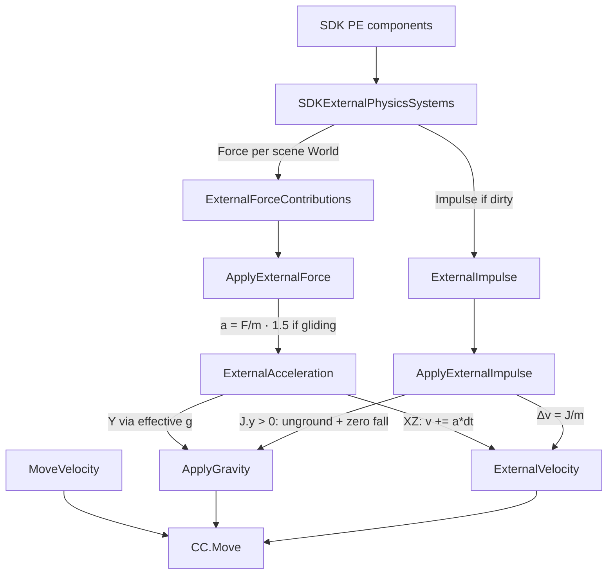

# Physics parity plan — Unity Explorer vs ThreejsClient

**Status:** **PE P0+P1+P2 ✅** · **scene collider PART/ROOT ✅ (v1.5.0)** · **MeshCollider platform riding + CCT ground law ✅ (2026-08-09, `dev-latest`, no release)** · **PE P3 pad/wind checklist ready, QA still open** (no Explorer delta in-tree — do not retune `EXTERNAL_SCENE_SCALE`) · multi-shape GLTF `40M+` ride follow-up  
**Branch context:** `dev-latest`  
**Last updated:** 2026-08-18  

Related code:

- PE: [`src/player/externalPhysics.ts`](../src/player/externalPhysics.ts), [`PlayerSystem.ts`](../src/player/PlayerSystem.ts), [`locomotion.ts`](../src/player/locomotion.ts)
- Scene solids: [`PhysXWorld.ts`](../src/physics/PhysXWorld.ts), [`World.ts`](../src/core/World.ts) (`pushColliderRootPoses` / `pushColliderPartPoses`)
- Riding: [`platformMotion.ts`](../src/physics/platformMotion.ts), `SceneScriptSystem.standSurfaceEcsFromPhys`
- Policy: [COLLIDER_MOTION_POLICY.md](./COLLIDER_MOTION_POLICY.md) · [RIDING_TRANSFER_LAW.md](./RIDING_TRANSFER_LAW.md)

Official scene API: [Player Physics](https://docs.decentraland.org/creator/scenes-sdk7/interactivity/player-physics).

---

## Goal

Match **Unity Explorer** continuous force + one-shot impulse feel for:

- `Physics.applyForceToPlayer` / `removeForceFromPlayer` / duration / repulsion  
- `Physics.applyImpulseToPlayer` / `applyKnockbackToPlayer`  
- Glider **1.5×** continuous force only  

Scene-side accumulation already matches (SDK writes `PhysicsCombinedForce` 1216 / `PhysicsCombinedImpulse` 1215 on `PlayerEntity`). Parity work is **client integration**.

---

## Shared architecture (both clients)

| Layer | Role |
|--------|------|
| Scene SDK `Physics.*` | Accumulators → PE summary components |
| CRDT | World-space vectors on `PlayerEntity` |
| Client motion | F/m, J/m → velocity → kinematic **CCT** move |

Neither client applies PhysX dynamic forces on the avatar body. Player is a **CharacterController / CCT** driven by displacement each frame.

---

## Unity Explorer reference

Sources (commit `aba4c692…` era paths):

- `SDKExternalPhysicsSystems.cs` — CRDT → per-scene force slots + impulse buffer  
- `ApplyExternalForce.cs` — a = F/m, glide ×1.5, **XZ only** into `ExternalVelocity`  
- `ApplyExternalImpulse.cs` — Δv = J/m; upward impulse ungrounds + zeros falling gravity  
- `ApplyGravity.cs` — `effectiveGravity = |g| - ExternalAcceleration.y`  
- `ApplyExternalVelocityDragAndClamp.cs` — dedicated external drag  
- `CalculateCharacterVelocitySystem.cs` — pipeline order  
- `InterpolateCharacterSystem.cs` — `Move(move + gravity + external) * dt`  
- `CharacterControllerSettings` — mass, glide wind, external drag defaults  

### Pipeline



### Force (continuous)

1. Per **current** scene world: `ExternalForceContributions[world] = force.vector`  
2. Sum → `ExternalForce`  
3. `a = F / CharacterMass` (**default mass = 1**)  
4. If gliding: `a *= GlideWindResponse` (**1.5**)  
5. Integrate **X/Z only** into `ExternalVelocity`  
6. **Y** does **not** go into external velocity — feeds gravity:

   `effectiveGravity = |g| - a_y`  
   - Air: accumulate with direction  
   - Grounded: if `effectiveGravity <= 0` → **unground** (lift)

### Impulse (one-shot)

1. `ExternalVelocity += J / mass` (all axes)  
2. If `J.y > 0`: unground; if `GravityVelocity.y < 0`, **zero** it (jump pads beat fall)  
3. Clear pending impulse  
4. **No** glide multiplier  

### Final displacement

```
Move( MoveVelocity*dt + GravityVelocity*dt + ExternalVelocity*dt + slope )
```

Three velocity channels stay separate.

### Defaults (`CharacterControllerSettings`)

| Setting | Default |
|---------|---------|
| CharacterMass | 1 |
| GlideWindResponse | 1.5 |
| Gravity | −9.8 |
| ExternalEnvDrag | 0.5 (always) |
| ExternalGroundFriction | 4 (grounded) |
| MaxExternalVelocity | 50 |

`ExternalVelocity *= (1 - damping*dt)`; grounded zeros external **Y**; clamp magnitude to 50.

### Multi-scene / stale impulses

- Forces: one contribution slot per scene world; only **current** scene writes  
- Impulses: dirty flags discarded when scene becomes current again (no burst on re-enter)

---

## ThreejsClient today

[`PlayerSystem`](../src/player/PlayerSystem.ts) + [`externalPhysics.ts`](../src/player/externalPhysics.ts):

| Behavior | Ours (after P0) | Unity |
|----------|-----------------|-------|
| Impulse | `eventId` once → `_externalVelocity += J/m`; unground + zero fall `v.y` | Same |
| Force XZ | `_externalVelocity.xz += (F/m)*mult*dt` | Same |
| Force Y | Effective g: `g' = GRAVITY - a_y`; unground if `g' ≤ 0` | Same model, g≈9.8 |
| Glide force ×1.5 | Force only | Force only |
| Velocity split | `_velocity` (walk+g+jump) + `_externalVelocity` | Move / Gravity / External |
| External drag | Env 0.5 + ground friction 4; max 50 | Same |
| Grounded external Y | Cleared | Cleared |
| Gravity constant | Jump **20**; continuous F × `20/9.8`; **impulse × `9.8/20`** (platform client scale) | **9.8** |
| Multi-scene forces | Single PE (this client) — documented | Sum per World if IsCurrent |
| Stale impulse on re-enter | Reset latch on init/teleport/dispose + eventId 0 / missing | Clear dirty on re-activate |
| Mass | 1 | CharacterMass 1 |

`eventId` delivery matches protocol (Unity C# also uses dirty wrappers on the same component).

### Gravity mismatch

With `GRAVITY = 20`, continuous upward forces fight **~2×** harder than Explorer (g≈9.8). Same scene force magnitudes feel weaker for lift/wind.

Options:

- **A)** Keep g=20 for jump feel; scale external F/J by ~`20/9.8` for pad/wind parity  
- **B)** Effective-gravity path for force Y using a calibrated base (preferred with channel split)

---

## Implementation plan

### P0 — Correctness (do first) ✅

1. ✅ Split **`_externalVelocity`** from locomotion `_velocity`.  
2. ✅ **Impulse:** `external += J/m`; if `J.y > 0` → unground + clear negative vertical fall.  
3. ✅ **Force:**  
   - XZ → `external.xz += (F/m)*mult*dt`  
   - Y → effective gravity / unground when net upward.  
4. ✅ **Displacement:** `(velocity + external) * dt` into CCT `movePlayer`.  
5. ✅ **External drag/clamp** only on external: env 0.5, ground friction 4, max 50; grounded clear external Y.  
6. ✅ Keep: eventId once, glide ×1.5 on force only, DCL→Three vectors, strong upward impulse exits glide.

### P1 — Calibration ✅ (impulse refined 2026-07-19)

7. ✅ Keep jump `GRAVITY = 20`; **force** × `EXTERNAL_SCENE_SCALE = 20/9.8` so pads balance arcade g.  
7b. ✅ **Impulse platform scale** — `IMPULSE_CLIENT_SCALE = 9.8/20` (Explorer g / arcade g). Same scene J as Explorer mass=1, but our CCT + arcade g launch hotter at raw J; single global factor (not per-scene).  
7c. ✅ **Impulse launch grace** — only ~0.18s suppress re-ground after pad (Explorer zeros external Y on land; old `extY>2.5` lofted 3–6s).  
8. ✅ Continuous upward force ungrounds + no Y-strip when external/lift active (P0).

### P2 — Edge cases ✅

9. ✅ Stale impulse: `resetExternalPhysicsState` on initCapsule / dispose / teleport; re-arm when component missing or `eventId === 0`.  
10. ✅ Multi-scene PE: N/A for single-worker client — only current PE; noted in code.  
11. ✅ Order: gravity → impulse (fall cancel) → force XZ → jump → damp external → move.

### P3 — Verify (manual QA vs Explorer)

**Optional after-clock QA.** Does **not** gate SceneLoop 🟢 or tag 2.2. Do not flip those rows from this PR. Do not retune `EXTERNAL_SCENE_SCALE` / `IMPULSE_CLIENT_SCALE` without a measured Explorer delta pasted below.

**Law:** same official `bin/scene.js` in Explorer and this client. Compare PE feel, not scene names. Named places (plaza bounce parasols, SpaceRunner pads, any wind tunnel) are **guides** — bundles that happen to write `PhysicsCombinedImpulse` / `PhysicsCombinedForce`. No `if Genesis Plaza`, no per-scene scale, no invented `getClick` / y=0 PE hits.

**How:** same bundle, same stand pose, same authored vector. Record Explorer first, then this client. Pass = same family of motion (apex, drift, latch), not pixel identity. Fail = miss large enough to justify one **global** factor change.

12. Manual checklist vs Explorer:

    | Check | Scene API / PE | Pass | Guide (not law) |
    | --- | --- | --- | --- |
    | [ ] Launch pad impulse `(0, 50, 0)` | `Physics.applyImpulseToPlayer` → `PhysicsCombinedImpulse` | Apex / hang / land ≈ Explorer. Unground + fall cancel. **No** glide ×1.5 on impulse | Any authored pad with that vector (plaza bounce is one) |
    | [ ] Wind tunnel continuous force X | `Physics.applyForceToPlayer` → `PhysicsCombinedForce` | XZ accel while inside; stops when the scene removes the force | Any continuous-force volume |
    | [ ] Glide + wind → 1.5× | force only × `GlideWindResponse` | Gliding is visibly stronger than walk in the same wind; impulse still unscaled | Any glider + force volume |
    | [ ] Updraft while gliding lifts | force Y → effective-g | Continuous up force lifts a gliding avatar | Any updraft + glide |
    | [ ] Grounded continuous up force lifts off | `g' = \|g\| - a_y ≤ 0` ungrounds | Standing in up-force leaves the floor (no Y-strip) | Any grounded lift volume |
    | [ ] Knockback / repulsion | scene helpers; PE sum already | Horizontal shove matches Explorer family; no second hit from latch | Any knockback / repulsion helper |
    | [ ] Leave scene / re-enter pad (stale latch) | P2: re-arm on missing component or `eventId === 0` | Pad fires again on re-enter. No burst of a stale impulse | Any pad scene you can walk out of and back into |
    | [ ] Teleport / drown respawn | `resetExternalPhysicsState` | No leftover `_externalVelocity` after teleport / drown | Any `movePlayerTo` / drown respawn |

**Retune gate (closed until a delta is pasted):** no Explorer capture is in-tree as of 2026-08-18. `EXTERNAL_SCENE_SCALE = 20/9.8` and `IMPULSE_CLIENT_SCALE = 9.8/20` stay. If a walk records a systematic miss (e.g. this client apex is N× Explorer on the same `(0, 50, 0)` pad), change **one** global constant in [`externalPhysics.ts`](../src/player/externalPhysics.ts) — never a scene-name fork.

**Walk-log (paste when run — still empty):**

```text
date:
bundle (catalyst pointer or world, not a nickname):
Explorer build:
this client tip:
pad (0,50,0) Explorer apex / this client apex:
wind X Explorer feel / this client feel:
glide ×1.5 confirmed (force only):
leave/re-enter pad fires again:
teleport/drown residual ext vel:
scale change? no | yes — measured ratio:
```

### Likely files

- `src/player/PlayerSystem.ts` — main integration  
- `src/player/locomotion.ts` — external drag / mass / max-v constants  
- Optional `src/player/externalPhysics.ts` — pure math for unit tests  
- Docs: this file + `INTEGRATION.md` / `PROGRESS.md` when verified  

**PhysXWorld** stays kinematic CCT — no dynamic actor forces on the capsule.

---

## Scene solids / CCT colliders (v1.5.0) ✅

Separate from PE force/impulse: **GLTF multi-shape + MeshCollider** motion under PhysX CCT.

| Track | Model | Status |
|-------|--------|--------|
| **ROOT** | Transform dirty → actor T+R only; entity-local cook once | 🟢 |
| **PART** | Animator running clip + coarse hull fp change → world-cook that entity | 🟢 |
| Thrash guards | Running/scheduled clips only · `toFixed(2)` hull fp · no cook budget | 🟢 |
| QA | Ice-rink door open/walk-through · Genesis Plaza solids idle | 🟢 |

Full policy: [COLLIDER_MOTION_POLICY.md](./COLLIDER_MOTION_POLICY.md).  
Code: `PhysXWorld.applyPartColliderMotions`, `World.pushColliderPartPoses`, `SceneScriptSystem.snapshotPhysMotionSets`.

**Out of scope for PART (still open):** continuous high-rate deforming hulls without Animator (prefer Tween/Transform ROOT or future per-shape actors).

---

## MeshCollider platform riding + CCT ground (2026-08-09) ✅

Explorer-parity **implementation gap close** on `dev-latest` — **not a release**. Full law: [RIDING_TRANSFER_LAW.md](./RIDING_TRANSFER_LAW.md) · plan: [PLAN_MESHCOLLIDER_PLATFORM_RIDING.md](./PLAN_MESHCOLLIDER_PLATFORM_RIDING.md).

| Track | Model | Status |
|-------|--------|--------|
| Stand phys map | raw ECS MeshCollider + 20M GLTF + −1 infinite | 🟢 |
| ROOT parent→child | Transform dirty expands to collider descendants | 🟢 |
| Riding Δ | **One** stand-actor world pose slide before `move()` | 🟢 |
| Anti-bandaid | No sticky multi-frame Δ · no residual snap · no pull-down | 🟢 |
| Cylinder cook | Y-up capsule / flat box; half-height excludes caps | 🟢 |
| nonWalkable | `PREVENT_CLIMBING_AND_FORCE_SLIDING` (sphere sides ≠ ladders) | 🟢 |
| Grounded law | Walkable support under capsule column; else freefall | 🟢 |
| Follow-up | Multi-shape GLTF `40M+` child ride key | 🟡 |

**Kill-list:** scene-name forks · sticky “help” · invent PE ground · per-game nginx for scene fetch (use `/api/scene-http`).

---

## Recommendation (shipped defaults)

- mass = 1  
- Unity external drag numbers  
- effective-g for force Y (base = client arcade 20)  
- **Force:** `EXTERNAL_SCENE_SCALE = 20/9.8`  
- **Impulse:** raw scene J (Explorer)  
- jump height still `sqrt(2 * 20 * h)`  

Next (PE only): run the **P3** checklist vs Explorer (pad `(0, 50, 0)`, wind, glide ×1.5, leave/re-enter latch). Tweak force/impulse scale only if a measured Explorer delta is pasted above. Not required to tag 2.2 / SceneLoop 🟢.  
Scene solids PART/ROOT: **done for v1.5.0 RC** — expand only if new scene classes fail QA.

---

## Out of scope (for this plan)

- Free camera / C key  
- Full locomotion curve parity (acceleration curves, wall slide, edge slip)  
- Remote players simulating the same local forces (forces are local-only by design)
- Content-specific collider hacks (plaza vs door labels) — use PART/ROOT policy only
