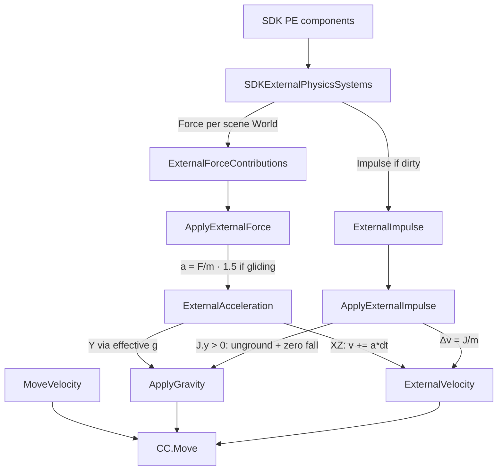

# Physics parity plan — Unity Explorer vs ThreejsClient

**Status:** **P0+P1+P2 on `dev-latest`** · impulse = Explorer-raw Δv · force keeps arcade scale · P3 manual QA open  
**Branch context:** `dev-latest` (merged from `lastraum` 2026-07-19)  
**Last updated:** 2026-07-19  

Related code: [`src/player/externalPhysics.ts`](../src/player/externalPhysics.ts), [`src/player/PlayerSystem.ts`](../src/player/PlayerSystem.ts) (`applyScenePhysicsCombined`), [`src/player/locomotion.ts`](../src/player/locomotion.ts) (`GLIDING_FORCE_MULTIPLIER`), PhysX CCT in [`src/physics/PhysXWorld.ts`](../src/physics/PhysXWorld.ts).

Official scene API: [Player Physics](https://docs.decentraland.org/creator/scenes-sdk7/interactivity/player-physics).

---

## Goal

Match **Unity Explorer** continuous force + one-shot impulse feel for:

- `Physics.applyForceToPlayer` / `removeForceFromPlayer` / duration / repulsion  
- `Physics.applyImpulseToPlayer` / `applyKnockbackToPlayer`  
- Glider **1.5×** continuous force only  

Scene-side accumulation already matches (SDK writes `PhysicsCombinedForce` 1216 / `PhysicsCombinedImpulse` 1215 on `PlayerEntity`). Parity work is **client integration**.

---

## Shared architecture (both clients)

| Layer | Role |
|--------|------|
| Scene SDK `Physics.*` | Accumulators → PE summary components |
| CRDT | World-space vectors on `PlayerEntity` |
| Client motion | F/m, J/m → velocity → kinematic **CCT** move |

Neither client applies PhysX dynamic forces on the avatar body. Player is a **CharacterController / CCT** driven by displacement each frame.

---

## Unity Explorer reference

Sources (commit `aba4c692…` era paths):

- `SDKExternalPhysicsSystems.cs` — CRDT → per-scene force slots + impulse buffer  
- `ApplyExternalForce.cs` — a = F/m, glide ×1.5, **XZ only** into `ExternalVelocity`  
- `ApplyExternalImpulse.cs` — Δv = J/m; upward impulse ungrounds + zeros falling gravity  
- `ApplyGravity.cs` — `effectiveGravity = |g| - ExternalAcceleration.y`  
- `ApplyExternalVelocityDragAndClamp.cs` — dedicated external drag  
- `CalculateCharacterVelocitySystem.cs` — pipeline order  
- `InterpolateCharacterSystem.cs` — `Move(move + gravity + external) * dt`  
- `CharacterControllerSettings` — mass, glide wind, external drag defaults  

### Pipeline



### Force (continuous)

1. Per **current** scene world: `ExternalForceContributions[world] = force.vector`  
2. Sum → `ExternalForce`  
3. `a = F / CharacterMass` (**default mass = 1**)  
4. If gliding: `a *= GlideWindResponse` (**1.5**)  
5. Integrate **X/Z only** into `ExternalVelocity`  
6. **Y** does **not** go into external velocity — feeds gravity:

   `effectiveGravity = |g| - a_y`  
   - Air: accumulate with direction  
   - Grounded: if `effectiveGravity <= 0` → **unground** (lift)

### Impulse (one-shot)

1. `ExternalVelocity += J / mass` (all axes)  
2. If `J.y > 0`: unground; if `GravityVelocity.y < 0`, **zero** it (jump pads beat fall)  
3. Clear pending impulse  
4. **No** glide multiplier  

### Final displacement

```
Move( MoveVelocity*dt + GravityVelocity*dt + ExternalVelocity*dt + slope )
```

Three velocity channels stay separate.

### Defaults (`CharacterControllerSettings`)

| Setting | Default |
|---------|---------|
| CharacterMass | 1 |
| GlideWindResponse | 1.5 |
| Gravity | −9.8 |
| ExternalEnvDrag | 0.5 (always) |
| ExternalGroundFriction | 4 (grounded) |
| MaxExternalVelocity | 50 |

`ExternalVelocity *= (1 - damping*dt)`; grounded zeros external **Y**; clamp magnitude to 50.

### Multi-scene / stale impulses

- Forces: one contribution slot per scene world; only **current** scene writes  
- Impulses: dirty flags discarded when scene becomes current again (no burst on re-enter)

---

## ThreejsClient today

[`PlayerSystem`](../src/player/PlayerSystem.ts) + [`externalPhysics.ts`](../src/player/externalPhysics.ts):

| Behavior | Ours (after P0) | Unity |
|----------|-----------------|-------|
| Impulse | `eventId` once → `_externalVelocity += J/m`; unground + zero fall `v.y` | Same |
| Force XZ | `_externalVelocity.xz += (F/m)*mult*dt` | Same |
| Force Y | Effective g: `g' = GRAVITY - a_y`; unground if `g' ≤ 0` | Same model, g≈9.8 |
| Glide force ×1.5 | Force only | Force only |
| Velocity split | `_velocity` (walk+g+jump) + `_externalVelocity` | Move / Gravity / External |
| External drag | Env 0.5 + ground friction 4; max 50 | Same |
| Grounded external Y | Cleared | Cleared |
| Gravity constant | Jump **20**; continuous F × `20/9.8`; **impulse raw** (Explorer J as Δv) | **9.8** |
| Multi-scene forces | Single PE (this client) — documented | Sum per World if IsCurrent |
| Stale impulse on re-enter | Reset latch on init/teleport/dispose + eventId 0 / missing | Clear dirty on re-activate |
| Mass | 1 | CharacterMass 1 |

`eventId` delivery matches protocol (Unity C# also uses dirty wrappers on the same component).

### Gravity mismatch

With `GRAVITY = 20`, continuous upward forces fight **~2×** harder than Explorer (g≈9.8). Same scene force magnitudes feel weaker for lift/wind.

Options:

- **A)** Keep g=20 for jump feel; scale external F/J by ~`20/9.8` for pad/wind parity  
- **B)** Effective-gravity path for force Y using a calibrated base (preferred with channel split)

---

## Implementation plan

### P0 — Correctness (do first) ✅

1. ✅ Split **`_externalVelocity`** from locomotion `_velocity`.  
2. ✅ **Impulse:** `external += J/m`; if `J.y > 0` → unground + clear negative vertical fall.  
3. ✅ **Force:**  
   - XZ → `external.xz += (F/m)*mult*dt`  
   - Y → effective gravity / unground when net upward.  
4. ✅ **Displacement:** `(velocity + external) * dt` into CCT `movePlayer`.  
5. ✅ **External drag/clamp** only on external: env 0.5, ground friction 4, max 50; grounded clear external Y.  
6. ✅ Keep: eventId once, glide ×1.5 on force only, DCL→Three vectors, strong upward impulse exits glide.

### P1 — Calibration ✅ (impulse refined 2026-07-19)

7. ✅ Keep jump `GRAVITY = 20`; **force** × `EXTERNAL_SCENE_SCALE = 20/9.8` so pads balance arcade g.  
7b. ✅ **Impulse not scaled** — plaza/scene J stays Explorer Δv (`scaleImpulseForClient` = 1/mass only). Over-boost when both F and J used the g-ratio.  
8. ✅ Continuous upward force ungrounds + no Y-strip when external/lift active (P0).

### P2 — Edge cases ✅

9. ✅ Stale impulse: `resetExternalPhysicsState` on initCapsule / dispose / teleport; re-arm when component missing or `eventId === 0`.  
10. ✅ Multi-scene PE: N/A for single-worker client — only current PE; noted in code.  
11. ✅ Order: gravity → impulse (fall cancel) → force XZ → jump → damp external → move.

### P3 — Verify (manual)

12. Manual checklist vs Explorer (smoke when ready):  
    - [ ] Launch pad impulse `(0, 50, 0)`  
    - [ ] Wind tunnel continuous force X  
    - [ ] Glide + wind → 1.5×  
    - [ ] Updraft while gliding lifts  
    - [ ] Grounded continuous up force lifts off  
    - [ ] Knockback / repulsion (scene helpers; PE sum already)  
    - [ ] Leave scene / re-enter pad — impulse still fires (stale latch)  
    - [ ] Teleport / drown respawn — no stuck external velocity

### Likely files

- `src/player/PlayerSystem.ts` — main integration  
- `src/player/locomotion.ts` — external drag / mass / max-v constants  
- Optional `src/player/externalPhysics.ts` — pure math for unit tests  
- Docs: this file + `INTEGRATION.md` / `PROGRESS.md` when verified  

**PhysXWorld** stays kinematic CCT — no dynamic actor forces on the capsule.

---

## Recommendation (shipped defaults)

- mass = 1  
- Unity external drag numbers  
- effective-g for force Y (base = client arcade 20)  
- **Force:** `EXTERNAL_SCENE_SCALE = 20/9.8`  
- **Impulse:** raw scene J (Explorer)  
- jump height still `sqrt(2 * 20 * h)`  

Next: **P3** pad/wind scene smoke vs Explorer (plaza bounce height QA), then tweak force scale only if needed.  

---

## Out of scope (for this plan)

- Free camera / C key  
- Full locomotion curve parity (acceleration curves, wall slide, edge slip)  
- Remote players simulating the same local forces (forces are local-only by design)
