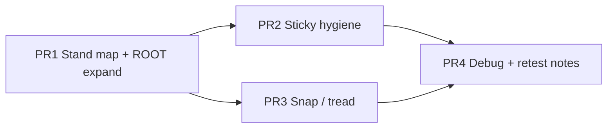

# Plan — MeshCollider platform riding (parent-driven movers)

**Status:** ✅ **Landed on `dev-latest` (2026-08-09)** — parity gap closed, **no release cut**  
**Date:** 2026-08-08 · updated 2026-08-09  
**Bar:** AGENTS.md COD · scene-bundle-is-law · COLLIDER_MOTION_POLICY · RIDING_TRANSFER_LAW · Explorer / AAA parity  
**Repro scene:** `brainrot.dcl.eth` (not a scene-name fork — representative of parent-driven MeshCollider floors)  
**Diagnosis:** [COD_BRAINROT_PLATFORM_FANOUT.md](./COD_BRAINROT_PLATFORM_FANOUT.md)  
**Law:** [RIDING_TRANSFER_LAW.md](./RIDING_TRANSFER_LAW.md)

---

## 1. Problem statement

On worlds with **bobbing / elevating MeshCollider floors** (parent Transform rewritten every frame, child holds `MeshCollider`), the local player can be **launched several meters upward** and then appear **stuck high** while CCT reports a real ground entity.

**Observed (brainrot):**

| Symptom | Log / fact |
|---------|------------|
| Sudden climb | feet y `0.9 → 6.9 → 8.4` in ~1 s |
| Wrong height stand | `groundPhys=2331` (raw MeshCollider ECS id) @ y≈6.86 |
| Scene amp | pad tops only **~0.1–1.4 m** — scene did not author a 7 m elevator |
| False leads | `planeY0=null` = pointer aim diag; infinite y=0 ground ≠ stand surface |

**Root cause class (client platform law, not scene forces):**

1. MeshCollider stand ids are not first-class in stand-surface / `groundIsMoving` / riding Δ.  
2. Parent Transform dirty does not expand into ROOT collider set the way PART hierarchy does.  
3. Sticky riding Δ can re-inject stale **+Δy** across frames (multi-frame stack through the 1.5 m/frame gate).  
4. Transfer + feet snap can double-lift using AABB **maxY** / pivot instead of tread.

Bundle confirmed: **no** player teleport / impulse / `movePlayerTo` on PLAY or pads.

---

## 2. Goals / non-goals

### Goals

1. Player **rides** parent-driven MeshCollider movers (Transform every frame) with Explorer-like feel.  
2. **No multi-meter launches** from bob amp ≤ ~1.3 m / speeds ≤ ~2 m/s.  
3. **No sticky ascent** after pad apex or ground entity change.  
4. Platform-wide fix — any scene with parent→child MeshCollider movers benefits.  
5. Logs and `?platformdebug` prove transfer Δ matches surface motion.

### Non-goals

- Scene-name forks (`if brainrot`).  
- Removing or “fixing” infinite y=0 ground as the launch cause.  
- Inventing pointer PE ground hits from `planeY0`.  
- Full multi-shape GLTF `40M+` child id overhaul (track as follow-up PR; brainrot is MeshCollider).  
- Gameplay changes to brainrot bundle.  
- AAA cosmetics unrelated to locomotion (materials, glider skin warnings).

---

## 3. Platform law (invariant)

```text
Moving walk surface =
  (1) PhysX actor pose matches visual world pose same frame
  (2) CCT-grounded actor only → riding Δ → capsule += Δ before movePlayer

Phys id classes (all must work for stand + riding):
  -1              infinite ground (no riding)
  raw ECS id      MeshCollider root
  19_000_000+     landscape
  20_000_000+ecs  GltfContainer phys parent
  40_000_000+…    multi-shape child (follow-up)

Sticky / snap must never invent vertical travel the surface did not take this frame.
```

---

## 4. Design

### 4.1 Stand surface + groundIsMoving (MeshCollider first-class)

**Today:** `standSurfaceEcsFromPhys` only returns ECS when `phys ≥ GLTF_COLLIDER_ENTITY_BASE` (20M). MeshCollider stand `2331` → `null` → `groundIsMoving` always false → actor-root / walk-surface riding probes skipped.

**Change:**

```text
standSurfaceEcsFromPhys(phys):
  if phys is null or -1 → null
  if phys ≥ 40M → decode multi-shape parent ecs (follow-up if needed)
  if phys ≥ 20M → ecs = phys - 20M
  if phys ≥ 19M → landscape (no ecs ride map, or dedicated path)
  else if MeshCollider / colliderRoot has phys → ecs = phys
  else → null
```

Wire so `World.syncPlayerMotionFrame` sets `groundIsMoving` true when that ECS (or its collider-bearing child that CCT hit) is in transformDirty / poseChanged / meshMotion.

**Files:** `SceneScriptSystem.ts` (`standSurfaceEcsFromPhys`, helpers), `World.ts` (`syncPlayerMotionFrame`).

### 4.2 ROOT transformDirty expands to collider descendants

**Today:** PART uses `expandToExtractedColliderEntities` (parent/children). ROOT `addRoot` only keeps entities that **themselves** have phys ids. Bobbing **parent** has no MeshCollider → dropped; child not in `lastSyncFrameTransformEntities`.

**Change:** When adding ROOT movers from sync-frame Transform / system dirty / Tween, **expand to collider-bearing descendants** (same tree walk as PART, but path = ROOT pose slide, not world-recook).

```text
parent Transform dirty
  → transformDirty ∪ { child MeshCollider entities in subtree }
  → pushColliderRootPoses slides child actors to live matrixWorld
```

Reuse `markDescendantColliderPosesDirty` / `collectColliderEntitiesInSubtree` / `expandToExtractedColliderEntities` patterns — one shared expand helper preferred to avoid drift.

**Files:** `SceneScriptSystem.buildPhysMotionSets`, optional extract `expandToColliderEntities`.

### 4.3 Sticky riding Δ hygiene

**Today:** last riding Δ kept **12 frames**; successful transfer **refreshes** to 12 → can climb through a full sticky window of capped +1.5 m/frame.

**Change (pick one policy in review; recommended = A+B):**

| Option | Behavior |
|--------|----------|
| **A (recommended)** | Cancel sticky on: ground entity change, unground, **sign(Δy) flip**, or frame with no significant live Δ from probes |
| **B (recommended)** | Do **not** full-refresh lifetime on transfer; only set sticky when a **new live probe** committed Δ this frame |
| **C** | Multi-frame vertical budget (e.g. max +1.5 m net climb per 250 ms from transfer alone) |
| **D** | Reduce sticky frames (e.g. 3–4) — alone is insufficient without A/B |

**Files:** `PhysXWorld.ts` (`recordStickyPlatformDelta`, `refreshStickyPlatformDelta`, `getPlatformTransferDelta`, `applyPlatformVelocityTransfer`).

### 4.4 Snap feet after transfer

**Today:** after `pos += Δ`, if `|Δy| ≥ 0.01`, snap to `platformWalkSurfacePos` which may be **matrix origin** or **AABB maxY**, up to `PLATFORM_OVERHEAD_CATCH` (~2.7 m).

**Change:**

1. Prefer walk-surface top under **feet XZ** (column), not global actor maxY.  
2. Skip snap if post-transfer gap to tread ≤ contact tolerance.  
3. Reject snap if gap > small band (e.g. step height + margin), not full overhead catch, **when** transfer already applied this frame.  
4. Never snap upward more than remaining gap after Δ.

**Files:** `PhysXWorld.ts` (`snapFeetToPlatformWalkSurface`, `applyPlatformVelocityTransfer`, walk-surface top helpers).

### 4.5 Diagnostics (cheap)

- `?platformdebug`: log groundPhys, groundEcs, groundIsMoving, live Δ vs sticky, snap gap.  
- Optional: tag pointer logs `aimDiag planeY0=` so they are not read as PhysX (P2).

---

## 5. Work packages (review as PR DAG)



| PR | Title | Depends | Scope | Risk / status |
|----|-------|---------|-------|------|
| **PR1** | MeshCollider stand + ROOT descendant expand + mesh Δ seed | — | §4.1 + §4.2 + snapshot no-overwrite | **Done** 2026-08-09 |
| **PR2** | Sticky riding cancel + no stale refresh | PR1 | §4.3 A+B | **Done** 2026-08-09 |
| **PR3** | Transfer snap residual only | PR1 | §4.4 | **Done** 2026-08-09 |
| **PR4** | Single generic `/api/scene-http` egress + retest | — | worker + SignedFetch + nginx | **Done** 2026-08-09 |

**Shipped as one stack** (was MVP PR1–PR3 + leaderboard proxy).

---

## 6. Implementation checklist (PR1) — done

- [x] `standSurfaceEcsFromPhys`: raw MeshCollider phys id → ECS entity  
- [x] phys→ecs decode covers −1 / raw / 20M / 40M (40M ride key follow-up)  
- [x] `buildPhysMotionSets` / ROOT path: expand parents to collider descendants  
- [x] `groundIsMoving` true when stand child’s parent (or child) is in dirty sets  
- [x] `pushColliderRootPoses` slides child actor when only parent Transform CRDT fires  
- [x] No scene-name branch; no infinite-ground removal  

## Implementation checklist (PR2) — done (law stronger than sticky hygiene)

- [x] **Removed sticky multi-frame Δ** (cancel/hygiene obsolete — single live actor Δ only)  
- [x] No refresh of stale +Δy  
- [x] Vertical stack budget not needed after single-author path  
- [x] `?platformdebug` / transfer path logs stand actor only  

## Implementation checklist (PR3) — done (no residual snap)

- [x] **Deleted residual feet snap + pull-down** after transfer (bandaids)  
- [x] Riding = capsule += stand-actor world Δ only  
- [x] Descending-platform head-crush (`eCOLLISION_UP`) retained as collision response  
- [x] **Grounded law:** walkable under-column support required (walk-off freefall)  

## Implementation checklist (PR4) — done

- [x] Retest contract in this plan + COD fanout + CONTRIBUTOR_TESTING pointer  
- [x] Linked from PHYSICS_PARITY_PLAN · COLLIDER_MOTION_POLICY · RIDING_TRANSFER_LAW · PROGRESS

---

## 7. Risks and mitigations

| Risk | Mitigation |
|------|------------|
| Expanding ROOT to all descendants on busy scenes → CPU | Expand only from dirty parents (already O(dirty)); pad scenes ~100 parents/frame is OK if pose slide is actor T+R only |
| Sticky too aggressive cancel → fall-through on sparse probe frames | Keep 1–2 frame grace **only** when live ground entity unchanged and last Δy sign consistent |
| Snap too weak → feet sink into rising pad | Residual gap snap ≤ step offset + contact offset |
| Regression on Tween elevators / Animator doors | Retest Genesis blimp (ROOT rotate only), Flagtag coins if relevant, ice-rink / known PART doors |
| GLTF multi-shape still broken | Explicit out of MVP; track follow-up claim |

---

## 8. Acceptance / retest contract

### Primary — brainrot.dcl.eth (`?platformdebug`)

| Case | PASS | FAIL |
|------|------|------|
| Stand on bobbing tile | feet y tracks pad top **~0.1–1.4 m**; no multi-meter spikes | y jump ≥1.5 m in 1–2 frames without PE impulse |
| Walk across several pads | transfer Δy ≈ pad dy/frame (≪0.1 @ 60fps); entity = MeshCollider child | sticky +dy while pad descending |
| Center open floor (no pads) | feet on floor slab ~y=0 | `groundPhys` set at y>3 with empty air above pads |
| PLAY pedestal + click orb | game starts; no launch | launch on approach or click |
| After launch fix | no `groundPhys` stick at y≈7 mid-arena | stuck high with grounded true |

### Regression smoke

| Scene / behavior | Expect |
|------------------|--------|
| Genesis Plaza walk / stairs | no float, no launch |
| Static MeshCollider floors | unchanged |
| Tween move (if available) | still rides |
| Empty parcel / infinite ground | still land y=0; no riding on -1 |

### Log signals (debug on)

```text
groundPhys=<mesh ecs> groundEcs=<same or parent> groundIsMoving=1
platform transfer live Δ=(…, dy, …)   # not only sticky
no repeated sticky +dy after sign flip
```

---

## 9. Explicit out-of-scope follow-ups

| Item | Why later |
|------|-----------|
| Multi-shape GLTF child phys id ↔ parent Δ key | Different id space; not brainrot’s 2331 path |
| World-baked ROOT no-op + actor-root desync | GLTF PART/ROOT edge |
| Worlds policy: disable infinite ground under sealed colliders | Design product decision |
| PLAY sphere CCT “not a floor” special case | Prefer general normal/contact rules after PR1–3 |
| Dead `applyGroundContactDelta` wire-up | Nice-to-have contact-point ride |

---

## 10. Decision log (for reviewers)

| Decision | Choice | Rationale |
|----------|--------|-----------|
| Blame synthetic plane? | **No** | groundPhys=2331 @ y≈7 |
| Blame scene launch API? | **No** | bundle has no player force/teleport |
| Scene fork? | **No** | platform MeshCollider parent movers |
| MVP PRs | **PR1+PR2** | mapping + sticky stop multi-meter climb |
| Sticky policy | **A+B** | cancel + live-only refresh |
| PR3 snap | After MVP retest | avoid over-constraining fall-through recovery |

---

## 11. Review asks

Please approve or amend:

1. **MVP = PR1 + PR2** (stand map + ROOT expand + sticky hygiene)?  
2. Sticky policy **A+B** vs add budget **C** in MVP?  
3. Ship PR3 snap in same stack or only if retest fails?  
4. Any required regression scenes beyond Genesis + brainrot?

Once approved, implementation can start on PR1 without further design fan-out.

---

## Related

- [COD_BRAINROT_PLATFORM_FANOUT.md](./COD_BRAINROT_PLATFORM_FANOUT.md) — full diagnosis  
- [COLLIDER_MOTION_POLICY.md](./COLLIDER_MOTION_POLICY.md) — ROOT vs PART  
- [PHYSICS_PARITY_PLAN.md](./PHYSICS_PARITY_PLAN.md) — PE / CCT context  
- Code: `platformMotion.ts`, `PhysXWorld.ts`, `World.syncPlayerMotionFrame`, `SceneScriptSystem` motion sets  
