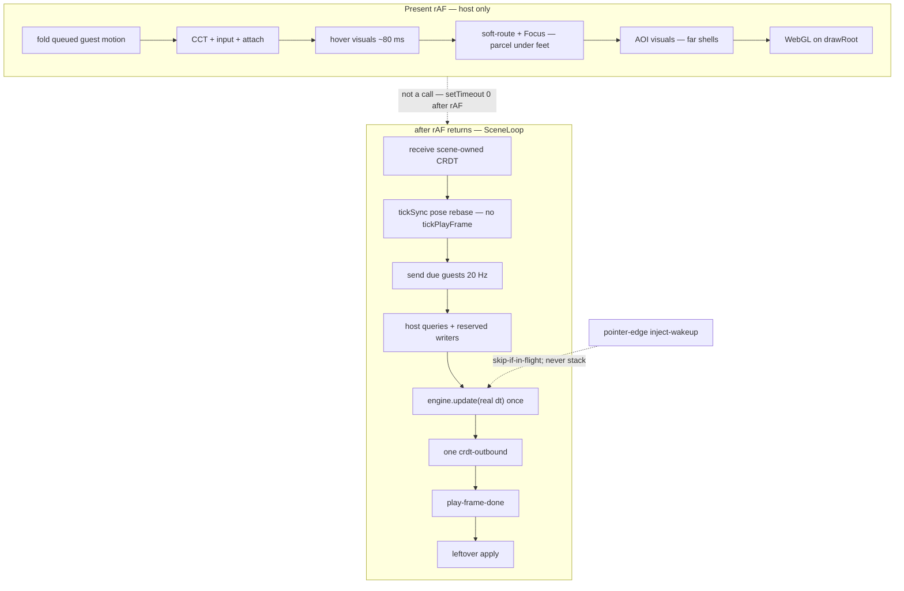

# v2.2 — Bevy Explorer platform parity (finish invert clock)

| Field | Value |
| --- | --- |
| **Author** | ThreejsClient maintainers |
| **Date** | 2026-08-18 |
| **Status** | **Shipped v2.2.0** — SceneLoop 🟢 (walk-log 2026-08-19). |
| **Product version today** | **v2.2.0** (`package.json` / `main`) |
| **Working tree** | Clock PRs #64–#69 + plaza Cast Line walk-log on `main`. |
| **Tip (2026-08-19)** | `main` = v2.2.0. SceneLoop 🟢. Neighbor FPS / residency stay on `dev-latest`. |
| **Reference (do not rename this client)** | Bevy/Unity Explorer **platform law** |
| **Our clock name** | SceneLoop / host invert |
| **This plan** | [`docs/V2.2_BEVY_PARITY.md`](./V2.2_BEVY_PARITY.md) |

---

## Overview

v2.0 shipped **who owns truth** (host store is the world; official `bin/scene.js` is a guest VM). v2.1 shipped **local preview + stay-in-play reload + this-client Tag shaders** and deferred the invert clock. Dual-clock landmine sealed (PR-2). Walk-log pasted 2026-08-19. [`docs/PROGRESS.md`](./PROGRESS.md) marks SceneLoop 🟢. **v2.2.0** is the product cut of that clock.

Code on `feat/hot-reload` already has the SceneLoop **target shape** (P0/P1 = in-tree with named leftovers; written against the `perfv2` merge). The invert work reached this branch via `63b5525 Merge branch 'perfv2' into dev-latest` and follow-ups (`6d609ab` host clock for primary/PE, `3319458` in-flight/queued receive).

**P0–P4 target shape is in-tree. SceneLoop is 🟢 (v2.2.0).** Dual-clock landmine sealed (`tickSync` never `tickPlayFrame`; `peTickIntervalMs === 50`). Walk-log pasted 2026-08-19. Do not copy-paste pre-2.2 “clock still yellow / no walk-log” into new work. Remaining city/FPS work lives on `v3` / `OPEN_WORLD_RESIDENCY.md` — not a second invert.

**Named scenes are guides, not law.** Genesis Plaza, Genesis CBD, SpaceRunner, Flagtag, NeonScreen, CREATOR Hub are **example bundles** that happen to exercise the platform. Implementation is universal: no `if Genesis Plaza`, no CBD-only FPS path, no fishing-only pointer. If a law only makes sense on one of those names, it is the wrong law.

**v2.2 is not a greenfield invert.** It is:

1. **Prove** the invert clock: only named sources `play-frame` | `pointer-edge` start `engine.update(dt > 0)` after the first play-frame (walk-log of pointer + Tween + scene timers + HUD meters).
2. **Seal** leftover extra clocks **and** the dual-clock landmine (`preemptSceneEngineTick`, unscoped `requestSceneEngineTick()`, `nudgePlayAfterSceneTeleport` → `tickPlayFrame()`, `peTickIntervalMs() === 0`, `tickSync` → `tickPlayFrame` if the ownership flag is false).
3. **Commit** `SCENELOOP_COMPLETION.md` + this plan as law and correct PROGRESS.
4. **Must before SceneLoop 🟢 / tag 2.2:** dual-clock landmine sealed (`skipPlayFrame: true` hard-coded; `peTickIntervalMs → 50`). Stacked live-neighbor **FPS** soak stays measure-only after that seal.

Do not invent scene APIs. Do not name this client after Bevy.

### Release call (2026-08-19)

**Shipped v2.2.0.** SceneLoop 🟢. Landmine sealed (PR-2). Walk-log pasted 2026-08-19 (`?sceneloop=1` plaza Cast Line entity `3385` + bobber at hit + `Fishing_Idle` + `BITING STEP`; no `dt=0.000`; sources only `play-frame` | `pointer-edge`). `dev-latest` → `main` · tag `v2.2.0`.

### Glossary (plain language)

Do **not** write bare “occupancy” in 2.2 work. It is not “how many people are in the world” (that is the map catalog). In this client it meant **which parcel your feet are on**. Three cheap jobs share that meaning today ([`World.ts`](../src/core/World.ts) L2530–2540):

| Job | What the player sees | Code |
| --- | --- | --- |
| **Soft-route** | URL, location pill, and minimap update to the parcel under your feet **without reloading** the world | `ScenePromoteController.tick` → `onSoftRoute` |
| **Current scene / Focus** | Pointer + SceneLoop know whose guest you are standing in (primary vs live neighbor under feet) | `syncCurrentSceneGuestAt` / `grantFocusToGuest` |
| **AOI visuals** | Far neighbor shells / distance fade. Can be heavier than (1) and (2) | `aoiVisual.update` |

Keep **(1)** and **(2)** on the present (render) frame so the URL, minimap, and clicks do not lag a frame behind your feet. Only **(3)** may be measured in PR-4 for moving off present.

---

## Background & Motivation

### Product

ThreejsClient is a browser-native DCL SDK7 explorer. Official `bin/scene.js` runs in a Worker VM. The host (`CrdtProjection` + `EntityStore` + `PhysXWorld`) is the world. Three.js presents. Official Explorers are Unity Foundation Client and Bevy Explorer. Platform law is Explorer-parity so official scene bundles behave the same.

[`docs/ARCHITECTURE.md`](./ARCHITECTURE.md) is the invert law. [`docs/AGENTS.md`](./AGENTS.md) is scene-bundle-is-law + FocusOwner. ECS component coverage is complete ([`docs/INTEGRATION.md`](./INTEGRATION.md): 65 tracked, 46 done, 0 partial, 0 not started, 19 client-only). Remaining work is **clock / platform law completion**, **open-world residency/FPS**, **shell product**, and a few measured Explorer goldens — not new ECS components.

### Why 2.2 exists

v2.1's missing half of invert is **one guest clock**. Official desktop Explorers do the same split: native host writes reserved/input components, scene JS consumes them on the next **real-`dt`** tick. We already named that clock `SceneLoop`. Shipping shaders and `/localpreview` without sealing the clock leaves pointer edges, Tweens, and stacked-neighbor FPS as "works until it doesn't."

### Pain: default path vs landmine

| Symptom | When it fires | Cause still in tree |
| --- | --- | --- |
| Guest `dt=0.000` for tens–hundreds of ms; Tweens / scene timers jump | **Default path** if extra clocks steal the mutex | Extra `engine.update(0)` or a second positive-`dt` start (`nudgePlayAfterSceneTeleport`, pointer-deliver preempt). *Guide:* plaza bobber / `idleEmoteTimer` |
| PET edge never lands; `getInputCommand(IA_POINTER, PET_UP, entity)` misses | **Default path** under pointer-deliver race | Pointer edge waits on mutex / no-target 700 ms budget-ack / epoch-kill of the tick that would consume PET. *Guide:* plaza Cast Line |
| PPI / aim freeze | Mitigated; residual | `play-frame-done` held while a tick is in flight (2 s in-flight timeout remains) |
| Dual play-frame (SceneLoop.send **and** `tickSync` → `tickPlayFrame`) | **Sealed (PR-2)** | `tickSync` / `tickStickySync` always `skipPlayFrame: true`. `peTickIntervalMs() === 50`. SceneLoop 🟢 still needs the pasted walk-log |
| < 20 FPS with stacked live neighbors | **Measure** after the landmine is sealed | Live guests are compile-default on (cap 4, boot concurrency 4). Dual-clock is one cause; heavy **AOI visuals** on the render frame is another. Soft-route (URL/minimap) and Focus stay on present. Do not blame `secondaryTickIntervalMs === 0` — that snapshot is OPEN_WORLD_RESIDENCY 2026-08-13, stale vs this tree. *Guide:* Genesis CBD walk |

### What this tree already shipped (do not redo)

- Host store is the world ([`docs/ARCHITECTURE.md`](./ARCHITECTURE.md)).
- SceneLoop guests: primary + PE + secondary ([`src/core/sceneLoop/`](../src/core/sceneLoop/)).
- Present rAF is host-only; guest send/receive/apply starts after the rAF returns ([`src/rendering/SceneHost.ts`](../src/rendering/SceneHost.ts) L599–619 `setTimeout(kick, 0)`).
- First `play-frame-tick` sets `setSceneLoopOwnsPositiveDt(true)` ([`src/shim/worker/sceneWorker.ts`](../src/shim/worker/sceneWorker.ts) L4084–4088).
- Kernel-owned TweenSequence: `ENABLE_SDK_TWEEN_SEQUENCE = false` before bundle eval ([`sceneWorker.ts`](../src/shim/worker/sceneWorker.ts) L4475).
- Comms plugin already Bevy-shaped (`CommsService`). Movement wire aligned (INTEGRATION `net:rfc4-movement`).
- Community claims: PR 62 (barn cards) and PR 56 (foil pack) are `pending_review` — **not** 2.2 core.

---

## Goals & Non-Goals

### Goals

1. After the first `play-frame-tick`, **only named sources** `play-frame` | `pointer-edge` may start `engine.update(dt > 0)`. `SceneLoop.send` is the **cadence** clock (20 Hz, skip-if-in-flight). `pointer-edge` is **inject-wakeup** — skip-if-in-flight, never a stacked second update. Do not add a third starter. Do not delete `pointer-edge`.
2. Host reserved/input writers (PE/Camera Transform, PPI, EngineInfo, RaycastResult, TriggerAreaResult) land in the guest store **before** that tick.
3. Pointer edges are inject-only (PET_DOWN/UP). `isPressed` arms on DOWN, falls on UP. Scenes that read `getInputCommand(IA_POINTER, PET_UP, entity)` get both edges on the authored hit entity — not `getClick`, not invented y=0 PE hits. Immediate wakeup is for **primary or current/FocusOwner** guest only.
4. Tweens/timers step on guest `dt` only. Host Animator / avatar mixers stay on present rAF.
5. One inbound inject + one outbound CRDT per guest tick.
6. Exit = recorded walk-log that proves those laws on **any** official bundle that uses pointer + Tween + scene timers (see Exit criteria). Example guide: Genesis Plaza fishing.
7. **Before SceneLoop 🟢 or tag 2.2:** dual-clock landmine sealed — `tickSync` never starts `tickPlayFrame`; `peTickIntervalMs() === 50` (never 0). Stacked-neighbor **FPS** soak is not the 🟢 gate.

### Non-goals (explicitly not 2.2)

| Park | Why |
| --- | --- |
| This-client Tag shaders | Already v2.1; not Bevy/Unity Explorer platform law |
| Saved outfits | Shell product |
| Create-community / invites | Shell CTAs still "coming soon" |
| Gallery multi-page | API max 100/page; product |
| Keybinds | `ui:preferences-controls` partial |
| Shell marketplace browse | ≠ P2P peer trade (already 🟢) |
| WSP systems pie | Parked ([`docs/WORKER_SYSTEM_PIE_V2.md`](./WORKER_SYSTEM_PIE_V2.md)); encode/send was the bill |
| Main-thread `@dcl/ecs` Engine | Forbidden invert resurrection |
| Scene-name forks (`if Genesis Plaza`) | Scene bundle is law |
| New ECS components | Matrix is complete |
| PR 62 / PR 56 | Community `pending_review` — do not reassign |
| Full residency rewrite (shells → disc → guests → promote) | [`docs/OPEN_WORLD_RESIDENCY.md`](./OPEN_WORLD_RESIDENCY.md) is its own chapter. 2.2 only owns the **clock law** applied to live guests that are already on |

---

## Where we are (gap audit)

Parity here means **Explorer platform laws** so official `scene.js` works the same as in Bevy/Unity desktop. Status: **law** = this tree matches and is documented as such; **partial** = implemented but leftover / unproven; **missing** = not in this tree.

| Area | Bevy/Unity Explorer law | This client today (cite) | Status | 2.2? |
| --- | --- | --- | --- | --- |
| Host store is the world | Native host owns components / PhysX / present | [`ARCHITECTURE.md`](./ARCHITECTURE.md); `CrdtProjection` + `EntityStore` + `PhysXWorld` | **law** | no |
| Present never blocked by scene JS | rAF is renderer; scene JS off present | [`SceneHost.ts`](../src/rendering/SceneHost.ts) present then `setTimeout` async; [`World.ts`](../src/core/World.ts) `onSyncFrame` CCT/input + feet-on-parcel jobs, `onAsyncFrame` SceneLoop | **partial** | keep URL/minimap/Focus on present; PR-4 may measure **AOI visuals** only |
| One guest tick after present | One `engine.update(real dt)` per cadence slot | [`SceneLoop.send`](../src/core/sceneLoop/SceneLoop.ts) → `tickPlayFrame` → `play-frame-tick` → `requestSceneEngineTick({ source: 'play-frame' })`. Extra starter: [`nudgePlayAfterSceneTeleport`](../src/core/systems/SceneScriptSystem.ts) L1746–1753 | **partial** | prove + leftover starts |
| Host writes reserved **before** tick | PE/Camera TF, PPI, EngineInfo, RaycastResult, TriggerAreaResult | [`applyPlayFrameReservedPoses`](../src/shim/worker/sceneWorker.ts); [`tickPlayFrame`](../src/core/systems/SceneScriptSystem.ts) L5691–5693 `updateRaycasts` + `updateTriggerAreas` before post | **law** | prove |
| Pointer edges inject-only | PET_DOWN/UP; no second update; **never abort a live scene job** (Bevy: skip-if-in-flight) | `inject-pointer-click`; World PE + sceneUi skip budget-ack ([`sceneWorker.ts`](../src/shim/worker/sceneWorker.ts) L2574–2581). No-target races **700 ms** (`NO_TARGET_ENGINE_UPDATE_BUDGET_MS + 250`). `preemptSceneEngineTick` still kills live update on pointer deliver (L707, L956) — **no Bevy analog** | **partial** | seal: match Bevy, never abort |
| Tweens/timers on guest `dt` | Renderer interpolates Tween; scene timers use tick `dt` | TweenBridge on host present; guest sees Transform/TweenState on play-frame. `ENABLE_SDK_TWEEN_SEQUENCE = false`. Extra `update(0)` still exists for transport / pre-SceneLoop | **partial** | prove (Tween duration ≈ wall; *guide:* plaza 900 ms / 1.3 s) |
| Host mixers on present | Animator / avatar on render clock | `pumpMotionBridges` on present for player path; remotes skip mixers if apply overran | **law** | no |
| One PhysX world; CCT on present | Native PhysX + CCT | `PhysXWorld` + `PlayerSystem` on `onSyncFrame` | **law** | no (PE P3 QA optional) |
| One inbound + one outbound per tick | Reserved + query results in; scene-owned dirty out | Play-frame reserved + LWW/append inject; `crdt-outbound`. Empty `sendBinary` drains inbound only ([`World.ts`](../src/core/World.ts) L6615–6619) | **law** | no |
| Kernel TweenSequence (ADR-133) | `ENABLE_SDK_TWEEN_SEQUENCE = false` before eval | [`sceneWorker.ts`](../src/shim/worker/sceneWorker.ts) L4475 | **law** | no |
| Movement wire | Bevy `global_crdt` + Unity outbound | INTEGRATION `net:rfc4-movement` 🟢 | **law** | no |
| Comms plugin | Bevy-shaped | `CommsService` | **law** | no |
| ECS component coverage | Scene-authorable set | 65 / 46 / 0 / 0 / 19 | **law** | no |
| Raycast cadence | Once per guest tick | [`RaycastSystem.sync`](../src/input/RaycastSystem.ts) only from `SceneScriptSystem.updateRaycasts` ← `tickPlayFrame`. Comment: once per guest tick | **law** | no |
| Hover prepare | Edges + ~80 ms, not every `mousemove` | [`PointerEventsSystem.HOVER_PREPARE_MS = 80`](../src/input/PointerEventsSystem.ts); present + async gated | **law** | no |
| `play-frame-done` | Ack when started or when in-flight (do not hold 2 s) | Deferred ack on `idle`/`deferred` ([`sceneWorker.ts`](../src/shim/worker/sceneWorker.ts) L4117–4122). Host still 2 s in-flight timeout ([`SceneScriptSystem.isPlayFrameInFlight`](../src/core/systems/SceneScriptSystem.ts) L5628–5635) | **partial** | observe |
| Extra `eng.update(0)` | Not a reason to tick systems | After first play-frame, inbound queues. `runSceneEngineUpdateNow(0)` remains for TweenState when `!isSceneLoopOwnsPositiveDt()`. Pointer UI still `eng.update(0)` | **partial** | seal transport-only |
| Multi-scene guests | Same SceneLoop queue; ≤1 secondary / async frame; FocusOwner under feet already follows live guest | [`SceneLoop.send`](../src/core/sceneLoop/SceneLoop.ts) L121–125; `reconcileLiveGuests`; `AOI_LIVE_GUESTS = true`; `secondaryTickIntervalMs() === 50`; Focus via [`syncCurrentSceneGuestAt`](../src/core/World.ts) L5363–5380 (promote flag off, origin not rebased) | **partial** | seal isDue + current-guest cap (PR-2) |
| Dual-clock death | `tickSync` never `tickPlayFrame` | **Sealed (PR-2):** `skipPlayFrame: true` hard-coded; `peTickIntervalMs() === 50`. SceneLoop 🟢 still needs the pasted walk-log | **law** (PR-2) | prove walk-log |
| Stand-on promote | FocusOwner under feet **and** origin rebase | `AOI_STAND_ON_PROMOTE = false` (Focus already follows feet onto a live secondary; origin stays on the current primary — no rebase) | **missing** (rebase) | **not 2.2** |
| Neighbor shells | Far disc = composite, no eval | `AOI_NEIGHBOR_SHELLS = false` | **missing** | **not 2.2** |
| PE P3 pad/wind | Explorer-raw feel | Implementation 🟢; manual QA open ([`PHYSICS_PARITY_PLAN.md`](./PHYSICS_PARITY_PLAN.md)) | **partial** | should if clock early |
| Platform goldens | Plane UV / AvatarAttach quat / VC lookAt | Open gaps ([`PLATFORM_COMPONENT_LAWS.md`](./PLATFORM_COMPONENT_LAWS.md) §10) | **partial** | measure-only |
| Graphics P3 culls | Scene / Landscape / Shadows Distance | Stubs | **missing** | **not 2.2** |
| Shell product | outfits / keybinds / invites / gallery pages | INTEGRATION yellows / ⬜ | **missing** | **not 2.2** |

---

## v2.1 leftover — the clock (code-verified)

### What v2.1 said

v2.1.0 milestone table originally said:

> | SceneLoop invert clock | 🟡 | Not this cut — still one guest clock to finish |

That note is now corrected: 🟡 remains, with pointers at this plan + [`docs/SCENELOOP_COMPLETION.md`](./SCENELOOP_COMPLETION.md). [`docs/ARCHITECTURE.md`](./ARCHITECTURE.md) related table points at both.

[`docs/SCENELOOP_COMPLETION.md`](./SCENELOOP_COMPLETION.md) is the committed target-shape law. An earlier draft said **“P0–P4 landed.”** That overclaim is gone. Verify leftovers against this tree.

### Verdict: target shape in this tree, unproven, leftover APIs remain

Do **not** treat the completion doc as a plan to re-implement P0–P4. The `feat/hot-reload` working tree already contains that shape (merged from `perfv2` → `dev-latest` → this branch). An earlier draft overclaimed in two places (now rewritten):

1. **“What is still not the law (today)”** (Raycast every rAF, `runSceneEngineUpdateNow(0)` on every host inject, play-frame-done held 2 s, pointer 1500 ms drop) described the **pre-P0** state. Those specific symptoms are mitigated in this tree. The committed doc replaces that table with the leftover inventory.
2. **“Working-tree hotfixes… are not SceneLoop completion”** vs **“P0–P4 landed”** was internally contradictory. Honest read: the target shape is in the tree; leftover extra-clock *APIs* and the pointer + Tween + timer walk-log are not sealed.

The law doc marks P0/P1 **“in-tree with named leftovers,”** not “landed.”

### P0–P4 vs this tree

| Phase (completion doc) | Claim | Evidence on `feat/hot-reload` | Verdict |
| --- | --- | --- | --- |
| **P0** Stop extra clocks | RaycastResult does not force `eng.update(0)`; deferred play-frame acks; live update not epoch-killed; video/audio/trigger store-only; World PE/sceneUi never budget-ack before PET; continuous rays on `tickPlayFrame` | `hostInjectNeedsSceneSystems` excludes RaycastResult ([`sceneEngineScheduler.ts`](../src/shim/worker/sceneEngineScheduler.ts) L883–887). Deferred `play-frame-done` on in-flight ([`sceneWorker.ts`](../src/shim/worker/sceneWorker.ts) L4117–4122). World PE + sceneUi `skipBudgetRace` (L2574–2581). Rays only from `tickPlayFrame` (L5691–5693). **`preemptSceneEngineTick` still runs** on pointer deliver (L707, L956) | **In-tree with named leftovers.** Preempt of a live `engine.update` is the remaining P0 hole |
| **P1** SceneLoop only positive-`dt` starter | After first play-frame, inbound/cooperative/hydration/keyboard only queue; sources `play-frame` \| `pointer-edge`; PE vehicle pumps deleted as clocks | `setSceneLoopOwnsPositiveDt(true)` on first play-frame. `sceneLoopAllowsStart` rejects other sources. `pump-scene-engine-tick` only `queueSceneEngineTick()` (L4305–4308). Hydration interval still starts ticks **until** first play-frame (correct). `requestSceneEngineTick()` **without source** still called after timed host inject (L2912). **`nudgePlayAfterSceneTeleport` still calls `tickPlayFrame()`** outside `SceneLoop.send` | **In-tree with named leftovers.** Seal unscoped + teleport nudge |
| **P2** Host query prepare | Raycast + TriggerArea once per guest tick in `tickPlayFrame`; hover visuals ~80 ms; edges browser down/up | Confirmed. `RaycastSystem.sync` has no rAF caller. Hover `HOVER_PREPARE_MS = 80` | **In-tree** |
| **P3** Multi-guest + present isolation | SceneLoop.send: primary + PE due; ≤1 secondary; all 20 Hz; `tickSync` pose rebase never `tickPlayFrame`; present does not send/receive/apply or TriggerArea | `SceneLoop.send` caps one secondary (first due, **not** current/Focus). `secondaryTickIntervalMs() === 50` (not 0). Secondaries `setPlayFrameOwnedExternally(true)` at [`World.attachMultiScene`](../src/core/World.ts) L5149. PE also owned externally when runtime attached (L5101). **Present still runs** soft-route (`scenePromote.tick`), current-scene/Focus (`syncCurrentSceneGuestAt`), and AOI visuals (`aoiVisual.update`) on `onSyncFrame` (L2529–2540). `tickSync` still invoked **before** `sceneLoop.send` on async (L2700) — safe only while the flag is true | **In-tree with landmines.** Dual-clock is one flag flip away — **seal in PR-2 before 🟢**. Soft-route + Focus stay on present |
| **P4** Encode / apply leftovers | Empty `sendBinary` does not await publish; AvatarAttach / PE-follow / Video/Audio use `writeHostLwwNoDirty`; WSP meters kept; systems pie parked | Empty outbound drains inbound only ([`World.handleSendBinary`](../src/core/World.ts) L6615–6619). [`writeHostLwwNoDirty`](../src/shim/worker/injectHostLww.ts) exists. WSP pie still parked | **In-tree** |

### Who still starts `engine.update` besides SceneLoop

After first `play-frame-tick` (`sceneLoopOwnsPositiveDt === true`):

| Starter | File | `dt` | Still a clock? |
| --- | --- | --- | --- |
| `requestSceneEngineTick({ source: 'play-frame' })` | `sceneWorker.ts` play-frame-tick, posted by `SceneLoop.send` → `tickPlayFrame` | positive, wall-clamped | **Cadence clock** |
| `requestSceneEngineTick({ source: 'pointer-edge' })` | pointer inject finally / queued edges | positive | **Inject-wakeup.** Allowed. Skip-if-in-flight. Never a stack. Do **not** delete |
| `nudgePlayAfterSceneTeleport()` → `tickPlayFrame()` | [`SceneScriptSystem.ts`](../src/core/systems/SceneScriptSystem.ts) L1746–1753. Host: [`World.ts`](../src/core/World.ts) L1166 (primary `movePlayerTo` — Flagtag / SpaceRunner reset), L1452, L5659 (PE `movePlayer` arbiter), L5896 | positive play-frame **outside** `SceneLoop.send` | **Leftover extra clock.** Comment says “do not stack” but still starts a play-frame. PR-2 converts to queue / `needsImmediateGuestTick` and **keeps** `forceResumeWorkerSceneTicks` |
| `requestSceneEngineTick()` no source | `sceneWorker.ts` L2912 timed host inject | would be positive | **Deferred** after P1 (`sceneLoopAllowsStart` queues). Force `queueSceneEngineTick` |
| `requestSceneEngineTick({ source: 'hydrate' })` | hydration interval / `afterHostLwwSystemsReact` | positive | Only **before** first play-frame (or if `!playFrameTickMainDriven`) |
| `runSceneEngineUpdateNow(0)` | TweenState inbound when `!isSceneLoopOwnsPositiveDt()`; one other path L2942 | 0 | Transport-only; must stay dt=0 and **not** run react-ecs as a second clock. **Do not stamp** `lastExecutedAt` on `dt === 0` |
| `eng.update(0)` | pointer UI (`runSceneUiPointerDownBatch`, `runPointerNonUiPhase`); boot tick | 0 | Transport / EventSystem. Must not become a second positive clock |
| `preemptSceneEngineTick` | pointer deliver (`preemptForPointerDelivery` L707, `schedulePointerDeliverWork` L956) | n/a | **No Bevy analog.** Violates skip-if-in-flight. PR-2 must not epoch-kill a live `engine.update` when `sceneLoopOwnsPositiveDt` / `engineUpdateInFlight` |
| `SceneWorkerSlot.tickSync` → `tickPlayFrame` | if `!playFrameOwnedExternally && !skipPlayFrame` | starts play-frame | **Dual-clock landmine** if flag off. Seal in PR-2 (`skipPlayFrame: true` hard-coded) |
| `PeSlotGuest.sendTick` | SceneLoop PE guest | play-frame | Intended (single clock via SceneLoop.send) |
| `SecondaryFirstFrameSampler` | isolated bake after present | play-frame on a **throwaway** host | Not a guest clock; keep off present rAF |
| Host `AnimatorBridge` / avatar `mixer.update(0)` | present | n/a | Not guest `engine.update` |

### Raycast: not every rAF

[`RaycastSystem.sync`](../src/input/RaycastSystem.ts) is only called from `SceneScriptSystem.updateRaycasts()` ← `tickPlayFrame()`. Continuous identical payloads skip LWW PUT (`lastContinuousSig`). JSDoc is “once per guest tick.”

### `runSceneEngineUpdateNow(0)` still exists

Yes. After SceneLoop owns positive `dt`, TweenState inbound **queues** instead ([`deliverTweenStateInbound`](../src/shim/worker/sceneWorker.ts) L2086–2090). The function remains for pre-play-frame / transport. 2.2 must keep it **quarantined** (`dt === 0`, no systems/react as a second clock, **no wall-clock stamp**) — not delete blindly (NeonScreen pauseDuration depends on not advancing wall clocks on TweenState inject).

### Play-frame-done / pointer ack budget

- **Play-frame:** if tick `started`, worker completes the tick then acks via the normal path; if `idle`/`deferred`, acks immediately so PPI keeps streaming. Host `isPlayFrameInFlight` auto-clears at **2000 ms** (safety, not the old 2 s stall).
- **Pointer:** World PE + sceneUi **do not** budget-ack before PET lands (`skipBudgetRace = !treatAsNoTarget`). No-target edges race **`NO_TARGET_ENGINE_UPDATE_BUDGET_MS + 250` = 450 + 250 = 700 ms** ([`sceneWorker.ts`](../src/shim/worker/sceneWorker.ts) L2296, L2574–2579). `EDGE_ACK_BUDGET_MS` (`sceneUi ? 2000 : 1500`) is **unused** for that race. Remaining air-click drop risk is real; water-mesh PET_UP is on the skip-budget path.

### Dual clock / `tickSync` / intervals

```text
onAsyncFrame:
  sceneLoop.receive()
  multiScene.tickSync(...)          // pose rebase; play-frame IFF flag false  ← landmine
  sceneLoop.send(...)               // primary + PE + ≤1 secondary tickPlayFrame
```

| Lever | Today |
| --- | --- |
| `secondaryTickIntervalMs` | **50** ([`caps.ts`](../src/dcl/multiScene/caps.ts) L140–143) — **not** the death value 0 |
| `peTickIntervalMs` | **0** (L145–147) — landmine if PE ownership flag is false |
| Secondary owned externally | **true** after `attachMultiScene` |
| PE owned externally | **true** when runtime attached |
| `AOI_LIVE_GUESTS` | **true** (compile default) |
| `AOI_NEIGHBOR_SHELLS` | **false** |
| `AOI_STAND_ON_PROMOTE` | **false** (Focus still follows feet onto a live secondary) |
| `AOI_SCENE_DISTANCE_VISUALS` | **true** |

[`docs/OPEN_WORLD_RESIDENCY.md`](./OPEN_WORLD_RESIDENCY.md) (2026-08-13) described kill-switch city fill and `secondaryTickIntervalMs() === 0`. **That snapshot is stale vs this tree.** Live guests are on. Dual-clock death is a **shipping landmine on the ownership boolean**, not a currently-on `interval === 0` path.

[`SceneScriptGuest.isDue`](../src/core/sceneLoop/SceneScriptGuest.ts) honors `needsImmediateGuestTick()` for **all** kinds. `_isCurrent` is already passed from `reconcileLiveGuests` and unused. **Do not** mute every secondary at 50 ms: Focus already follows feet onto a live neighbor (`World.syncCurrentSceneGuestAt` / `grantFocusToGuest`); `focusScript()` aims pointer prepare at that guest. Blanket 50 ms would delay PET on the focused neighbor (`getInputCommand` on any live guest under feet) and make a primary-only walk-log a false green.

Law for 2.2: honor immediate for `kind === 'primary'` **or** current/FocusOwner secondary (`_isCurrent()`). Mute non-focus secondaries at 50 ms. Current guest **wins** the existing ≤1-secondary-per-send cap (otherwise a due neighbor can steal FocusOwner’s slot).

### What Bevy actually does (pointer vs a live scene job)

Official Bevy Explorer (`decentraland/bevy-explorer`, `crates/scene_runner/src/lib.rs`, main, 2026-08) treats scene JS as a **job**, not something to abort mid-`engine.update`:

1. Schedule chain: `SceneSets::Input` **then** `SceneSets::RunLoop`. Pointer results / raycast results / camera / PPI-class host writes land in the scene CRDT **before** `send_scene_updates`.
2. `update_scene_priority` only queues scenes with `!context.in_flight()`. If the previous job is still in flight, the scene is **skipped** (`skipped_in_flight` counter). It is **not** killed, epoch-bumped, or mutex-forced.
3. `send_scene_updates` pops the next eligible scene and sends `RendererResponse::Ok(crdt, census)` on the scene channel. The Deno/JS worker runs to completion and replies `SceneResponse::Ok`.
4. A wedged worker is **not** preempted. After `SCENE_NOT_RESPONDING_TIMEOUT` they mark the scene `Broken` and free the job slot. That is abandon-the-isolate, not “pointer arrived so abort this tick.”

**Our leftover** (`preemptSceneEngineTick` + `forceReleaseEngineUpdateMutex` in `preemptForPointerDelivery`) has **no Bevy analog**. Bevy law = inject pointer into the store, skip-if-in-flight, wait for the live job.

**2.2 decision (final):**

- PR-2 **must not epoch-kill** a live `engine.update` on pointer (delete or skip `preemptSceneEngineTick` when `sceneLoopOwnsPositiveDt` / `engineUpdateInFlight`).
- Inject PET into the guest store immediately; the in-flight tick or the next `pointer-edge` / play-frame consumes it.
- Do **not** invent a Bevy-style “Broken after N seconds” in 2.2 — we already have skip-if-in-flight + 2 s play-frame safety. That is enough.
- Keep the pointer serial queue and inject-wakeup (`pointer-edge`). That is how CREATOR / scene-UI stays responsive without aborting a live guest tick.

---

## Proposed design

### Target shape (already named; updated to this tree)

```text
PRESENT (host rAF — never blocked by scene JS)
  fold queued guest motion
  CCT + host motion + input + AvatarAttach
  hover visuals if ≥ 80 ms or edge
  soft-route (URL / pill / minimap) + current-scene Focus   ← stay here
  AOI visuals (far shells)                                  ← PR-4 may measure moving this
  WebGL extract + beauty
  return                    ← guest send/receive/apply MUST NOT start here

AFTER rAF (SceneHost setTimeout(0) → onAsyncFrame)
  SceneLoop.receive         ← fold queued crdt-outbound
  tickSync                  ← reserved pose rebase ONLY (never tickPlayFrame)
  SceneLoop.send            ← due guests, skip if inFlight
      per guest:
        host query prepare (Raycast, TriggerArea, hover inject)
        reserved writers (PE / Camera / PPI / EngineInfo / attach / tween TF)
        play-frame-tick
        worker: apply reserved → engine.update(real dt) once → one outbound
        play-frame-done (or immediate ack if already in flight)
  apply current guest + leftover other live guests
  collider leftover / async bridges
```

Cadence: **20 Hz** (50 ms) via `SceneLoop.send`. Pointer **edge** may wake the next due tick immediately (`source: 'pointer-edge'`, skip-if-in-flight). It may not stack a second `engine.update`. If a tick overruns: **skip next guest**, do not kill the current one. `movePlayerTo` / PE `movePlayer` may mark the FocusOwner guest immediate and resume worker ticks — they must **not** call `tickPlayFrame()` themselves.



```mermaid
sequenceDiagram
  participant rAF as Present rAF
  participant Loop as SceneLoop
  participant W as Guest worker
  participant Scene as official scene.js

  rAF->>rAF: CCT + extract + WebGL
  Note over rAF: return before any guest start
  rAF->>Loop: onAsyncFrame
  Loop->>W: play-frame-tick (reserved + PPI)
  W->>W: apply reserved / RaycastResult / TriggerAreaResult
  W->>Scene: engine.update(dt)
  Scene->>W: getCrdtUpdates scene-owned
  W->>Loop: crdt-outbound + play-frame-done
  Loop->>rAF: peel / apply leftover for next present
```

### What 2.2 actually implements (phased)

Because the P0–P4 **target shape** is already in the tree, 2.2 does **not** re-land it. It:

**A. Makes the law undeniable (PR-1 = docs only)**

- Commit this plan as [`docs/V2.2_BEVY_PARITY.md`](./V2.2_BEVY_PARITY.md).
- Commit [`docs/SCENELOOP_COMPLETION.md`](./SCENELOOP_COMPLETION.md) after rewriting the stale “still not the law” table and marking P0/P1 **in-tree with named leftovers** (not “landed”).
- Point PROGRESS at both docs. Keep SceneLoop 🟡 until the walk-log **and** the dual-clock landmine are sealed.
- Stale comments (done this PR): `RaycastSystem.ts` L65 (“once per guest tick”); `SceneWorkerSlot.ts` L539 and `SecondaryLiveManager.ts` L1044 (scripts run on SceneLoop.send).
- **No CI clock inventory in PR-1.** The real seal is PR-2 making `source` required, plus `scripts/test-scene-engine-tick-sources.mjs` (grep `requestSceneEngineTick(` / `tickPlayFrame(` and assert every production start is a named source or SceneLoop.send).

**B. Deletes leftover extra-clock starts + dual-clock landmine (PR-2)**

| Change | Why |
| --- | --- |
| Do **not** epoch-kill a live `engine.update` on pointer (delete/skip `preemptSceneEngineTick` when `sceneLoopOwnsPositiveDt` / `engineUpdateInFlight`) | **Match Bevy:** inject PET into the store; skip-if-in-flight; wait for the live job. No `Broken`-on-timeout in 2.2. Keep pointer serial queue + `pointer-edge` wakeup |
| Replace unscoped `requestSceneEngineTick()` at `sceneWorker.ts` L2912 with `queueSceneEngineTick()` | After first play-frame this is already deferred; make it impossible to start |
| Require `source` on `requestSceneEngineTick` | Type-level seal. Allowed after first play-frame: `play-frame` \| `pointer-edge` only |
| `nudgePlayAfterSceneTeleport`: keep `forceResumeWorkerSceneTicks`; drop the `tickPlayFrame()` call; set `needsImmediateGuestTick` (or queue) so **SceneLoop.send** starts the next tick | Comment already says “do not stack.” Any scene using `movePlayerTo` still needs tick resume. *Guide:* SpaceRunner / Flagtag |
| `peTickIntervalMs()` return **50**, never 0 | PE landmine if ownership flag drops |
| `SecondaryLiveManager.tickSync` / `tickStickySync` and PE fallback always pass `skipPlayFrame=true` (do not rely on teardown-sensitive `playFrameOwnedExternally`) | Dual-clock landmine. **Required before SceneLoop 🟢** |
| `SceneScriptGuest.isDue`: immediate only if `kind === 'primary'` **or** `_isCurrent()` | Focus already follows feet onto a live secondary. Mute **non-focus** secondaries at 50 ms |
| `SceneLoop.send`: current/FocusOwner secondary wins the ≤1-secondary-per-send cap | A due mute neighbor must not steal FocusOwner’s slot |

Each change is default-safe: it **reduces** clocks. No second scheduler. Soft-route (URL/minimap) and current-scene Focus **stay on present** in this PR and after. Only AOI visuals (far shells) may be measured for moving off present in PR-4.

**C. Observability (PR-3)**

Existing HUD already has SceneLoop meters (`perfNoteSceneLoop`: send/receive/apply, inFlight/due/guests/sent) at [`src/debug/MainFrameHud.ts`](../src/debug/MainFrameHud.ts) L130–133. 2.2 adds last guest `dt` + a **guest-tick line** (debug / `?sceneloop=1`):

```text
[sceneloop] play-frame source=play-frame dt=0.050 inFlight=0
```

Fail window: **after the first `source=play-frame` line** (not `scene-play-ready` — hydration may still start `hydrate` ticks until then). Log `source` so hydrate-before-first-play-frame is not a fail. Fail if any later play-frame line shows `dt=0.000`. Do **not** stamp wall clock on transport `dt === 0` (`wrapEngineUpdateWithWallClock` already skips; keep that).

Instrumentation checklist (this PR):

- [x] Play-frame line logs `source` `dt` `inFlight` (`?sceneloop=1` or existing worker verbose flag)
- [x] HUD last guest `dt` + `src=`
- [x] Transport `dt === 0` does not stamp wall clock
- [x] Pasted walk-log of pointer + Tween + scene timers — **SceneLoop 🟢** (2026-08-19 plaza Cast Line e3385)

PROGRESS SceneLoop → 🟢 only if (1) this walk-log is pasted **and** (2) PR-2 dual-clock landmine has landed. Do not invent a plaza fishing walk-log. Do not flip 🟢 in this PR.

**D. Neighbor FPS soak (PR-4 — measure-only; not the 🟢 gate)**

Live guests are already on (cap 4, enter 20 m, keep 36 m, boot concurrency 4). Dual-clock **landmine** is sealed in PR-2. PR-4 does **not** rewrite shells/promote and does **not** re-decide `skipPlayFrame`.

Must-do: node/unit test that `tickSync` / `tickStickySync` never call `tickPlayFrame` (guards PR-2). Landed as extra assertions on [`scripts/test-scene-engine-tick-sources.mjs`](../scripts/test-scene-engine-tick-sources.mjs) — do not add a second engine.

Measure-only (decide from a stacked-neighbor walk log; do not change compile defaults in the same PR unless p5 < 30 is proven). **This cut has no pasted p5 log**, so boot concurrency stays **4** and `aoiVisual.update` stays on present. *Guide:* Genesis CBD.

- `SECONDARY_LIVE_BOOT_CONCURRENCY` (this tree = 4; OPEN_WORLD_RESIDENCY wanted 1).
- Whether **AOI visuals** (`aoiVisual.update` — far shells / distance fade) hitch present. If they do, that drain may move after leftover apply. **Do not** move soft-route (URL / location pill / minimap) or current-scene Focus (`syncCurrentSceneGuestAt`) off present.

Protocol (any dense live-neighbor island; named scenes are guides, not law):

1. High preset, Scene Distance 64. Live guests on (compile default). HUD `[fps]` + SceneLoop meters.
2. Walk primary → street → nearest live neighbor until **≥2 live guests** are resident. Stay long enough for p5 to settle (about one minute of walking, not a spawn screenshot).
3. Pass: p5 ≥ 30; `tickPlayFrame` per secondary ≤ 20 Hz; no double-send (`tickSync` rebase-only); URL / location pill / minimap / Focus update on the **same** render frame as your feet.
4. `?aoilive=0` still primary-only (no live secondaries; Focus stays the spawn primary).
5. Same bar on Worlds / any other official multi-scene island. Genesis CBD is a **guide**, not a fork.
6. Paste the `[fps]` + SceneLoop lines before flipping `SECONDARY_LIVE_BOOT_CONCURRENCY` or moving `aoiVisual.update` off present. No log → no compile-default change.

### Pointer / Tween / physics laws (unchanged; 2.2 obeys)

These are **platform** laws. Named scenes only illustrate them.

- `isPressed` on DOWN, falls on UP.
- `getInputCommand(IA_POINTER, PET_UP, entity)` is a real scene API. Host delivers both edges on the **authored hit entity** with live `hit.position`. Do not invent `getClick` or y=0 PE hits. *Guide:* plaza Cast Line on water mesh `gu`.
- Camera-drag discard is **scene** law (`getCameraWasDragged`), not a host filter.
- If a guest tick is in flight: write PET immediately (or as soon as the mutex is free). **Do not** ack-done before the inject landed. **Do not** epoch-kill the live update (Bevy: skip-if-in-flight; no abort). Wakeup is `source: 'pointer-edge'` on the FocusOwner guest, skip-if-in-flight.
- SDK `Tween` + scene timers: guest `dt` only. Host mixers: present rAF.
- Scene-authored follow-up (emote after N seconds of real `dt`, next Tween hop, etc.) is **scene** law. Host does not invent the transition. *Guide:* plaza `triggerSceneEmote(Fishing_Idle)` after 1.3 s.
- One PhysX world. CCT on present. `PhysicsCombinedImpulse` is host-read on PlayerEntity.

### Multi-scene (2.2 slice only)

```text
PRIMARY                 SceneLoop guest 20 Hz     FocusOwner (or not, if feet are on a live neighbor)
LIVE ≤ cap              SceneLoop secondaries     current/FocusOwner: immediate OK; others 50 ms
                        ≤1 secondary send / turn  current guest wins the cap
SHELLS                  not guests                not this cut (flag off)
PROMOTE / origin rebase off                       not this cut
```

Focus **already** follows feet onto a live secondary (`syncCurrentSceneGuestAt` / `grantFocusToGuest`) even though `AOI_STAND_ON_PROMOTE` is false (no origin rebase). Treat that guest as FocusOwner for pointer-immediate. Never `secondaryTickIntervalMs = 0` + `tickPlayFrame` every async frame.

---

## API / Interface Changes

No scene-facing API. Worker/host clock surface only.

### Clock law (named sources)

```ts
// sceneEngineScheduler.ts — already exists
export type SceneEngineTickSource = 'play-frame' | 'pointer-edge' | 'hydrate'

// After setSceneLoopOwnsPositiveDt(true):
//   play-frame     = SceneLoop.send cadence (20 Hz, skip-if-in-flight)
//   pointer-edge   = inject-wakeup (skip-if-in-flight, never a stack)
//   hydrate        = queue only
// Unscoped requestSceneEngineTick() is a type error.

export function requestSceneEngineTick(
  opts: { source: SceneEngineTickSource }  // source required
): SceneEngineTickRequest
```

This is **not** “delete pointer-edge.” It is “no third starter.”

### FocusOwner-aware due + current-guest cap

```ts
// SceneScriptGuest.isDue
if (this.kind === 'secondary' && !this.isCurrent()) {
  return this.sentAt <= 0 || now - this.sentAt >= 50
}
if (this.getSystem().needsImmediateGuestTick()) return true
return this.sentAt <= 0 || now - this.sentAt >= 50
```

Use the existing `_isCurrent` getter (wire it; stop prefixing unused). `kind === 'primary'` is always eligible for immediate.

```ts
// SceneLoop.send — when picking the one secondary this turn:
// prefer guest.id === currentGuestId (FocusOwner under feet) over first-due.
```

```ts
// caps.ts
export function peTickIntervalMs(_tier: PerformanceTier): number {
  return 50  // never 0
}
```

```ts
// SecondaryLiveManager.tickSync / tickStickySync / PE fallback
slot.tickSync(player, camera, interval, /* skipPlayFrame */ true)
```

```ts
// SceneScriptSystem.nudgePlayAfterSceneTeleport
this.forceResumeWorkerSceneTicks('move-player-to')
// do NOT this.tickPlayFrame()
// mark needsImmediateGuestTick / queue so SceneLoop.send starts the next play-frame
```

### Observability

| Signal | Where | Fail |
| --- | --- | --- |
| `dt` + `source` on play-frame line | `sceneWorker.ts` / `sceneEngineScheduler.ts` via `?sceneloop=1` | `dt=0.000` on a line **after the first `source=play-frame`** |
| `sceneLoop g= due= sent= inflight=` | [`MainFrameHud.ts`](../src/debug/MainFrameHud.ts) L130–133 (already) | `inflight` stuck > 2 s; `sent=0` while walking a live primary |
| last guest `dt` + `src` | `MainFrameHud.ts` SceneLoop line (PR-3) | same as play-frame fail window |
| Pointer edge line | existing `[sceneWorker] inject` warn | PET_UP on an authored hit without `getInputCommand` consumer in same tick |
| Secondary send count | SceneLoop meters | `sent` includes >1 secondary / turn |
| Current guest starved | SceneLoop meters / log | FocusOwner secondary due but a mute neighbor sent instead |
| Stacked-neighbor p5 FPS | `[fps]` | p5 < 30 on high with ≥2 live guests (**PR-4 measure**, not 🟢). *Guide:* Genesis CBD |

---

## Data Model Changes

None. No CRDT schema, no IDB, no catalyst change.

Runtime-only: guest-tick debug ring buffer (optional, debug-flagged, not persisted).

---

## Alternatives Considered

### A. Re-implement P0–P4 as if they were not in the tree

**Pros:** Matches a literal reading of PROGRESS 🟡.  
**Cons:** Duplicates merged `perfv2` work; review noise; risk of regressing any live primary.  
**Reject.** Evidence above.

### B. Tag 2.2 as “docs + walk-log only” and park leftover clocks / dual-clock landmine

**Pros:** Smallest cut.  
**Cons:** `preemptSceneEngineTick`, `nudgePlayAfterSceneTeleport`, and `tickSync` → `tickPlayFrame` are loaded guns. A SceneLoop 🟢 while `tickSync` can still start a play-frame is dishonest.  
**Reject as the whole of 2.2.** Docs are PR-1; 🟢 requires PR-2 landmine + PR-3 walk-log.

### C. Pull full OPEN_WORLD_RESIDENCY (shells → disc → guests → promote) into 2.2

**Pros:** City walk is the product.  
**Cons:** That chapter is four flagged PRs with a stacked-neighbor soak. Mixing it with invert proof makes neither reviewable. Live guests are already on; 2.2 only owns their **clock**. Promote/shells stay parked.  
**Reject as 2.2 scope.** May start as 2.3.

### D. Resurrect main-thread Engine / second scheduler / name this “Bevy clock”

**Reject.** Architecture law.

### E. Delete `pointer-edge` as a starter; only `SceneLoop.send` + `needsImmediateGuestTick`

**Pros:** One host function starts every positive-`dt` tick.  
**Cons:** CREATOR / scene-UI DOWN serial already uses inject-wakeup so PET lands without waiting a 50 ms cadence slot. World-mesh path already queues and waits for play-frame (`runSceneEnginePointerTick` “no stacked eng.update”). Deleting `pointer-edge` is a different product for mesh PET_UP vs scene UI.  
**Reject.** Keep `pointer-edge` as named inject-wakeup, skip-if-in-flight, never a stack.

### F. 2.2 = primary-clock proof only; dual-clock is 2.2.1 with a second PROGRESS yellow row

**Reject.** Live guests are compile-default on. One SceneLoop 🟢 while `tickSync` can still start `tickPlayFrame` is the contradiction this revision closes.

---

## Security & Privacy Considerations

| Threat | Mitigation |
| --- | --- |
| Pointer inject forging hits | Unchanged: host raycast + inject-only PET; no scene-authored y=0 hits |
| Secondary guest `fetch` / RestrictedActions | FocusOwner mute unchanged for **non-current** secondaries; current/Focus guest already has pointer prepare. 2.2 does not widen RestrictedActions |
| Guest tick DoS (scene JS infinite loop) | Skip-if-in-flight; do not abort live `engine.update` (Bevy: skip, do not kill). Present continues. No new Broken-on-timeout in 2.2 |
| Debug walk-log PII | `?sceneloop=1` logs poses/dt/`source` only; no wallet |

No new PII. No new sockets.

---

## Observability

See API section. Walk-log protocol is the release gate, not a dashboard.

Existing channels to keep: `[sceneWorker]` pointer edges, `[sceneloop]` / MainFrameHud meters, `[fps]`, `[phys] integrity`, Tween verbose (`?tweenverbose` if present).

Do not add a second HUD. Extend MainFrameHud SceneLoop line with last guest `dt` + `source`.

---

## Rollout Plan

| Stage | Flag / default | Soak | Rollback |
| --- | --- | --- | --- |
| PR-1 docs + stale comments | no runtime flag | n/a | revert doc |
| PR-2 leftover clock deletions **+ dual-clock landmine** | **strict reduction** (on by merge) | pointer PET_UP + scene UI toggle + `movePlayerTo` load-freeze (*guides:* plaza Cast Line, SpaceRunner) | revert PR; clocks come back |
| PR-3 walk-log + last-`dt` HUD | `?sceneloop=1` optional verbose | **instrumentation in**; walk-log box still open | hide flag |
| PR-4 neighbor FPS measure | no compile-default flip unless stacked-neighbor log proves p5 < 30 | walk with ≥2 live guests, p5 ≥ 30 (*guide:* Genesis CBD) | `?aoilive=0` already exists |
| SceneLoop 🟢 | **after PR-2 landmine + PR-3 walk-log** | — | do not flip early |
| 2.2 tag | after SceneLoop 🟢 (same bar) | one primary + one large-bundle / PE world (*guides:* Genesis, `deadsurge` or `spacerunner`) | tag stays; revert last PR |

Each PR independently reviewable. First PRs are clock reductions / proof, not a residency rewrite.

**Feature flags:** do not add a second SceneLoop flag. The invert is already the default path. Extra clocks go away; they do not hide behind `?sceneloop`.

**2.2 cannot flip SceneLoop 🟢 or tag while `tickSync` can still start `tickPlayFrame`.** That seal is PR-2, not a parallel “should-ship.”

---

## Risks

| Risk | Severity | Mitigation |
| --- | --- | --- |
| Stopping live-tick preempt stalls CREATOR / scene-UI pointer serial | **P0** | **Match Bevy:** inject PET, skip-if-in-flight, do not abort the live guest tick. Keep pointer serial queue + `pointer-edge` wakeup. Do not add Broken-on-timeout |
| `nudgePlay` without `tickPlayFrame` leaves a `movePlayerTo` scene frozen | **P0** | Keep `forceResumeWorkerSceneTicks`; mark FocusOwner immediate so the next `SceneLoop.send` runs; smoke `movePlayerTo`. *Guide:* SpaceRunner |
| Quarantining `update(0)` breaks TweenState COMPLETED / texture-move pause | **P0** | Keep dt=0 transport; do not stamp wall clock; do not request real-`dt` on TweenState (already queued). *Guide:* plaza NeonScreen |
| `peTickIntervalMs = 50` slows PE vehicle if someone still uses tickSync as clock | P1 | PE is SceneLoop-owned; 50 ms is the law cadence |
| Live guests already on — stacked-neighbor FPS already bad | **P1** | Landmine sealed in PR-2; PR-4 measures; `?aoilive=0` rollback; do not raise boot concurrency. *Guide:* Genesis CBD |
| Declaring SceneLoop 🟢 before walk-log **or** before dual-clock seal | **P0** (process) | 🟢 only in PR-3, and only if PR-2 has landed |
| SCENELOOP_COMPLETION reverted to “P0–P4 landed” | P1 | Law doc says “in-tree with named leftovers” |
| Treating a named scene as a special case | **P0** | Guides only; no `if Genesis Plaza` / `if CBD` / fishing forks |
| Muting all secondaries at 50 ms | **P0** | Immediate for primary **or** `_isCurrent()`; current guest wins send cap |

---

## Exit criteria

The bar is **platform law**. Named scenes below are **guides** — official bundles that already exercise the law. Passing them is evidence, not a special case. Any other official `bin/scene.js` that uses the same APIs must pass the same checks. **No scene-name branch.**

### Must-pass before SceneLoop 🟢 / tag 2.2

1. **PR-2 dual-clock landmine sealed** — `tickSync` / `tickStickySync` / PE fallback never call `tickPlayFrame`; `peTickIntervalMs() === 50`; node test around that branch. `nudgePlayAfterSceneTeleport` does not call `tickPlayFrame`. **No live-tick preempt:** `preemptSceneEngineTick` does not run while `sceneLoopOwnsPositiveDt` / `engineUpdateInFlight`.
2. **Walk-log of pointer + Tween + scene timers** (PR-3).

Record the walk-log on `feat/hot-reload` (or the 2.2 branch) with `?sceneloop=1` (or existing worker warn lines). **Guide bundle:** Genesis Plaza fishing — one official scene that already combines cursor-aim, PET_UP on an authored mesh, a ~900 ms Tween, and a 1.3 s scene timer. Substitute any other official bundle that covers the same APIs if plaza is down.

| Platform check | Pass | Guide (not law) |
| --- | --- | --- |
| Aim / PPI | PPI + continuous camera Raycast on the **same** play-frame as the guest raycast callback | plaza `z6e` |
| Pointer PET_UP | `getInputCommand(IA_POINTER, PET_UP, entity)` on the **authored hit**; both DOWN and UP land on that entity before ack | plaza Cast Line / water mesh `gu` |
| Tween real-time | guest `dt` sums ≈ wall for the authored duration; not a jump after a `dt=0` stall | plaza bobber ~900 ms |
| Scene timer | scene-authored follow-up fires after **real** `dt` (emote, next hop, etc.) | plaza `Fishing_Idle` at 1.3 s |
| Play-frame line | **No** `dt=0.000` **after the first `source=play-frame` line**. Hydrate ticks before that line are not a fail. `source` must be logged | any primary |
| Present | rAF does not wait on `engine.update` | any |
| Dual clock | one play-frame start per due guest per send; `tickSync` rebase-only | any live guest |

### Also smoke (named in AGENTS / completion / prior QA — not new 2.2 features)

| Guide scene | Platform law it exercises |
| --- | --- |
| SpaceRunner (`spacerunner.dcl.eth`) | Gltf FINISHED + `movePlayerTo` nudge must still clear load-freeze **without** a stacked play-frame |
| Dead Surge (`deadsurge.dcl.eth`) | Large-bundle boot + VC / PE attach — clock seal must not resurrect mutex steal |
| Parent-driven MeshCollider pad | Riding law unchanged (CCT on present) — any scene with a moving walkable |
| Live neighbor under feet | Click / `getInputCommand` on the **current** secondary still immediate (not 50 ms mute) |
| `?noaoi=1` | Primary-only still works |

### PR-4 should-pass (FPS; not the 🟢 gate)

Walk any dense live-neighbor area: primary → street → nearest live neighbor, high preset, Scene Distance 64. *Guide:* Genesis CBD. p5 ≥ 30. `tickPlayFrame` count per secondary ≤ 20 Hz. No double-send. Decide boot-concurrency and whether **AOI visuals** (far shells) hitch present from this log. URL / minimap / Focus must still update on the same render frame as your feet. The same numbers apply on Worlds / any other multi-scene island. `?aoilive=0` still primary-only.

**This PR is measure-only.** No pasted p5 < 30 log → `SECONDARY_LIVE_BOOT_CONCURRENCY` stays 4; `aoiVisual.update` stays on present next to soft-route + Focus. Regression: `npm run test:tick-sources` (tickSync / tickStickySync never `tickPlayFrame`). See §D protocol.

---

## What 2.2 is not

- Product shell: saved outfits, create-community/invites, gallery multi-page, keybinds, marketplace browse.
- Shaders-as-Bevy (already this-client-only in 2.1).
- WSP systems pie / main-thread Engine / a **third** positive-`dt` starter (pointer-edge stays).
- Full open-world residency chapter (shells, Scene Distance rewrite, stand-on promote / origin rebase).
- New ECS components.
- Community PRs 62 and 56.

**After 2.0 (next)** items that stay parked: RTS box-select / pad-drag, graphics P3 culls, Social WS reliability, multi-shape GLTF `40M+` riding. PE P3 pad/wind is the only one allowed to sneak in **after** the clock proof, as a QA PR, not as 2.2 headline.

---

## Key Decisions

1. **2.2 headline is finishing the invert clock as law, not re-implementing it.** The P0–P4 **target shape** is in this tree (merged `perfv2` → `dev-latest` → `feat/hot-reload`) **with named leftovers**. Committed law doc must say “in-tree with named leftovers,” not “landed.” Rationale: PROGRESS 🟡 is stale; inventing a second invert would regress any live primary; “landed” would be copy-pasted over preempt / nudgePlay / dual-clock.

2. **Only named sources `play-frame` | `pointer-edge` may start `dt > 0` after the first play-frame.** `SceneLoop.send` is the cadence clock. `pointer-edge` is inject-wakeup, skip-if-in-flight, never a stack. Do not add a third starter. Do not delete `pointer-edge`. Do not name this after Bevy. Rationale: mesh PET_UP vs CREATOR scene-UI both need wakeup; a second *scheduler* is the bug, not the named source.

3. **Leftover `eng.update(0)` stays transport-only** (pointer EventSystem, TweenState COMPLETED without advancing wall clocks). Do not stamp `lastExecutedAt` on `dt === 0`. Rationale: texture-move pause / TweenState COMPLETED; *guide:* plaza NeonScreen.

4. **Match Bevy: never abort a live scene job for pointer.** Inject PET into the guest store; skip-if-in-flight; wait for the live `engine.update`. Delete/skip `preemptSceneEngineTick` when `sceneLoopOwnsPositiveDt` / `engineUpdateInFlight`. Do **not** invent Bevy `Broken`-after-timeout in 2.2 (we already skip-if-in-flight + 2 s play-frame safety). Keep pointer serial queue + `pointer-edge` wakeup so CREATOR scene-UI stays responsive. Rationale: `crates/scene_runner/src/lib.rs` — `SceneSets::Input` then `RunLoop`; `update_scene_priority` skips `in_flight` (`skipped_in_flight`); no epoch-kill; Broken is abandon-the-isolate, not “pointer arrived.” Our `preemptForPointerDelivery` has no Bevy analog.

5. **Named scenes are guides, not law.** Exit gate is a walk-log of **platform** pointer + Tween + scene-timer laws. Genesis Plaza fishing, Genesis CBD, SpaceRunner, etc. are example official bundles that exercise those laws. No `if Genesis Plaza`, no CBD-only path, no fishing-only pointer. Rationale: scene-bundle-is-law.

6. **Dual-clock landmine must be sealed before SceneLoop 🟢 / tag 2.2.** Fold `skipPlayFrame: true` (hard-coded on `tickSync` / `tickStickySync` / PE fallback) and `peTickIntervalMs → 50` into **PR-2**. Neighbor **FPS** soak (boot concurrency; whether **AOI visuals** hitch present) is PR-4 measure-only and does **not** gate 🟢. Soft-route (URL/minimap) and current-scene Focus stay on the present frame. Immediate wakeup is for primary **or** current/FocusOwner secondary — not “all secondaries ignore immediate.” Current guest wins the ≤1-secondary-per-send cap. Shells / promote stay parked. Rationale: `AOI_LIVE_GUESTS` is already true; Focus already follows feet; one SceneLoop 🟢 while `tickSync` can start `tickPlayFrame` is dishonest.

7. **PROGRESS SceneLoop row flips 🟢 only with a pasted walk-log *and* PR-2 landmine landed.** Rationale: we already over-claimed “landed” in an earlier draft.

8. **Community PR 62 / 56 are not 2.2 core.** Rationale: `CLAIMS.yaml` `pending_review`.

9. **`peTickIntervalMs` must never be 0.** Same FPS-death class as `secondaryTickIntervalMs === 0` (already 50 in this tree). Rationale: PE ownership flag is teardown-sensitive.

10. **Do not dump After-2.0 product ideas into 2.2.** Rationale: user request; keep the tag reviewable.

11. **`nudgePlayAfterSceneTeleport` is a leftover extra clock.** Convert to queue / `needsImmediateGuestTick` + keep `forceResumeWorkerSceneTicks`. Do not leave “do not stack” as a comment while still calling `tickPlayFrame()`. Rationale: any `movePlayerTo` scene must still resume ticks; stacking a play-frame outside `SceneLoop.send` violates Goal 1. *Guide:* Flagtag / SpaceRunner.

---

## Open Questions

None remaining. Prior forks, resolved:

1. **Is 2.2 a proof+docs tag, or does stacked-neighbor FPS ride the same tag?** **Resolved.** 2.2 cannot flip SceneLoop 🟢 or tag without the dual-clock landmine sealed (PR-2). Pointer + Tween + timer walk-log is still required (PR-3). Neighbor FPS soak is PR-4 and does not gate 🟢.

2. **What does Bevy do about preempt — delete, skip, or keep?** **Resolved (Bevy source).** Bevy never aborts a live scene job for pointer (`crates/scene_runner/src/lib.rs`: Input then RunLoop; skip `in_flight`; Broken-on-timeout is abandon-isolate, not pointer preempt). PR-2 must not epoch-kill a live `engine.update`. Inject PET; skip-if-in-flight; keep `pointer-edge` + serial queue. No new Broken-on-timeout in 2.2.

3. **What is “occupancy” — should it stay on present?** **Resolved.** It meant **which parcel your feet are on**, not how many people are in the world. Soft-route (URL / pill / minimap) and current-scene Focus **stay on present**. Only AOI visuals (far shells) may be measured in PR-4 for moving off present.

Already answered from code:

- Are P0–P4 only on unmerged `perfv2`? **No** — target shape is in this tree, with named leftovers.
- Is `secondaryTickIntervalMs` still 0? **No** — it is 50. The `=== 0` landmine is `peTickIntervalMs`.
- Are live guests off? **No** — compile default on.
- Does Focus follow feet onto a live secondary without promote? **Yes** — `syncCurrentSceneGuestAt` / `grantFocusToGuest`.
- Is ECS incomplete? **No**.
- Should we invent `getClick` / y=0 PE? **No**.
- Should we delete `pointer-edge` as a starter? **No** — named inject-wakeup, skip-if-in-flight.
- Should we abort a live `engine.update` when a click arrives? **No** — Bevy skips the next job; we match that.

---

## References

- [`docs/V2.2_BEVY_PARITY.md`](./V2.2_BEVY_PARITY.md) — this plan
- [`docs/ARCHITECTURE.md`](./ARCHITECTURE.md) — host invert law
- [`docs/SCENELOOP_COMPLETION.md`](./SCENELOOP_COMPLETION.md) — target shape + leftover inventory (P0/P1 not “landed”)
- [`docs/PROGRESS.md`](./PROGRESS.md) — v2.1.0 deferred the clock
- [`docs/AGENTS.md`](./AGENTS.md) — scene-bundle-is-law · FocusOwner
- [`docs/INTEGRATION.md`](./INTEGRATION.md) — ECS complete; shell yellows
- [`docs/PLATFORM_COMPONENT_LAWS.md`](./PLATFORM_COMPONENT_LAWS.md) — TweenSequence · open goldens
- [`docs/OPEN_WORLD_RESIDENCY.md`](./OPEN_WORLD_RESIDENCY.md) — dual-clock death (snapshot partly stale)
- [`docs/MULTI_SCENE_CONTINUITY.md`](./MULTI_SCENE_CONTINUITY.md) — FocusOwner / live vs shells
- [`docs/PHYSICS_PARITY_PLAN.md`](./PHYSICS_PARITY_PLAN.md) — PE P3 pad/wind QA
- [`docs/CLAIMS.yaml`](./CLAIMS.yaml) — PR 62 / 56 pending_review
- [`src/core/sceneLoop/`](../src/core/sceneLoop/) — SceneLoop
- [`src/shim/worker/sceneEngineScheduler.ts`](../src/shim/worker/sceneEngineScheduler.ts) — tick sources / mutex
- [`src/shim/worker/sceneWorker.ts`](../src/shim/worker/sceneWorker.ts) — play-frame-tick / pointer inject
- [`src/core/systems/SceneScriptSystem.ts`](../src/core/systems/SceneScriptSystem.ts) — `tickPlayFrame` / `nudgePlayAfterSceneTeleport`
- [`src/core/World.ts`](../src/core/World.ts) — present vs async · Focus under feet
- [`src/debug/MainFrameHud.ts`](../src/debug/MainFrameHud.ts) — SceneLoop meters
- Bevy Explorer `crates/scene_runner/src/lib.rs` (main, 2026-08) — `SceneSets::Input` then `RunLoop`; `jobs_in_flight` / `skipped_in_flight`; Broken-on-timeout
- ADR-133 TweenSequence · ADR-117 scene CRDT · ADR-148 EngineInfo · ADR-204 island ≠ scene room

---

## PR Plan

Incremental, independently reviewable. First PRs are clock reductions / proof. Do not start a residency rewrite unless the clock is already proven. **SceneLoop 🟢 / tag 2.2 requires PR-2 (landmine) + PR-3 (walk-log).**

### PR-1 — Commit invert-clock law + honest gap audit

- **Title:** `docs: SceneLoop invert is in-tree with leftovers; 2.2 proves it`
- **Files/components:**
  - `docs/V2.2_BEVY_PARITY.md` — this design (destination; PROGRESS points here)
  - `docs/SCENELOOP_COMPLETION.md` — track + rewrite stale “not the law” table; P0/P1 = **in-tree with named leftovers**, not “landed”
  - `docs/PROGRESS.md` — keep SceneLoop 🟡; pointer to `V2.2_BEVY_PARITY.md` + completion doc
  - `docs/ARCHITECTURE.md` related row (already points at completion doc)
  - `src/input/RaycastSystem.ts` L65 comment (“once per guest tick”, not “every frame”)
  - `src/dcl/multiScene/SceneWorkerSlot.ts` L539 comment (scripts run on SceneLoop.send, not tickSync)
  - `src/dcl/multiScene/SecondaryLiveManager.ts` L1044 comment (same)
- **Dependencies:** none
- **Description:** Make the completion doc match this tree. No runtime change. **No CI clock inventory** — that script lands in PR-2 with the type-required `source`. Do not flip the PROGRESS 🟢 row.

### PR-2 — Delete leftover extra-clock starts + seal dual-clock landmine

- **Title:** `clock: named sources play-frame|pointer-edge; tickSync never tickPlayFrame`
- **Files/components:**
  - `src/shim/worker/sceneWorker.ts` — `preemptForPointerDelivery` / `schedulePointerDeliverWork`: do **not** `preemptSceneEngineTick` when a guest tick is in flight; L2912 → `queueSceneEngineTick`
  - `src/shim/worker/sceneEngineScheduler.ts` — require `source`; skip `preemptSceneEngineTick` when `sceneLoopOwnsPositiveDt` / `engineUpdateInFlight` (match Bevy: never abort a live job)
  - `src/core/systems/SceneScriptSystem.ts` — `nudgePlayAfterSceneTeleport`: keep `forceResumeWorkerSceneTicks`; remove `tickPlayFrame()`; mark immediate / queue
  - `src/core/World.ts` — call sites stay; they still call nudge (resume + immediate), not `tickPlayFrame`
  - `src/dcl/multiScene/caps.ts` — `peTickIntervalMs` → 50
  - `src/dcl/multiScene/SceneWorkerSlot.ts` — `tickSync` never `tickPlayFrame` when SceneLoop is the host clock
  - `src/dcl/multiScene/SecondaryLiveManager.ts` — `tickSync` / `tickStickySync` always `skipPlayFrame=true`
  - `src/dcl/multiScene/PortableExperienceManager.ts` — PE fallback never starts play-frame
  - `src/core/sceneLoop/SceneScriptGuest.ts` — immediate only for primary **or** `_isCurrent()`
  - `src/core/sceneLoop/SceneLoop.ts` — current guest wins ≤1-secondary-per-send cap
  - `scripts/test-scene-engine-tick-sources.mjs` — grep `requestSceneEngineTick(` / production `tickPlayFrame(`; every start is named or SceneLoop.send
- **Dependencies:** PR-1 (reviewers need the law doc)
- **Description:** Strict reduction of extra clocks **and** the dual-clock landmine. Default on. **Match Bevy: never abort a live `engine.update` for pointer** — inject PET, skip-if-in-flight, keep `pointer-edge` + serial queue (CREATOR scene-UI). No Broken-on-timeout. Smoke: one **pointer PET_UP on an authored mesh** + scene UI panel toggle + `movePlayerTo` load-freeze still clears. *Guides:* plaza Cast Line, SpaceRunner. Formatted `?sceneloop=1` log can wait for PR-3. **Required before SceneLoop 🟢.**

### PR-3 — Pointer + Tween + timer walk-log + guest-`dt` observability

- **Title:** `clock: walk-log proves SceneLoop (pointer + Tween + timers)`
- **Files/components:**
  - `src/shim/worker/sceneWorker.ts` — play-frame log (`dt`, `source`, inFlight)
  - `src/shim/worker/sceneEngineScheduler.ts` — applied `dt` / source for that line; never stamp wall clock on `dt === 0`
  - `src/debug/MainFrameHud.ts` — last guest `dt` on the existing SceneLoop line (L130–133 already has `g=/due=/sent=/inflight=`)
  - `docs/PROGRESS.md` — SceneLoop row → 🟢 **only if** the walk-log is pasted **and** PR-2 has landed
  - `docs/SCENELOOP_COMPLETION.md` / `docs/V2.2_BEVY_PARITY.md` — checklist ticked
- **Dependencies:** **PR-2** (do not 🟢 while `tickSync` can still start `tickPlayFrame`)
- **Description:** Instrument play-frame `dt`/`source` and HUD last guest dt. Do **not** flip SceneLoop 🟢 without a pasted walk-log. *Guide:* Genesis Plaza fishing (or any official bundle that uses pointer + Tween + scene timers). Pass = aim tracks, PET_UP on the authored hit, Tween duration ≈ wall, scene timer fires on real `dt`, no `dt=0.000` after first `source=play-frame`. This PR lands instrumentation only; the walk-log box stays open.

### PR-4 — Neighbor FPS measure (not the 🟢 gate)

- **Title:** `clock: stacked live-guest FPS soak (measure-only)`
- **Files/components:** `scripts/test-scene-engine-tick-sources.mjs` (tickSync / tickStickySync never `tickPlayFrame`; boot concurrency locked at 4; present keeps soft-route + Focus + AOI together). `src/dcl/multiScene/caps.ts` / `src/core/World.ts` comments only — boot concurrency **only if** a walk log proves p5 < 30; **only** `aoiVisual.update` (far shells / distance fade) may move off present if that log proves a present hitch; **do not** move `scenePromote.tick` (URL / location pill / minimap) or `syncCurrentSceneGuestAt` (whose guest your feet are in).
- **Dependencies:** PR-2. May parallelize with PR-3. **Does not block SceneLoop 🟢.**
- **Description:** Must-do is the regression test that `tickSync` never `tickPlayFrame` (extend PR-2 grep; do not add a second engine). Measure-only: boot concurrency (tree = 4); whether AOI visuals hitch the render frame. Soft-route and Focus stay on present. Soak: any dense live-neighbor walk (*guide:* Genesis CBD), `?aoilive=0` still primary-only. Do not change compile defaults in this PR unless the pasted log fails p5 ≥ 30. Same bar on Worlds / any multi-scene island. Protocol is §D.

### PR-5 — PE P3 pad/wind Explorer QA (optional, after clock)

- **Title:** `phys: PE P3 pad/wind manual QA vs Explorer`
- **Files/components:** `docs/PHYSICS_PARITY_PLAN.md` checklist; `src/player/externalPhysics.ts` only if a measured scale miss
- **Dependencies:** PR-3 (do not retune g-scale during clock churn)
- **Description:** Launch pad `(0, 50, 0)`, wind tunnel, glide ×1.5, leave/re-enter latch. Tweak `EXTERNAL_SCENE_SCALE` only if Explorer delta is measured. No scene-name forks.

### PR-6 — Platform goldens (measure-only; land only with Explorer evidence)

- **Title:** `platform: Explorer goldens for plane UV / AvatarAttach quat / VC lookAt`
- **Files/components:** `docs/PLATFORM_COMPONENT_LAWS.md` §10; bridges only if a measurement exists
- **Dependencies:** none (can be anytime). Not required to tag 2.2
- **Description:** Closing a gap = one Explorer capture or unityrenderer commit, then one client law change. Do not invent.

### Explicitly out of the PR train

- Shell marketplace, outfits, invites, gallery pages, keybinds
- WSP systems pie
- `AOI_NEIGHBOR_SHELLS` / `AOI_STAND_ON_PROMOTE` default-on
- Graphics P3 distance culls
- PR 62 (barn cards) / PR 56 (foil pack)
